# בית המדרש הדיגיטלי — Digital Beit Midrash
## Planning & Architecture Dossier

> Prepared 19 Jul 2026 · Planning phase (no code) · For approval before implementation.

**Stack at a glance:** Next.js (App Router) · PostgreSQL + Prisma · row-level multi-tenancy · Auth.js (invite-only) · Cloudflare R2 · TipTap/ProseMirror · Postgres FTS + trigram · bounded RAG (Claude) · Vercel + Neon + R2.

---

## Table of Contents

1. (א) Product Vision
2. (ב) UI / UX Concepts
3. (ג) Wireframes & Screen Sketches
4. (ד) Navigation & Information Architecture
5. (ה) User Journeys
6. (ו) Database Architecture
7. (ז) Entities & Relationships
8. (ח) Folder / Project Structure
9. (ט) Technology Stack
10. (י) Authentication & Authorization
11. (יא) File Storage
12. (יב) Search Architecture
13. (יג) AI Integration Strategy
14. (יד) Scalability Strategy
15. (טו) Future Roadmap
16. (טז) Key Decisions, Trade-offs & Open Questions

---

## 1. Product Vision

### 1.1 Vision Statement

> **עברית:** בית מדרש דיגיטלי — זיכרון חי, מסודר ובר-חיפוש של לימוד החבורה. מקום אחד שבו כל נושא, דיון, סיכום, מקור ודעה נשמרים לתמיד, נגישים בכל רגע, וכתובים בעברית כשפת-אם — כדי שלימוד של שנים לא ילך לאיבוד, אלא ייבנה שכבה על גבי שכבה.

> **English:** A Digital Beit Midrash — a living, organized, fully-searchable memory of a study group's Torah learning. One place where every topic, discussion, summary, source, and opinion is preserved permanently, reachable in an instant, and written in Hebrew as a native language — so that years of study are never lost but accrue, layer upon layer.

The product turns the ephemeral, spoken, scattered life of a chevruta into a durable, structured, and retrievable **shared brain** — and is architected from day one to grow from one private circle into a public Digital Beit Midrash for many.

### 1.2 The Core Problem

A serious Torah study group generates enormous intellectual value every week — and loses most of it. Learning is spoken aloud, jotted in private notebooks, half-remembered, and scattered across incompatible tools.

| Pain today | What it looks like in practice | Cost to the group |
|---|---|---|
| **Scattered notes** (הערות מפוזרות) | Insights live in personal notebooks, phone notes, WhatsApp, printouts | No single source of truth; the same ground re-covered |
| **Lost discussions** (דיונים אבודים) | A brilliant exchange happens once and evaporates | The group's best thinking is not reusable |
| **No shared searchable memory** (זיכרון משותף) | "Didn't we discuss this sugya two years ago?" — nobody can find it | Continuity breaks; newcomers can't catch up |
| **Sources not connected to thought** (מקורות מנותקים) | A מקור (source) is quoted, then detached from the discussion it illuminated | Context is lost; the chain of reasoning cannot be rebuilt |
| **Hebrew as an afterthought** | General tools mishandle RTL, bidi, mixed Hebrew/Latin/refs, and Hebrew typography | Reading and writing feel foreign in the group's own language |
| **No archive, no permanence** | Nothing is versioned, nothing is authoritative | The group has activity but no *accumulated body of knowledge* |

The deep problem is not note-taking. It is **institutional memory**: a chevruta has no organ that remembers, organizes, and lets it search its own decades of learning.

### 1.3 Guiding Product Principles

| # | Principle | Hebrew | What it commits us to |
|---|---|---|---|
| 1 | **Hebrew-first** | עברית כשפת-אם | Native RTL, correct bidi for mixed Hebrew/Latin/numbers/source-refs, first-class Hebrew typography — never a translated skin over an English product |
| 2 | **Archival permanence** | קביעות ארכיונית | Everything is versioned (Revision), soft-deleted, and audit-logged from day 1; content is preserved, not overwritten. Nothing valuable is ever truly gone |
| 3 | **Extensibility** | הרחבה עתידית | Every V1 decision (multi-tenant rows, `groupId`, structured content, source model) is made so the platform can become multi-group without a rewrite |
| 4 | **Calm, focused reading** | קריאה רגועה וממוקדת | Comfortable long-form Hebrew reading — serif for text, generous measure, light/dark themes; the interface recedes so the Torah content leads |
| 5 | **Low-friction capture** | תיעוד ללא חיכוך | Capturing a thought, a source, or a summary must be near-instant; friction is the enemy of a living archive |
| 6 | **Structure over silos** | מבנה על פני איים | Content is typed and linked (Topics, Discussions, Sources, Citations, InternalLinks), so knowledge forms a connected web, not a pile of documents |

### 1.4 Who the Users Are

V1 serves **one private group**, but roles are modeled through `Membership` + `Role` (RBAC scoped per `Group`) so the same model scales.

| Role | Hebrew label (gloss) | In scope | Primary needs |
|---|---|---|---|
| **Admin / Gabbai** | גבאי / מנהל (administrator) | **V1** | Invite members, organize topics & categories, curate summaries, manage sources, moderate, safeguard the archive |
| **Member / Chaver** | חבר (member) | **V1** | Read long-form, add Contributions (opinions), write Notes, attach Sources, search everything, follow topics |
| **Guest** | אורח (guest, read-mostly) | Future | Limited/invited read access to selected content |
| **Individual learner** | לומד יחיד (group-less user) | Future | A personal Beit Midrash without a group; later can join groups |
| **Multi-group participant** | חבר בכמה חבורות (member of several groups) | Future | One identity, membership in many `Group`s, per-group role & content isolation |

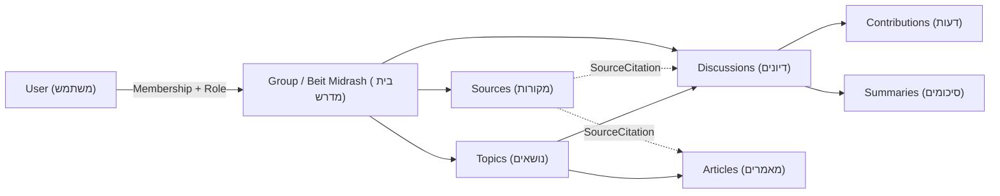

### 1.5 What V1 Explicitly IS

- A **private, invite-only** website for **one** Torah study group (single seeded `Group`).
- A structured home for: **Topics, Categories, Tags, Discussions, Contributions, Summaries, Sources (manual refs), SourceCitations, Articles, Notes, TableBlocks, Attachments (files/images/PDFs), InternalLinks, NewsPosts**.
- **Hebrew-first, RTL, responsive** with a deliberately designed mobile experience.
- **Searchable** across all content (Postgres full-text + `pg_trgm` fuzzy Hebrew matching behind a `SearchService`).
- **Archived**: versioned (`Revision`), soft-deleted, audit-logged (`ActivityLog`) from day 1.
- A rich **TipTap** editor storing structured JSON + derived text, with custom nodes for citations, tables, links, attachments.
- **Multi-tenant-ready** in the schema — every content row already carries `groupId`.

### 1.6 What V1 Explicitly IS NOT

| Not in V1 | Why deferred | Where it lands |
|---|---|---|
| Deep **Sefaria integration** / auto source lookup | V1 stores manual `Source` refs against the canonical model; live API integration is heavy | Future |
| **Paragraph-anchored & voice Comments**, AI transcription | Needs anchoring model, audio pipeline, `VoiceRecording`/`Transcript` | Future |
| **AI assistant / RAG** over our knowledge base | Requires `pgvector` embeddings + `AIService`; must be bounded and phased | Future |
| **StudyCards, SourceSheets, generated images/PDFs** from sources | Depends on mature source integration | Future |
| **Configurable dashboard widgets** (Hebrew date, zmanim, weather) | `Widget`/`UserWidgetPref` modeled but not built out | Future |
| **Notifications** system (replies, follows, announcements) | `Notification`/`Follow` schema present; delivery deferred | Future |
| **Public sign-up, individual users, many groups, billing** | V1 is a single private group; multi-tenancy is in the schema, not the UX | Future |
| Native **mobile apps** | Responsive web first | Future |

The discipline: **model for the future, build for the present.** Future entities may exist in the data model; they are not surfaced in the V1 product.

### 1.7 North-Star Metric & Success Signals

**North-star:** *Retrievable knowledge in active use* — measured as **the number of archived items (discussions, summaries, sources, notes) that are searched, opened, or linked-to per active member per week.** It rewards the loop we actually care about: the group both *deposits* learning and *withdraws* it later.

| Signal | Hebrew | What it tells us | V1 target (single group) |
|---|---|---|---|
| **Weekly active contributors** | תורמים פעילים | The archive is being fed, not just read | ≥ 60% of members contribute weekly |
| **Search → open rate** | חיפוש שמוביל לפתיחה | Memory is genuinely retrievable | ≥ 50% of searches lead to opening a result |
| **Revisit depth** | חזרה לתוכן ישן | Old learning gets reused, not just created | Growing share of opens on items > 30 days old |
| **Capture friction** | חיכוך בתיעוד | Low-friction capture principle is holding | Time-to-save a note/contribution stays low |
| **Linked knowledge** | קישוריות | Content forms a web (InternalLinks, SourceCitations) | Rising links-per-item over time |
| **Archive growth** | צמיחת הארכיון | The shared memory compounds | Steady month-over-month growth in preserved items |

A vanity metric we explicitly reject: raw pageviews. Value is *retrieval and reuse*, not traffic.

### 1.8 Phased Ambition — From Private Circle to Digital Beit Midrash

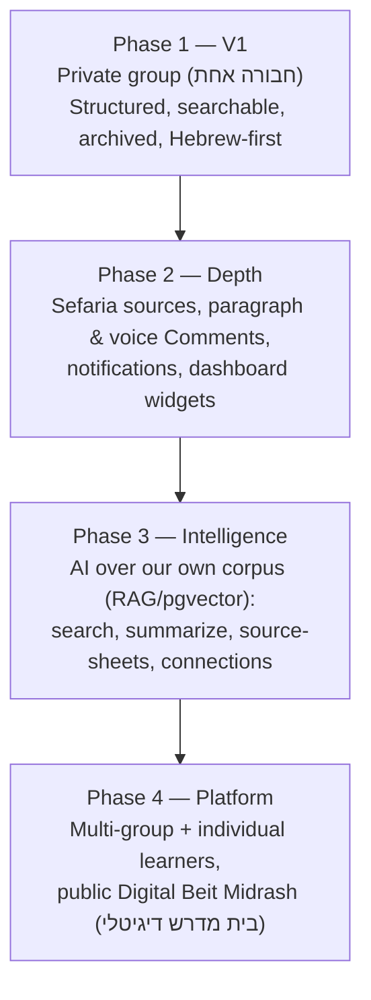

| Phase | Theme | Unlocks | Foundation already laid in V1 |
|---|---|---|---|
| **1** | **Preserve** (לשמר) | The group has a real, searchable memory | Multi-tenant rows, versioning, search abstraction, structured content |
| **2** | **Deepen** (להעמיק) | Sources anchored to thought; conversation richer | `Source`/`SourceCitation` model, `Comment`/`VoiceRecording` reserved |
| **3** | **Understand** (להבין) | AI that knows *our* Torah, not the open web | `AIService` abstraction, `pgvector` reserved, derived text for retrieval |
| **4** | **Open** (לפתוch) | Many chevrutot and individual learners on one platform | `Group`/`Membership`/`Role` from day 1; row-level isolation |

The ambition is grounded by a single rule: **V1 stays simple, the foundation stays extensible.** A private group of chaverim gets a beautiful, calm, Hebrew-first archive today — built on bones strong enough to carry a public Digital Beit Midrash for years to come.

---

I have all the canonical decisions I need in the brief. This is a writing task, so I'll produce the section directly.

## 2. UI / UX Concepts

This section explores three distinct design directions for the בית המדרש הדיגיטלי (Digital Beit Midrash), evaluates their fit, then commits to a recommended hybrid and specifies the resulting design language in build-ready detail. Every direction assumes the canonical constraints: Hebrew-first RTL, comfortable long-form reading, correct bidi handling, and a deliberately designed mobile experience.

### 2.1 Design Principles (apply to every direction)

Before the concepts, five non-negotiable principles that any chosen direction must satisfy:

1. **Hebrew is the medium, not a translation.** Line length, leading (line-height), and font weights are tuned for the Hebrew abjad — no nikud reliance for readability, generous vertical rhythm, tall x-height sans for UI.
2. **Reading is the primary act.** The interface recedes; the text (discussion, source, article) is the hero. Chrome is quiet, content has contrast.
3. **RTL is the default coordinate system.** We author in logical properties (`margin-inline-start`, not `margin-left`). LTR islands (source refs, code, URLs, numbers) are handled with `dir="auto"` / `unicode-bidi: isolate`, never by flipping the page.
4. **Calm density.** A study group accumulates years of material. The UI must scale from 10 discussions to 10,000 without becoming a wall — hence structure, hierarchy, and search-first navigation.
5. **One system, two themes, three future languages.** Tokens are semantic (`--surface`, `--text-primary`), never raw hex in components, so dark mode and future locales are configuration, not rework.

---

### 2.2 Direction A — "בית מדרש / ספרים" (Beit Midrash / Sefarim)

Warm, book-like, parchment-and-ink; evokes a traditional study hall and a printed Gemara page.

| Aspect | Detail |
|---|---|
| **Mood** | Reverent, warm, tactile. Aged paper, dark ink, a hint of gold. Feels like sitting at a שטענדער (shtender / lectern). |
| **Layout** | Centered reading column (~65–72 characters), generous margins that echo a printed page's white space. Sources presented in a "Mikraot Gedolot" motif — a main text with commentary rails. Soft ruled dividers. |
| **Palette** | Parchment `#F7F1E3`, ink `#2B2118`, deep maroon accent `#7C2D2D`, muted gold `#B08D57`, sepia border `#D9CBB0`. |
| **Typography** | **Frank Ruhl Libre** (פרנק-רוהל) for body and headings — a classic Hebrew serif with deep scholarly associations; **Assistant** for small UI labels. |
| **Strengths** | Emotionally resonant with the target audience; signals seriousness and respect for the material; excellent for long reading. |
| **Weaknesses** | Can feel heavy/slow for feed-scanning, dashboards, and dense tables; risk of "skeuomorphic costume" that fights modern interaction patterns; low-contrast parchment needs care for WCAG. |
| **Fits** | The reading and source-study surfaces; users who value tradition and atmosphere. |

---

### 2.3 Direction B — "בסיס ידע מודרני" (Modern Knowledge Base)

Clean, structured, Notion/Linear-like, sans-forward, fast.

| Aspect | Detail |
|---|---|
| **Mood** | Crisp, efficient, trustworthy. A well-organized digital library. Neutral surfaces, confident accent, zero ornament. |
| **Layout** | Persistent right-side navigation rail (RTL: nav sits on the right), breadcrumb + content in a wide-but-bounded column, sticky table-of-contents on the inline-end. Card grids for Topics/Categories; dense, sortable tables for archives. |
| **Palette** | Paper `#FFFFFF` / slate ink `#1E293B`, primary indigo `#4F46E5`, cool border `#E2E8F0`, success `#0F766E`. |
| **Typography** | **Heebo** or **Rubik** for everything (UI + body); optional **Noto Serif Hebrew** only inside long articles. |
| **Strengths** | Scales to huge archives; fast to scan; familiar mental model; trivially themeable to dark; strong for tables, search results, admin. |
| **Weaknesses** | Can feel cold/generic — "another SaaS app," missing the soul of a beit midrash; sans-only long reading is less comfortable than serif. |
| **Fits** | Dashboards, search, admin, archive/browse, notes, tables — the "operational" surfaces. |

---

### 2.4 Direction C — "פיד ומיקוד" (Feed & Focus)

A calm home feed (news, activity, followed topics) plus a distraction-free reading/writing mode.

| Aspect | Detail |
|---|---|
| **Mood** | Contemplative and modern. A quiet daily "what's new in the beit midrash," and a full-bleed focus mode for deep work. |
| **Layout** | Home = single-column vertical feed of מקורות, עדכונים, discussions (news + activity interleaved), with a slim widgets rail (Hebrew date, זמני שבת). Opening any item expands into **Focus Mode**: chrome fades, single column, adjustable text size, optional serif. |
| **Palette** | Warm off-white `#FAF8F4` / near-black `#14110E`, teal-green accent `#2F6F63` (study/growth), soft amber highlight `#C9873A`. |
| **Typography** | **Assistant** for the feed/UI; **Frank Ruhl Libre** engaged automatically inside Focus/reading mode. |
| **Strengths** | Great daily re-engagement loop; best-in-class reading/writing experience; mobile-native (feeds are inherently mobile); cleanly separates "browse" from "read." |
| **Weaknesses** | A pure feed hides structure — poor for "find that discussion from two years ago"; needs strong search + browse to compensate; widgets rail is desktop-only. |
| **Fits** | The home/landing experience, the news feed, and the core reading/writing act; re-engagement and mobile. |

---

### 2.5 Recommendation — Hybrid: "מדרש שקט" (Quiet Midrash)

**Adopt a hybrid with a B-shaped skeleton, a C-shaped home and reading flow, and an A-shaped reading skin.** None of the three alone is right: A is too heavy to operate, B is too soulless to inhabit, C is too structureless to archive. The synthesis:

- **Structure & navigation from B** — semantic tokens, sortable archives, breadcrumbs, a right-hand nav rail, dense tables. This is the operational backbone that scales for years.
- **Home & reading flow from C** — a calm home that blends the news feed (`NewsPost`) with recent activity, plus a genuine **Focus Mode** for reading a `Discussion`/`Article`/`Source` and for writing a `Contribution`.
- **Reading skin & warmth from A** — a warm (not white) paper, an ink-brown text color, and **Frank Ruhl Libre serif automatically inside long-form content**, so reading feels like a beit midrash while the app feels like a modern tool.

The result is **decisively warm-neutral, serif-for-reading, sans-for-doing, RTL-native**. Concretely: sans UI on a warm-paper surface, teal-green as the primary "study" accent, and a serif reading column that carries the tradition without costuming the whole app.

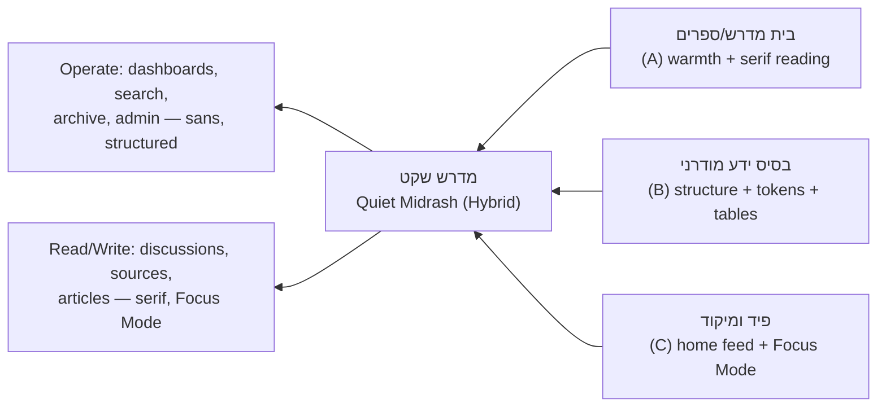

**Surface-to-flavor map** (how the hybrid is applied per screen):

| Surface | Dominant flavor | Font | Notes |
|---|---|---|---|
| Home / feed (`NewsPost` + activity) | C | Assistant (sans) | Widgets rail on desktop; single column on mobile |
| Reading a Discussion / Article / Source | A + C | Frank Ruhl Libre (serif) | Focus Mode, adjustable size, paragraph anchors |
| Writing a Contribution (TipTap) | A + B | Serif in canvas, sans in toolbar | RTL editor, source-citation nodes |
| Search & results | B | Assistant (sans) | Highlighted snippets, filters, fast scan |
| Archive / browse (Topics, Categories, Tags) | B | Assistant (sans) | Cards + sortable tables |
| Dashboard / admin / settings | B | Assistant (sans) | Dense, functional |

---

### 2.6 Design Language

#### 2.6.1 Colour Tokens

Tokens are semantic. Components reference `--color-*` names only. Two themes below; the palette is warm-neutral with a teal-green study accent and an amber highlight for sources/annotations.

**Light theme (default)**

| Token | Hex | Role |
|---|---|---|
| `--color-bg` | `#FAF7F1` | App background (warm paper) |
| `--color-surface` | `#FFFFFF` | Cards, panels, editor canvas |
| `--color-surface-sunken` | `#F1ECE2` | Wells, code, quoted source blocks |
| `--color-text-primary` | `#211C16` | Body ink (≈15.8:1 on bg) |
| `--color-text-secondary` | `#5B5347` | Metadata, captions |
| `--color-text-muted` | `#8A8072` | Placeholders, disabled |
| `--color-border` | `#E4DCCF` | Hairlines, dividers |
| `--color-border-strong` | `#CFC4B2` | Inputs, emphasized separation |
| `--color-primary` | `#2F6F63` | Primary action, links, "study" accent |
| `--color-primary-hover` | `#265C52` | Hover/active |
| `--color-primary-contrast` | `#FFFFFF` | Text on primary |
| `--color-accent` | `#B0793A` | Source citations, highlights (amber/gold) |
| `--color-accent-soft` | `#F6E9D6` | Citation background, highlight fill |
| `--color-success` | `#2E7D5B` | Confirmations |
| `--color-warning` | `#B45309` | Warnings |
| `--color-danger` | `#B4232A` | Destructive / errors |
| `--color-info` | `#2C6E9E` | Neutral info |
| `--color-focus-ring` | `#2F6F63` | Focus outline (paired with offset) |

**Dark theme**

| Token | Hex | Role |
|---|---|---|
| `--color-bg` | `#16130F` | App background (warm near-black) |
| `--color-surface` | `#1F1B15` | Cards, panels, editor canvas |
| `--color-surface-sunken` | `#12100C` | Wells, code, quoted source |
| `--color-text-primary` | `#EDE6D8` | Body ink (≈13.5:1 on bg) |
| `--color-text-secondary` | `#B7AD9A` | Metadata |
| `--color-text-muted` | `#857C6C` | Placeholders, disabled |
| `--color-border` | `#332E25` | Hairlines |
| `--color-border-strong` | `#4A4335` | Inputs, separation |
| `--color-primary` | `#5FB3A2` | Primary action, links (lightened for contrast) |
| `--color-primary-hover` | `#77C4B3` | Hover/active |
| `--color-primary-contrast` | `#0E1A17` | Text on primary |
| `--color-accent` | `#D6A461` | Source citations, highlights |
| `--color-accent-soft` | `#3A2F1E` | Citation background, highlight fill |
| `--color-success` | `#5FB98A` | Confirmations |
| `--color-warning` | `#D9922B` | Warnings |
| `--color-danger` | `#E8686E` | Destructive / errors |
| `--color-info` | `#6BB2DE` | Neutral info |
| `--color-focus-ring` | `#5FB3A2` | Focus outline |

> **Contrast rule of thumb:** all body/secondary text pairs above meet WCAG AA (≥4.5:1); primary text pairs meet AAA (≥7:1). The parchment warmth is kept subtle enough to preserve contrast — the "book" feeling lives mainly in the **reading column** (see typography), not in a low-contrast global wash.

#### 2.6.2 Hebrew Typography Scale

**Font stack**

```
--font-ui:      "Assistant", "Heebo", system-ui, sans-serif;   /* UI, feed, tables, forms */
--font-reading: "Frank Ruhl Libre", "Noto Serif Hebrew", Georgia, serif; /* long-form reading */
--font-mono:    "IBM Plex Mono", ui-monospace, monospace;      /* refs, code, keys (LTR) */
```

Rationale: **Assistant** (סאנס) has a tall x-height and reads cleanly at small UI sizes; **Frank Ruhl Libre** (פרנק-רוהל) is the canonical Hebrew scholarly serif and carries the beit-midrash tone in reading mode. Fonts are self-hosted (`next/font`) with `font-display: swap` and Hebrew subsets to control layout shift and weight.

**Type scale** — reading contexts use a larger base (18px) and looser leading than UI contexts, because Hebrew long-form is more comfortable with extra vertical rhythm and no tight tracking (Hebrew should never be letter-spaced negatively).

| Token | Size | Line-height | Weight | Font | Usage |
|---|---|---|---|---|---|
| `--text-display` | 40px / 2.5rem | 1.2 | 700 | UI | Page hero titles |
| `--text-h1` | 32px | 1.25 | 700 | UI | Section / topic titles |
| `--text-h2` | 26px | 1.3 | 600 | UI | Subsections |
| `--text-h3` | 21px | 1.35 | 600 | UI | Card titles, group headers |
| `--text-body-ui` | 16px | 1.6 | 400 | UI | Default UI text, forms |
| `--text-small` | 14px | 1.5 | 400 | UI | Metadata, captions |
| `--text-caption` | 12.5px | 1.45 | 500 | UI | Labels, badges, timestamps |
| `--text-reading` | **18px** | **1.85** | 400 | **Reading (serif)** | Discussion/article/source body |
| `--text-reading-lg` | 20px | 1.9 | 400 | Reading | Focus Mode "comfortable" step |
| `--text-reading-xl` | 22px | 1.95 | 400 | Reading | Focus Mode "large" step |
| `--text-source` | 18px | 2.0 | 400 | Reading | Torah source text (extra leading for parsing) |

**Reading-column rules**

- **Measure:** 60–72 Hebrew characters (`max-inline-size: 38rem` for reading, `44rem` for sources with commentary).
- **Leading:** never below 1.75 in reading contexts; Hebrew letters + optional nikud + source refs need the air.
- **No negative letter-spacing** on Hebrew, ever. Word-spacing default.
- **Paragraph spacing** over first-line indent (indent reads oddly in modern RTL web).
- **User text-size control** in Focus Mode: three steps (`--text-reading` → `-lg` → `-xl`), persisted per user (foreshadows `UserWidgetPref`-style preferences).

#### 2.6.3 Spacing, Radius, Elevation

**Spacing scale** (4px base): `2, 4, 8, 12, 16, 20, 24, 32, 40, 48, 64, 80`. Tokens `--space-1 … --space-12`. Vertical rhythm in reading = multiples of the reading line-height.

**Radius:** `--radius-sm 6px`, `--radius-md 10px`, `--radius-lg 16px`, `--radius-pill 999px`. Slightly soft, book-friendly; nothing sharp-industrial.

**Elevation** (warm shadows, low spread — the "book on a table" feel, not floating glass):

| Token | Light | Dark |
|---|---|---|
| `--elev-1` | `0 1px 2px rgba(33,28,22,.06)` | `0 1px 2px rgba(0,0,0,.4)` |
| `--elev-2` | `0 2px 8px rgba(33,28,22,.08)` | `0 2px 10px rgba(0,0,0,.5)` |
| `--elev-3` | `0 8px 24px rgba(33,28,22,.12)` | `0 10px 30px rgba(0,0,0,.6)` |

Prefer **borders over shadows** for structural separation (calmer, better in dark mode); reserve elevation for popovers, modals, and drag states.

#### 2.6.4 Iconography

- **Library:** Lucide (or Phosphor) — consistent 1.5px stroke, rounded joins; matches the soft-but-precise tone.
- **Sizing:** 20px default in UI, 16px inline with `--text-small`, 24px in primary nav. Optical alignment to the Hebrew baseline, not the Latin cap-height.
- **RTL mirroring:** mirror **directional** icons only (arrows, chevrons, reply, indent, list-alignment, breadcrumb separators) via `[dir="rtl"] .icon-directional { transform: scaleX(-1); }`. **Never mirror** logos, media controls (play/pause), checkmarks, search glass, or clocks. Maintain an explicit allow-list of mirrored icons.
- A small custom set for domain concepts: מקור (source scroll), חברותא (two-figures), סיכום (summary), ניקוד/reaction.

#### 2.6.5 RTL-Specific Rules

| Rule | Implementation |
|---|---|
| **Author in logical properties** | `margin-inline-start`, `padding-inline-end`, `inset-inline-start`, `border-inline-start`. Zero physical `left/right` in components. Tailwind: use logical utilities (`ms-*`, `me-*`, `ps-*`, `pe-*`, `start-*`, `end-*`). |
| **Page direction** | `<html dir="rtl" lang="he">`. Direction is a document concern, not per-component flipping. |
| **Bidi isolation for LTR islands** | Wrap source refs, URLs, emails, code, and numbers in `dir="auto"` with `unicode-bidi: isolate` so a ref like `Zevachim 19a` or `#1234` never scrambles the surrounding Hebrew. A `<Ltr>` helper component enforces this. |
| **Numbers & dates** | Latin digits by default; Gregorian and Hebrew (עברי) dates both available. Hebrew date via `Intl.DateTimeFormat('he-u-ca-hebrew')`. Time ranges and ref ranges rendered LTR-isolated. |
| **Punctuation & quotes** | Hebrew geresh/gershayim (׳ ״) for acronyms/refs; logical quotation via CSS `quotes` for RTL. |
| **Directional UI** | Nav rail on the **inline-end-start** per layout (main nav on the right), "next" points **left**, breadcrumbs read right→left, progress bars fill right→left. |
| **Input fields** | `text-align: start`; inputs holding known-LTR data (URL, email) get `dir="ltr"` but `text-align: start` so they still align naturally in the RTL form. |
| **Mixed-content editor (TipTap)** | Per-paragraph auto-direction (`dir="auto"` on block nodes) so a pasted English quote block flips correctly inside an otherwise-Hebrew document. |
| **Testing** | Every component reviewed in RTL first (RTL is the default snapshot), LTR is the secondary check for future multilingual. |

#### 2.6.6 Accessibility

| Area | Standard |
|---|---|
| **Contrast** | Body text AA (≥4.5:1), primary text AAA (≥7:1), non-text/UI components ≥3:1. Palette above is pre-validated; the amber `--color-accent` is used for **surfaces/borders**, and for text only at ≥16px bold or on `--color-accent-soft`. |
| **Focus** | Visible focus ring on every interactive element: 2px `--color-focus-ring` + 2px offset, `:focus-visible` only (no ring on mouse click). Never `outline: none` without a replacement. |
| **Font sizing** | Base in `rem`; respects browser/OS zoom to 200% without horizontal scroll. Reading Focus Mode adds explicit user text-size control (three steps). |
| **Target size** | Interactive targets ≥44×44px on touch; 24×24px minimum with spacing on desktop. |
| **Motion** | Honor `prefers-reduced-motion` — Focus-Mode chrome fade and feed transitions reduce to instant. |
| **Semantics** | Landmark regions (`<main>`, `<nav>`, `<aside>`), heading order matches visual order, skip-to-content link (RTL-positioned), `lang` attributes on foreign-language spans so screen readers switch voices (Hebrew ↔ Aramaic source ↔ Latin). |
| **Forms** | Every input labeled; errors linked via `aria-describedby`; error state not conveyed by color alone (icon + text). |
| **Dark mode** | A genuine dark theme (not dimmed), toggle plus `prefers-color-scheme`, persisted per user. |
| **Reduced reliance on nikud** | Never require nikud for comprehension; where source text carries nikud, it is preserved but font sizing accounts for the extra glyph height (source line-height 2.0). |

#### 2.6.7 Token Summary (developer handoff shape)

Design tokens ship as CSS custom properties on `:root` and `[data-theme="dark"]`, surfaced to Tailwind via `theme.extend` so components use semantic utilities (`bg-surface`, `text-primary`, `text-reading`, `ps-4`). This keeps the two themes, the future locales, and the A/B/C surface-flavors as **configuration over the same primitives**, satisfying the "V1 simple, foundation extensible" mandate.

---

## 3. Wireframes & Screen Sketches

This section specifies the eight core screens precisely enough to build. **Reading direction is RTL**: the primary navigation, the first thing the eye lands on, and the "start" of every row live on the **right**; secondary/supporting content and "next/forward" affordances live on the **left**. All sketches below are drawn in RTL orientation — the right edge of each box is the top of the reading order.

**Global bidi rules that recur on every screen** (called out again where they bite):

| Content | Rule |
|---|---|
| Source refs (e.g. `Zevachim 19a`, `שבת כג ע"ב`) | Wrap each ref in an isolated inline element (`dir="auto"` / `<bdi>`) so a Latin ref inside a Hebrew sentence does not reorder the surrounding words. |
| Cardinal numbers, dates, times | Digits render LTR *inside* the RTL flow; use `bdi` for counts like "12 תגובות" (12 comments) so the number stays attached to its noun. |
| Mixed Hebrew/Latin titles | Container is `dir="rtl"`; individual runs get `dir="auto"`. |
| Icons with directional meaning (back, next, submit-arrow) | Mirror horizontally: "back/forward" chevrons point the RTL way; a send arrow points **left** (forward = leftward). |
| Progress, breadcrumbs, pagination | Flow right→left; "1 › 2 › 3" becomes "3 ‹ 2 ‹ 1". |

Layout primitives are described with **logical** terms (inline-start = right, inline-end = left in this RTL app) so the same spec maps cleanly onto Tailwind logical utilities.

---

### 3.1 Global chrome (shared shell)

Present on all authenticated desktop screens; described once, referenced later.

- **Top bar (full width, sticky).** Reading right→left: Group switcher / logo (מזהה הקבוצה) → global search box (חיפוש) that expands on focus → quick-capture "+" button (הוספה מהירה) → notifications bell (התראות) with unread count badge → user avatar menu. The search box sits center-right because it is a primary, frequently-used action in a knowledge base.
- **Sidebar (inline-start edge = right, collapsible).** Primary nav: בית (Home) · נושאים (Topics) · מקורות (Sources) · מאמרים (Articles) · חדשות (News) · חיפוש (Search). Below a divider: קטגוריות (Categories) tree and תגיות מובילות (top Tags). Collapses to an icon rail < 1024px.
- **Content column (inline-end = left).** The screen-specific body.

---

### 3.2 Home / Dashboard — `דף הבית`

**Purpose.** A daily landing pad: what's new (news feed), at-a-glance widgets, re-entry into recent topics, and a friction-free capture box. Optimized for returning members, not first-time onboarding.

**Layout (RTL, 3-zone).** Right sidebar = global nav. The main area is a two-column grid: the **wider primary column on the right** (news feed + recent topics, because it's the reading focus) and a **narrower widget rail on the left**.

**Key regions, top-to-bottom (primary column):**
1. **Quick-capture bar** (הוספה מהירה) — a single always-visible input "מה עלה בלימוד?" (What came up in study?) with type chips underneath: הערה (Note) · מקור (Source) · דיון (Discussion) · קובץ (Attachment). Submitting a note inline creates it without leaving Home.
2. **News feed** (חדשות ועדכונים) — reverse-chronological `NewsPost` cards: announcements, new sources, schedule changes. Each card: category pill (right), title, 2-line excerpt, author + relative time (left), reaction/comment affordances.
3. **Recent & followed topics** (נושאים אחרונים) — compact `Topic` cards: title, category, last-activity time, contribution count.

**Widget rail (left column):** stacked `Widget` cards, order from `UserWidgetPref`: תאריך עברי (Hebrew date) · זמני היום / שקיעה (sunset/zmanim) · שבת (Shabbat times) · לוח שנה (Jewish calendar) · מזג אוויר (weather). A "התאמת ווידג'טים" (customize) link at the rail foot.

**Primary actions:** quick-capture submit; open a news post; open a topic; react/comment; customize widgets.

**States:**
- *Loading:* skeleton cards for feed and topic lists; widget rail shows shimmer tiles (widgets fetch independently so a slow weather API never blocks the feed).
- *Empty (fresh group):* feed shows an illustrated "עדיין אין עדכונים — התחילו נושא ראשון" (No updates yet — start the first topic) with a primary button to create a Topic; recent-topics zone hidden; quick-capture stays prominent.

**Bidi notes:** Hebrew date + Gregorian shown together — Hebrew primary, Gregorian in parentheses via `bdi`. Zmanim times (e.g. `19:42`) are LTR numerals inside RTL labels. Relative times ("לפני 3 שעות" / 3 hours ago) keep the digit isolated.

**Mobile reflow:** widget rail is **not** a shrunk column — it collapses into a horizontally-scrollable widget strip directly under the header, then feed below. See §3.9.

```
RTL — right edge = start of reading
┌──────────────────────────────────────────────────────────────────────┐
│ [avatar] [🔔3]        [ + ]         [🔎 חיפוש............]   בית המדרש  │  top bar
├───────────────┬──────────────────────────────────┬───────────────────┤
│  ווידג'טים     │  ┌────────────────────────────┐  │   ניווט            │
│ ┌───────────┐ │  │ + מה עלה בלימוד?  [שלח ◀]   │  │  ● בית            │
│ │ ד' תמוז    │ │  │ הערה · מקור · דיון · קובץ    │  │  ○ נושאים          │
│ │ (Jul 19)  │ │  └────────────────────────────┘  │  ○ מקורות          │
│ └───────────┘ │  חדשות ועדכונים                   │  ○ מאמרים          │
│ ┌───────────┐ │  ┌────────────────────────────┐  │  ○ חדשות           │
│ │ שקיעה 19:42│ │  │ [הודעה] מקור חדש נוסף…       │  │  ○ חיפוש           │
│ └───────────┘ │  │ מאת דוד · לפני 3 שעות   ♡ 4  │  │ ─────────         │
│ ┌───────────┐ │  └────────────────────────────┘  │  קטגוריות          │
│ │ שבת 20:31 │ │  ┌────────────────────────────┐  │   הלכה · אגדה      │
│ └───────────┘ │  │ [לו״ז] שיעור נדחה ליום ג'    │  │  תגיות: #ברכות    │
│  התאמת…       │  └────────────────────────────┘  │                   │
│               │  נושאים אחרונים                   │                   │
│               │  • כוונה בתפילה   · 12 תגובות     │                   │
│               │  • מלאכת בורר    · 5 תגובות       │                   │
└───────────────┴──────────────────────────────────┴───────────────────┘
     (left = widgets)          (right = focus)         (right edge = nav)
```

---

### 3.3 Topics index — `נושאים`

**Purpose.** Browse, filter, and search the topic corpus; the main "shelf" of the beit midrash.

**Layout (RTL).** Global nav on the right. Content = a **filter rail on the right of the content area** (inline-start, so filters are the first thing scanned) + a **results list/grid on the left**.

**Regions top-to-bottom:**
1. **Header row:** page title `נושאים`, result count, a view toggle (רשימה/כרטיסים — list/cards), and a sort control (עודכן לאחרונה / נוצר / הכי פעיל — recently updated / created / most active).
2. **Filter rail (right):** search-within (`SearchService` scoped to topics), `Category` tree, `Tag` multi-select, contributor filter, date range, and a "עם מקורות" (has sources) / "עם קבצים" (has attachments) toggle set. Active filters appear as removable chips above the results.
3. **Results:** `Topic` cards — title, category pill, tag chips, snippet, meta row (contributions count, sources count, last activity, lead contributors' avatars).

**Primary actions:** open topic; create topic (+); apply/clear filters; change sort/view.

**States:**
- *Loading:* 6–8 card skeletons; filter rail interactive immediately.
- *Empty (no matches):* "לא נמצאו נושאים לסינון זה" (No topics for this filter) + a "נקה סינון" (clear) button; distinct from *empty corpus* which prompts topic creation.

**Bidi notes:** counts and dates isolated; tag chips containing Latin (e.g. `#Rambam`) get `dir="auto"`.

**Mobile reflow:** filter rail becomes a "סינון" (Filter) button opening a bottom sheet; sort stays inline as a compact select; cards go single-column.

---

### 3.4 Topic detail — `נושא` (the heart of the app)

**Purpose.** The single most important screen: everything known about one subject — its summary, attached Torah sources, the running discussion (participant contributions), attachments, editable tables, notes, and related topics — all searchable and versioned.

**Layout (RTL, 3-column on wide, 2 on medium).** From right to left:
- **Right rail (inline-start):** table of contents / section jumper + topic metadata (category, tags, contributors, dates, follow button).
- **Center column (widest):** the reading + discussion spine.
- **Left rail (inline-end):** attachments, sources shelf, and related topics — supporting material.

On medium widths the left rail collapses into tabs inside the center column; the right meta rail persists.

**Center column, top-to-bottom:**
1. **Topic header:** title (`h1`), category pill + tags, contributor avatars, `Follow` toggle (מעקב), overflow menu (עריכה, גרסאות, שיתוף, מחיקה רכה — edit, revisions, share, soft-delete).
2. **Summary block** (סיכום) — the curated `Summary`, rendered from TipTap JSON; an "עריכת סיכום" (edit summary) affordance for editors; shows "עודכן ע״י … · גרסה 4" (updated by … · v4) linking to `Revision` history.
3. **Sources strip** (מקורות) — horizontally scrollable `SourceCitation` chips (e.g. `זבחים יט ע"א`), each opening the Source viewer (§3.6). "צירוף מקור" (attach source) button.
4. **Discussion / contributions** (דיון) — chronological `Contribution` cards (each a participant's opinion/message): author, timestamp, rich body, reactions, reply/quote. A composer pinned at the column foot. *(Future: paragraph-anchored `Comment`s and voice contributions render inline here — reserve a right-margin gutter for anchor markers now.)*
5. **Tables & notes** (טבלאות והערות) — embedded `TableBlock`s and `Note`s, collapsible.

**Left rail:** קבצים (Attachments — thumbnails for images/PDFs), מקורות מצורפים (attached sources list view), נושאים קשורים (related topics — `InternalLink` + suggested).

**Primary actions:** add contribution; attach source/file/table; edit summary; follow; open revision history; create internal link to another topic.

**States:**
- *Loading:* header + summary skeleton first (fast path), discussion streams in below.
- *Empty:* a topic with only a title shows "אין עדיין סיכום — הוסיפו את המחשבה הראשונה" (No summary yet — add the first thought) with the composer expanded; sources/attachments rails show dashed "צירוף…" placeholders.

**Bidi notes:** this screen has the densest bidi load. Source refs inside summary prose must be `bdi`-isolated so a citation like `Bava Metzia 59b` mid-sentence doesn't flip word order. Contribution timestamps and "v4"/"12 תגובות" counters stay LTR-isolated. Quoted source text (often pointed Hebrew with `ע"ב` markers) renders in the serif reading font at larger line-height.

```
RTL — right edge = start
┌──────────────────────────────────────────────────────────────────────┐
│ [avatar] [🔔] [ + ] [🔎]                                בית המדרש      │
├──────────┬───────────────────────────────────────────┬────────────────┤
│ תוכן /    │  כוונה בתפילה                    [⋯][מעקב] │  קבצים          │
│ מטא-דאטה  │  הלכה · #תפילה #כוונה                      │  ┌────┐┌────┐   │
│          │  ─────────────────────────────────────────│  │PDF ││IMG │   │
│ • סיכום   │  סיכום            עודכן ע״י דוד · גרסה 4 ▸ │  └────┘└────┘   │
│ • מקורות  │  ┌───────────────────────────────────────┐│  מקורות מצורפים │
│ • דיון    │  │ לפי הרמב״ם … (Rambam Tefilah 4:1) …    ││  • זבחים יט ע"א │
│ • טבלאות  │  └───────────────────────────────────────┘│  • שו"ע או"ח    │
│          │  מקורות ◂ [זבחים יט ע"א][ברכות ל ע"ב] +    │  נושאים קשורים  │
│ קטגוריה   │  דיון (12 תגובות)                          │  • מלאכת בורר   │
│ תגיות     │  ┌───────────────────────────────────────┐│  • נוסח התפילה │
│ משתתפים   │  │ יעקב · אתמול                           ││                │
│ [מעקב]    │  │ נראה לי ש…                       ♡ 3   ││                │
│          │  └───────────────────────────────────────┘│                │
│          │  ┌───────────────────────────────────────┐│                │
│          │  │ [ כתבו תגובה…              שלח ◀ ]      ││                │
│          │  └───────────────────────────────────────┘│                │
└──────────┴───────────────────────────────────────────┴────────────────┘
  (right rail=TOC/meta)      (center = summary→sources→discussion)   (left=support)
```

---

### 3.5 Article reader & editor — `מאמר`

**Purpose.** Long-form reading and authoring of standalone `Article`s (essays, write-ups) distinct from topic discussions. Reading comfort is paramount.

**Reader layout (RTL).** A single centered measure (~65–72 Hebrew characters) in the serif reading font. Right-anchored floating TOC for long articles (auto-generated from headings). Meta header: title, author, reading time ("כ-7 דק' קריאה" / ~7 min read), category, tags. Foot: related articles/topics, reactions.

**Editor layout (RTL).** TipTap surface with an RTL toolbar (bold/italic/heading/quote/list on the right, insert-menu — source citation, table, internal link, attachment — grouped left). A right meta panel: category, tags, cover image, publish/draft status. **Autosave to `Revision`**; a "גרסאות" (versions) button opens a diff view. Editor and reader share the exact same typographic styles so WYSIWYG is truthful (critical for RTL + pointed Hebrew).

**Primary actions:** reader — read, react, follow author, jump via TOC; editor — format, insert custom nodes, save draft, publish, view revisions.

**States:**
- *Reader loading:* title + first paragraphs render from cached HTML, TOC hydrates after.
- *Editor empty:* placeholder "כתבו כאן…" (Write here…) with a slash-menu hint for inserts.
- *Saving:* subtle "נשמר" (Saved) / "שומר…" (Saving…) indicator near the title.

**Bidi notes:** the insert-source node must render its ref LTR-isolated inline; block quotes of Latin-titled works keep quote punctuation on the correct (right) side; the send/publish arrow points left.

**Mobile:** reader is single measure with a collapsible TOC (chapter dropdown at top). Editor uses a sticky bottom formatting toolbar (thumb-reachable) instead of a top toolbar, and the meta panel becomes a "הגדרות" (settings) sheet.

---

### 3.6 Source viewer / citation panel — `מקור`

**Purpose.** View a Torah `Source` (aligned to Sefaria's reference scheme), select a text range, and attach it as a `SourceCitation` to the current content. In V1 sources may be manually entered; the panel is designed so future Sefaria API text-loading drops in without redesign.

**Presentation.** A **right-side slide-over panel** (inline-start origin, ~420px) over Topic/Article, so the user keeps context. On dedicated deep-reading, a full page with the same internal layout.

**Regions top-to-bottom:**
1. **Ref header:** normalized ref string (e.g. `זבחים יט ע"א` / `Zevachim 19a`) shown in both scripts, work → section breadcrumb (RTL: `זבחים ‹ פרק ב ‹ יט ע"א`), and a "פתיחה בספריא" (open in Sefaria) external link (future-live).
2. **Source text:** pointed Hebrew in serif reading font, generous line-height; optional translation toggle (future). Selectable text; selection surfaces a floating "צירוף קטע נבחר" (attach selected range) action.
3. **Citation actions:** צירוף למקור זה (attach whole) / צירוף קטע (attach selection) → choose target (current topic/article) + optional note. "יצירת כרטיס לימוד" (generate study card) and "יצירת PDF" appear disabled with a "בקרוב" (coming soon) tag in V1.

**States:**
- *V1 manual mode:* if no text is stored, show the ref + a "הוספת טקסט המקור" (add source text) editor and a note that live text loading is a future capability — never a broken/empty body.
- *Loading (future API):* skeleton lines in the text area; ref header renders immediately from the stored `Source`.
- *Selection empty:* attach-selection action hidden until a range exists.

**Bidi notes:** the ref appears amid both Hebrew body and Latin UI — always isolated. Daf/amud markers (`ע"א`/`ע"ב`) and folio numbers must not reorder. Selection ranges store character offsets against the normalized text so highlights survive re-render.

**Mobile:** the slide-over becomes a full-height bottom sheet with a drag handle; attach actions pin to the sheet foot.

---

### 3.7 Search results — `חיפוש`

**Purpose.** One entry point across all content types via `SearchService` (V1: Postgres FTS + pg_trgm fuzzy). Must tolerate Hebrew typos, partial words, and missing niqqud.

**Layout (RTL).** Large query box at top (echoes the value from global search). Below: a **type filter rail on the right** (הכל / נושאים / דיונים / מאמרים / מקורות / הערות / קבצים / חדשות — all / topics / discussions / articles / sources / notes / files / news) with per-type result counts, and **results on the left**.

**Result row:** type icon + label pill (right), title with matched terms highlighted, a snippet with match context, breadcrumb (which topic/article it lives in), and meta (author, date). Sources show their ref.

**Controls:** sort (רלוונטיות / חדש ביותר — relevance / newest), and a "חיפוש מקורב" (fuzzy) indicator when trigram matching kicked in ("מציג גם תוצאות דומות" — also showing similar results).

**States:**
- *Idle (no query):* recent searches + "נושאים פופולריים" (popular topics).
- *Loading:* row skeletons; counts resolve per-type.
- *No results:* "לא נמצאו תוצאות ל‘…’" with suggestions — check spelling, try fewer/other words, and (future) a "שאלו את העוזר" (ask the AI assistant) affordance shown disabled in V1.

**Bidi notes:** highlighted matches inside mixed-script snippets must not break the `bdi` isolation of adjacent refs/numbers. Query echo preserves user's original direction via `dir="auto"`.

**Mobile:** type filter becomes a horizontally-scrollable chip row under the search box; results single-column.

---

### 3.8 Global quick-capture / create — `הוספה מהירה`

**Purpose.** Capture a thought, source, note, or start a discussion from anywhere with minimal friction — the "+ " in the top bar and the Home capture bar both open this. Frictionless capture is what keeps a study group's material in the system instead of in notebooks.

**Presentation.** A **command-style modal** centered, opened by the top-bar "+" or keyboard shortcut. First step is a **type selector** (large tappable tiles): הערה (Note) · מקור (Source) · דיון (Discussion) · מאמר (Article) · טבלה (Table) · קובץ (Attachment) · עדכון חדשות (News post).

**Per-type minimal forms (progressive — ask the least):**

| Type | Minimum fields | Optional inline |
|---|---|---|
| הערה (Note) | body | topic to attach to, tags |
| מקור (Source) | ref string (autocomplete against Sefaria scheme) | selected text, target topic |
| דיון (Discussion) | title + first contribution | category, tags |
| מאמר (Article) | title | opens full editor (§3.5) |
| טבלה (Table) | title + rows/cols | target topic |
| קובץ (Attachment) | file (presigned upload) | title, target topic |
| חדשות (News) | body | category (announcement/source/schedule) |

**Attach-to context:** if opened *from* a topic/article, that target is pre-selected ("מצורף אל: כוונה בתפילה" — attached to: …) and can be changed.

**Primary actions:** pick type → fill minimum → "שמירה" (save) or "שמירה ופתיחה" (save & open). Escape/overlay closes with an unsaved-changes guard.

**States:**
- *Upload in progress:* progress bar per file; save disabled until upload resolves (per safety rules, uploads are explicit user actions).
- *Validation:* inline field errors in Hebrew; the source ref field warns if the ref can't be normalized but still allows manual save (V1 manual mode).

**Bidi notes:** the ref autocomplete list mixes Hebrew work names and Latin normalized refs — each item `dir="auto"`. The save arrow points left.

**Mobile:** opens as a **full-screen sheet** rising from the bottom; type tiles in a 2-col grid; a large thumb-friendly primary button pinned at the foot. The Home quick-capture bar and this sheet share one code path.

---

### 3.9 Mobile home & mobile topic (deliberate mobile design)

Mobile is designed for **one-handed re-entry and capture**, not a narrowed desktop. Two structural decisions:

- **Bottom tab bar** (thumb zone) replaces the right sidebar: בית · נושאים · חיפוש · חדשות · פרופיל. A **center floating "+"** (הוספה מהירה) sits above the bar — capture is always one thumb-tap away.
- **Content-first header:** a slim top bar with only the group name and the notifications bell; search is a tap that expands to full-screen.

**Mobile Home structure, top-to-bottom:**
1. Slim header (group name · 🔔).
2. **Widget strip** — horizontally scrollable pills (Hebrew date, sunset, Shabbat, calendar, weather) per `UserWidgetPref`; not a stacked column.
3. **Quick-capture bar** — tap opens the capture sheet (§3.8).
4. **News feed** — full-width cards.
5. **Recent topics** — compact list.
6. Bottom tab bar + floating "+".

```
Mobile Home (RTL)              Mobile Topic (RTL)
┌───────────────────────┐     ┌───────────────────────┐
│ בית המדרש        🔔3   │     │ ‹ חזרה        [⋯][מעקב]│
├───────────────────────┤     ├───────────────────────┤
│ [ד' תמוז][שקיעה 19:42]▸│     │ כוונה בתפילה           │
│  (scroll widgets ◂──) │     │ הלכה · #תפילה          │
├───────────────────────┤     ├───────────────────────┤
│ + מה עלה בלימוד?       │     │ [סיכום][מקורות][דיון]  │ ← tabs
├───────────────────────┤     │       [קבצים]          │
│ חדשות                  │     ├───────────────────────┤
│ ┌───────────────────┐ │     │ סיכום        גרסה 4 ▸  │
│ │[הודעה] מקור חדש…   │ │     │ לפי הרמב״ם…            │
│ │ דוד · לפני 3 שע' ♡4│ │     │ (Rambam Tefilah 4:1)  │
│ └───────────────────┘ │     │ מקורות ◂[זבחים יט ע"א] │
│ נושאים אחרונים         │     │ ─────────────────────  │
│ • כוונה בתפילה ·12     │     │ דיון · 12 תגובות       │
│ • מלאכת בורר ·5        │     │ ┌───────────────────┐ │
├───────────────────────┤     │ │ יעקב · אתמול   ♡3  │ │
│ 🏠  📚  🔎  📰  👤      │     │ └───────────────────┘ │
│         ⊕ (FAB)        │     │ [ כתבו תגובה…   ◀ ]   │
└───────────────────────┘     └───────────────────────┘
```

**Mobile Topic decisions:**
- The desktop's three columns become **sticky tabs** inside one column: `סיכום` (Summary) · `מקורות` (Sources) · `דיון` (Discussion) · `קבצים` (Attachments). Default tab = Summary (fastest to read); a badge on `דיון` shows contribution count.
- The **contribution composer** is a sticky bottom bar (above the tab bar when the Discussion tab is active), so replying is thumb-native; it expands to a full sheet for long/rich input.
- Source chips open the Source viewer as a **bottom sheet** (§3.6), preserving scroll position in the discussion.
- Attachments tab shows a 2-col thumbnail grid; tapping a PDF opens a full-screen viewer.

**Mobile bidi notes:** the back chevron on Topic points **right** (RTL back). Horizontal widget/source strips scroll starting from the right. Contribution counts and version numbers stay LTR-isolated inside their Hebrew labels.

---

### 3.10 Screen-to-screen navigation map

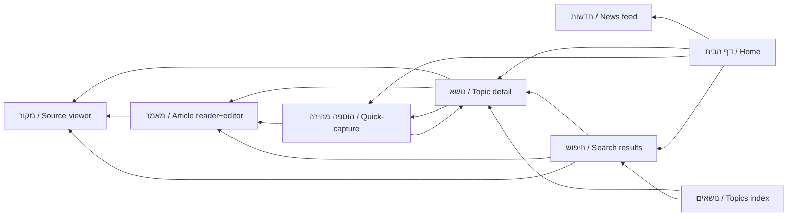

**Cross-screen contracts to hold during build:**

| Contract | Rule |
|---|---|
| Quick-capture context | When opened from a Topic/Article, that entity is the default attach-target and is shown explicitly. |
| Source panel | Always a slide-over/bottom-sheet over the current screen — never a full navigation that loses discussion scroll. |
| Search box | Global top-bar box and the `/חיפוש` page share one query state and one `SearchService` call. |
| Revision entry point | Every editable surface (Summary, Article, Note, Table) exposes "גרסאות" (versions) linking to the same `Revision` diff view. |
| Direction/typography | Reader and editor share identical serif reading styles; UI chrome uses the sans stack — consistent across all screens. |

---

## 4. Navigation & Information Architecture

Navigation is designed **RTL-first**: the visual "start" edge is the **right**, the "forward" direction reads right-to-left, and every layout primitive uses CSS logical properties (`inline-start`/`inline-end`) so a future LTR locale is a token flip, not a rewrite. The IA below serves V1 (one seeded `Group`) but every route and label is already shaped for the multi-tenant `Digital Beit Midrash`.

### 4.1 Global information architecture (site map)

The site is organized into six top-level destinations plus a personal/admin cluster. `Topic` (נושא) is the primary organizing spine — most content hangs under a Topic — while `Feed` (מבזקים), `Sources` (מקורות), `Articles` (מאמרים), and `Search` (חיפוש) are cross-cutting.

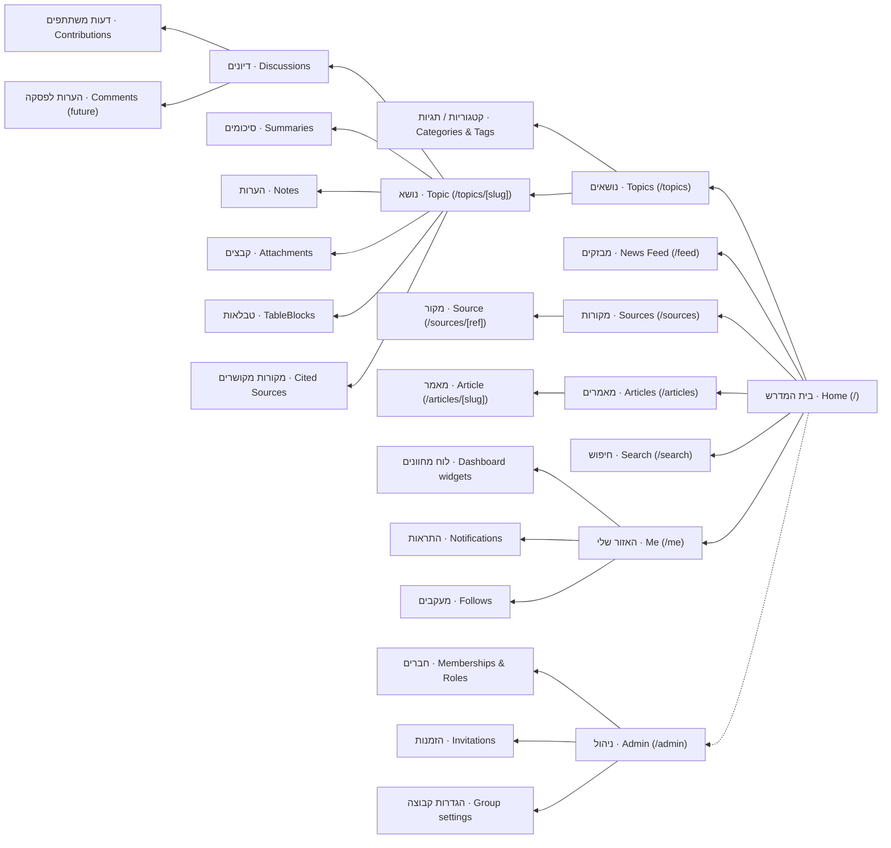

### 4.2 Primary navigation model

We use a **hybrid**: a persistent RTL top bar for global destinations plus a collapsible right-side rail for the Topic tree on wide screens; a bottom tab bar on mobile.

| Breakpoint | Primary nav | Rationale |
|---|---|---|
| **Desktop (≥1024px)** | **Top bar** (fixed, RTL: brand + search on the right, global links flowing right→left) **+ right-side rail** (מגירת ניווט) showing the Topic/Category tree, collapsible | Long-form Torah reading needs maximal vertical space and a stable content column; the right rail matches the RTL "start" edge so the eye begins there, mirroring a printed Hebrew page's structure. |
| **Tablet (640–1023px)** | Top bar; right rail becomes an off-canvas drawer opened from an inline-start hamburger | Preserves reading width; tree is one tap away. |
| **Mobile (<640px)** | **Bottom tab bar** (5 items: בית / נושאים / חיפוש / מבזקים / אזור-אישי) + top app bar with contextual title & back | Thumb-reachable, a deliberate mobile IA (not a shrunk desktop); the 5 tabs map to the highest-frequency journeys, everything else is reached via lists and the "אזור אישי" hub. |

**Why a bottom tab bar over a hamburger on mobile:** the five primary jobs (read a topic, search, catch the feed, browse topics, manage self) are all high-frequency in a daily study group; tabs keep them one tap deep and visible, whereas a hamburger hides the product's shape. Admin, Sources browsing, and settings are intentionally *not* tabs — they are lower-frequency and live inside lists/hub screens.

**Global top-bar contents (RTL order, right→left):** brand/`Group` name → global search box → נושאים → מאמרים → מקורות → מבזקים → (spacer) → notifications bell → user/avatar menu. In V1 the `Group` name is static; it becomes a group switcher when multi-tenant (see 4.7).

### 4.3 Secondary navigation within a Topic

A `Topic` is a workspace, not a single page. On entering `/topics/[slug]` the user lands on an **Overview** with a secondary nav (RTL tab strip on desktop, horizontally scrollable segmented control on mobile):

| Hebrew tab | English gloss | Content |
|---|---|---|
| סקירה | Overview | Description, pinned Summary, recent activity, key `SourceCitation`s |
| דיונים | Discussions | List of `Discussion` → each opens its `Contribution` thread |
| סיכומים | Summaries | `Summary` documents (versioned) |
| מקורות | Sources | `SourceCitation`s attached to this Topic |
| הערות | Notes | `Note` items |
| טבלאות | Tables | `TableBlock`s |
| קבצים | Files | `Attachment`s (files/images/PDFs) |

The Topic title, follow (מעקב) control, and category/tag chips form a **sticky sub-header** so context never scrolls away — important for long discussions. The secondary nav preserves its selected tab in the URL (see 4.5) so a tab is deep-linkable and back-navigable.

### 4.4 Breadcrumbs & back behaviour in RTL

- **Breadcrumb direction:** breadcrumbs read **right→left**, root on the right. The separator points **leftward** (`‹`, i.e. inline-end chevron), because "deeper" moves in the reading direction. Example: `בית ‹ נושאים ‹ הלכות שבת ‹ דיון: הוצאה מרשות לרשות`.
- **Truncation:** on narrow screens collapse the middle to `…`, always keeping root + current (`בית ‹ … ‹ דיון`).
- **Bidi safety:** each crumb label is wrapped so a Latin/number segment (e.g. a source ref `Shabbat 23b`) inside an otherwise-Hebrew trail renders with correct isolation (`unicode-bidi: isolate` / `dir="auto"` per segment), preventing the classic "jumping punctuation" bug.
- **Back button:** the top app-bar back affordance uses an **inline-end (right-pointing) arrow** in RTL, and `router.back()` semantics. We keep a lightweight in-app history stack so "back" from a deep-linked paragraph returns to the referring list, not the OS-blank; if there is no in-app referrer (cold deep link) back resolves to the logical parent (the Topic/Discussion), never a dead end.

### 4.5 URL / route structure

Routes are **flat, human-readable, and Hebrew-slug friendly** (`slug` may contain URL-encoded Hebrew; a stable short `id` prefix guarantees uniqueness and rename-safety). All content routes are notionally group-scoped; in V1 the single seeded `Group` is implicit and the `/g/[group]` prefix is omitted (see 4.7).

| Path | Purpose | Notes |
|---|---|---|
| `/` | Home / dashboard | `Widget` grid + activity |
| `/topics` | Topic index | filter by `Category`/`Tag` via query, e.g. `?category=halacha&tag=shabbat` |
| `/topics/[slug]` | Topic overview | secondary tab in URL: `/topics/[slug]/discussions` etc. |
| `/topics/[slug]/discussions/[discussionId]` | A `Discussion` thread | `Contribution`s render here |
| `/topics/[slug]/summaries/[summaryId]` | A `Summary` | versioned; `?rev=` selects a `Revision` |
| `/articles` · `/articles/[slug]` | `Article` index / reader | |
| `/sources` · `/sources/[ref]` | Source browser / one `Source` | `[ref]` is the normalized Sefaria-style ref, e.g. `/sources/Zevachim.19a` |
| `/feed` | `NewsPost` news feed | separate from discussions |
| `/search` | Global search | `?q=`, `?type=discussion|source|article|note`, `?topic=` |
| `/me` | Personal hub | dashboard prefs, follows |
| `/me/notifications` | `Notification` center | |
| `/me/settings` | User settings, `UserWidgetPref` | |
| `/admin` | Group admin home | gated by `Role` |
| `/admin/members` · `/admin/invitations` · `/admin/settings` | `Membership`/`Role`, `Invitation`, `Group` settings | |
| `/auth/*` | Auth.js flows | magic-link / sign-in, invite acceptance `/auth/invite/[token]` |
| **Future** `/g/[group]/…` | group-scoped mirror of all of the above | see 4.7 |
| **Future** `/sources/[ref]/sheet` , `/ai` | `SourceSheet`, `AIConversation` | not in V1 |

**Slug + id convention:** canonical URL is `/[type]/[slug]`; internally every entity also has a permanent id, and `/[type]/[id]` 301-redirects to the current slug so renames and internal `InternalLink`s never break.

### 4.6 Deep-linking (paragraph & source anchors)

Deep links are first-class because `Comment`s (future) anchor to paragraphs and `SourceCitation`s select text ranges.

| Target | URL shape | Mechanism |
|---|---|---|
| A paragraph in a Summary/Article | `/articles/[slug]#p-[blockId]` | TipTap/ProseMirror nodes carry a stable `blockId`; the fragment scrolls-into-view + highlights. Because it's a fragment, it works without server round-trips and is share-safe. |
| A specific `Contribution` | `/topics/[slug]/discussions/[id]#c-[contributionId]` | same block-anchor pattern |
| A **selected range** inside a source | `/sources/[ref]?range=[start]-[end]` (+ optional `#sel`) | range encoded as ProseMirror/character offsets against the normalized `Source`; the `SourceCitation` persists the same range so the link and the stored citation agree |
| A comment anchored to a paragraph (future) | `/…#p-[blockId]&comment=[commentId]` | opens the thread pinned to that block |

Anchors use **opaque block ids**, never text offsets that shift when content is edited; a `Revision`-aware resolver falls back to the nearest surviving block if a paragraph was removed, and `?rev=` can pin the exact historical version for citations that must be immutable.

### 4.7 How navigation scales when multi-tenant

The IA is built so the jump from one implicit `Group` to many is **additive, not a restructure**:

1. **Route prefix reserved now, activated later.** Every content route conceptually lives under `/g/[group]/…`. In V1 a middleware resolves the single seeded `Group` and serves the un-prefixed paths, so links stay short. When multi-tenant, the same route handlers move under `/g/[group]/` and the un-prefixed paths 301-redirect to the user's default group. Because every query is already `groupId`-scoped (row-level tenancy), no data-access code changes.
2. **Group switcher replaces the static brand.** The top-bar `Group` name becomes a switcher (מעבר בין בתי מדרש) sourced from the user's `Membership`s; the current group is held in the session and the `[group]` segment. Guests/individual (group-less) users get a personal space that reuses the identical shell.
3. **Role-aware nav.** Nav items render against the user's `Role` **within the active group** — `/admin` and admin tabs appear only for owner/admin, editor sees authoring affordances, member/guest see read + participate. The same component tree simply hides/shows nodes per-`Membership`, so cross-tenant navigation never leaks another group's structure.
4. **Search & feed become tenant-partitioned by default.** `SearchService` and `/feed` already filter on `groupId`; multi-tenant adds an optional "across my groups" scope for personal search without changing URLs (a `?scope=all` query), keeping the single-group experience unchanged.
5. **Stable deep links survive tenancy.** Since deep-link anchors key on entity ids (not paths), and ids are globally unique, a citation or `InternalLink` created in V1 resolves correctly once the `/g/[group]` prefix is introduced — the id → canonical-URL resolver just emits the group-scoped path.

This keeps V1 navigation deliberately simple (no group switcher, no visible `/g/` noise) while guaranteeing the multi-tenant `Digital Beit Midrash` is a configuration and routing change rather than an IA rebuild.

---

## 5. User Journeys

This section maps the key end-to-end journeys for V1, plus one flagship future journey. Each is written as the actual path a person walks through the product — the screens they see, the actions they take, and the moment they succeed. Every journey respects the canonical model (row-level tenancy via **Group** / בית המדרש, RBAC via **Membership** + **Role**, TipTap content stored as ProseMirror JSON, `SearchService` over Postgres FTS + pg_trgm). Hebrew is the primary UI language; RTL and correct bidi are assumed everywhere.

**Personas referenced**

| Persona | Hebrew label | Role (per Group) | Primary need |
|---|---|---|---|
| Member / participant | חבר (chaver) | `member` / `editor` | Read, contribute opinions, find past learning |
| Gabbai / admin | גבאי (gabbai) | `admin` / `owner` | Invite people, keep order, post news |
| First-timer | מוזמן (muzman) | pre-`member` (invited) | Get in and oriented with zero friction |

---

### 5.1 First-time member onboarding via invitation

**Trigger:** A gabbai creates an **Invitation** for an email address; the invitee receives an email in Hebrew ("הוזמנת לבית המדרש הדיגיטלי" — "You've been invited to the Digital Beit Midrash").

**Path**

| # | Screen / surface | User action | System behavior |
|---|---|---|---|
| 1 | Email inbox | Taps the invite link (single-use, signed token) | Token validated → `Invitation` matched to Group + intended Role |
| 2 | Landing / קבלת פנים (welcome) | Reads a one-line explanation, taps "הצטרפות" (join) | No password requested yet |
| 3 | Auth.js magic-link screen | Confirms email, taps "שלחו לי קישור" (send me a link) | Magic-link email dispatched; optional password offered, not required |
| 4 | Inbox → magic link | Taps sign-in link | Session cookie set; **User** created if new; **Membership** created linking User↔Group with the invited Role; **Invitation** marked consumed |
| 5 | Profile bootstrap | Enters display name, optional photo | Minimal — one screen, skippable |
| 6 | Guided home (עמוד הבית) | Sees dashboard with a "התחלה מהירה" (quick start) card | ActivityLog records `member.joined` |

**Friction to minimise**

- **No account creation as a separate step.** The magic link *is* the account. Password is strictly optional.
- **Single-use, expiring tokens** (e.g. 7 days) with a clear "expired — request a new invite" path that emails the gabbai, not a dead end.
- **Zero empty-state dread:** the home screen must never be blank for a first-timer — show recent group Topics and a friendly "how this works" card.
- **Bidi correctness in the email itself** (Hebrew body + Latin URL) so the link is not mangled RTL.

**Success end-state:** The invitee is an authenticated **Member** of the Group, has a session, sees real group content, and knows the one next action to take.

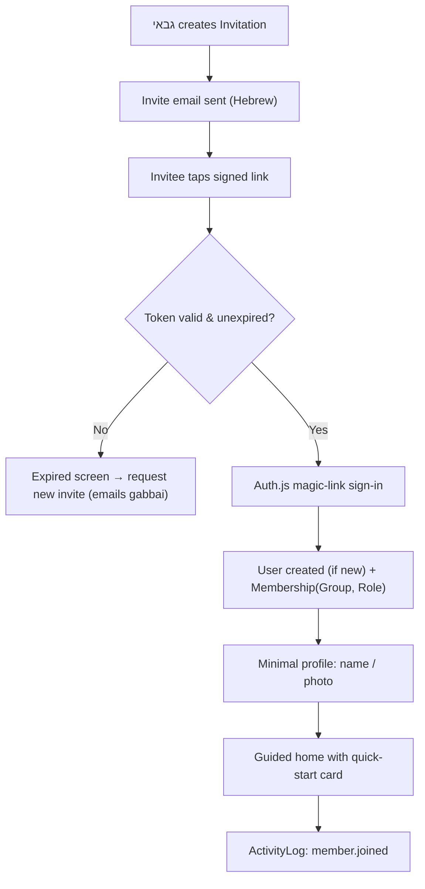

---

### 5.2 Capturing a study session (the core creation loop)

This is the product's beating heart: turning a live chevruta session into durable, searchable knowledge. It must feel like *taking notes*, not *operating a CMS*.

**Trigger:** A study session (שיעור / חברותא) just happened, or is happening live, and someone wants to record it.

**Path — create the container, then fill it**

| # | Screen | Action | Notes |
|---|---|---|---|
| 1 | Home → "נושא חדש" (new Topic) | Create a **Topic**, give it a title, assign **Category** + **Tag**s | Topic is the organizing unit; groupId auto-set |
| 2 | Topic page | Add a **Summary** (סיכום) using the TipTap editor | Stored as ProseMirror JSON + derived plain text for search |
| 3 | Topic page | Open a **Discussion** (דיון) under the Topic | Discussion holds the back-and-forth |
| 4 | Discussion | Add **Contribution**s (דעות / opinions), each attributed to a participant | A Contribution = one person's opinion/message; attributable to any Member, not only the author |
| 5 | Editor toolbar → "מקור" (source) | Insert a **SourceCitation** — type/select a **Source** ref (e.g. `Zevachim 19a` / זבחים י"ט ע"א), optionally mark a selected text range | V1: manual ref entry via the citation node; normalized ref string stored; deep Sefaria pull is future |
| 6 | Editor toolbar → "קובץ" (attach) | Upload a PDF as an **Attachment** via presigned direct-to-R2 upload | Thumbnail generated; DB stores key + metadata only |
| 7 | Editor toolbar → "טבלה" (table) | Insert a **TableBlock** (e.g. שיטות / positions comparison) and edit inline | Editable table as a first-class custom node |
| 8 | Save / autosave | Content persisted; a **Revision** is written | Soft-delete + version history from day 1 |

**Live-vs-later modes.** Two entry rhythms share the same screens:
- **Live capture:** terse Contributions typed fast during the shiur; formatting deferred.
- **Post-session write-up:** the Summary and sources added afterward, calmly.

Both must autosave aggressively — a chevruta member should never lose a thought to a dropped connection.

**Friction to minimise**

| Friction | Mitigation |
|---|---|
| "Which button creates what?" confusion between Topic/Discussion/Summary/Contribution | Progressive disclosure: creating a Topic offers "add a summary" and "start a discussion" inline, so the hierarchy is discovered by doing, not by decoding a menu |
| Source entry feels like data-entry homework | Source citation node accepts a free-typed Hebrew or Latin ref, normalizes it, and defers validation; never blocks saving |
| Upload anxiety (big PDFs, mobile data) | Presigned direct upload with visible progress, background completion, and resumable retry; the Contribution saves even if the attachment is still uploading |
| Fear of "messing it up" | Every save is a Revision; nothing is destructive; soft-delete is reversible |
| Attribution overhead | Attributing a Contribution to another Member is a quick picker, defaulting to the author |

**Success end-state:** A single Topic now holds a Summary, a Discussion with several attributed Contributions, at least one attached Source (with selected range), a PDF Attachment with a thumbnail, and an editable Table — all versioned, all searchable, all scoped to the Group.

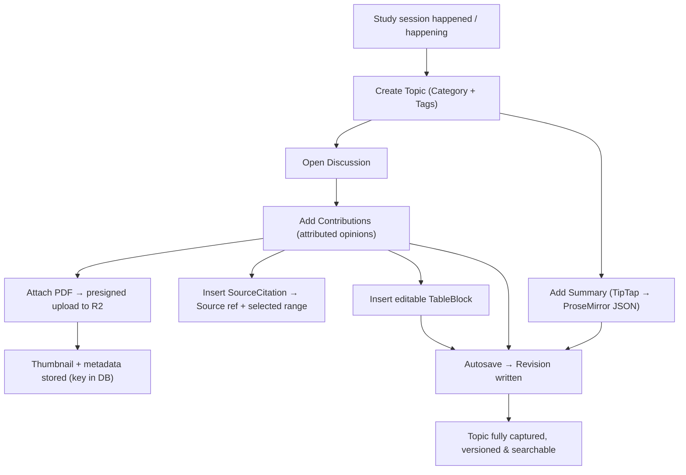

---

### 5.3 Finding something later (search + internal links)

**Trigger:** Weeks later someone half-remembers a discussion — "the one about מלאכת בורר on Shabbat" — and needs it now.

**Path**

| # | Screen | Action | System behavior |
|---|---|---|---|
| 1 | Global search bar (חיפוש) | Types a partial/typo'd Hebrew query | `SearchService` runs Postgres FTS (`simple` config) + pg_trgm fuzzy match across derived plain-text of Summaries, Contributions, Articles, Notes, Sources |
| 2 | Results screen | Scans grouped results | Results faceted by type (Topic / Discussion / Source / Article / Attachment) and by Tag/Category; highlighted Hebrew snippets |
| 3 | Result → Topic | Opens the Topic | Related items shown: cited Sources, attachments, linked Topics via **InternalLink** |
| 4 | Within content | Follows an **InternalLink** to a related discussion | InternalLink is a first-class node; navigation stays in-app |
| 5 | Source panel | Clicks a **SourceCitation** | Jumps to everywhere that Source is cited across the Group |

**Friction to minimise**

- **Hebrew fuzzy tolerance is mandatory, not nice-to-have:** unaccent + pg_trgm must forgive מלא/מלאה/מלאכת-style variation and niqqud presence/absence. V1 has no Hebrew stemmer, so trigram partial matching carries the load.
- **No dead-end results:** every hit is one tap from the full context (Topic + Discussion + Source).
- **Bidi-safe highlighting:** snippet emphasis must not break RTL flow when a Latin source ref sits inside a Hebrew sentence.
- **Backlinks, not just forward links:** a Source or Topic shows "מוזכר ב־" (mentioned in) so knowledge is navigable in both directions.

**Success end-state:** The user reaches the exact discussion in a handful of seconds, and discovers adjacent related material they'd forgotten, via citations and internal links.

---

### 5.4 Reading comfortably on mobile (during / after a shiur)

**Trigger:** A member opens the site on a phone in the beit midrash — one-handed, variable lighting, possibly poor signal.

This journey is about *reading*, not creating, and it is a deliberately designed mobile experience (per the canonical mandate), not a shrunk desktop.

**Design commitments**

| Concern | Decision |
|---|---|
| Typography | Serif Hebrew face (Frank Ruhl Libre / Noto Serif Hebrew) for long-form body; generous line-height and measure tuned for Hebrew; sans (Heebo/Assistant) for chrome |
| RTL | Logical CSS properties throughout; source refs and numbers render bidi-correctly inline |
| Theme | Light + dark toggle; dark mode genuinely comfortable for a dim room |
| Navigation | Bottom-anchored primary actions reachable by thumb; sticky "back to Topic" |
| Sources & PDFs | Inline source citation expands in a sheet; PDF opens to its thumbnail first, full view on demand (respecting data) |
| Offline-ish resilience | Recently viewed Topics cached for re-reading with no signal |

**Path:** Open app → land on home → tap a Topic from "אחרונים" (recent) → read the Summary in comfortable serif → expand a SourceCitation in a bottom sheet → scroll the Discussion → optionally add a quick Contribution from the same screen.

**Friction to minimise**

- Tap targets and reading measure sized for one-handed use.
- Source expansion never navigates away and loses reading position.
- Heavy media (PDF/images) lazy-loads; nothing autostarts on cellular.

**Success end-state:** The member reads a full summary and its sources comfortably on the phone, in the room, without pinch-zooming or fighting the layout.

---

### 5.5 Admin / gabbai: inviting members and posting a news update

**Trigger:** The gabbai wants to grow the circle and announce something (a schedule change, a new article, an interesting source).

**Two sub-journeys, one admin surface (ניהול).**

**A — Invite members**

| # | Screen | Action | System behavior |
|---|---|---|---|
| 1 | ניהול → חברים (members) | Enters one or more emails, picks a **Role** | Creates **Invitation**(s) scoped to the Group |
| 2 | Confirmation | Reviews before sending | **Sending invite emails is an explicit, confirmed send action** |
| 3 | Members list | Sees pending vs active Memberships; can resend or revoke | Revoke invalidates the token |

**B — Post a news update** (the internal feed is *separate* from discussions)

| # | Screen | Action | System behavior |
|---|---|---|---|
| 1 | ניהול → חדשות (news) or "עדכון חדש" | Composes a **NewsPost** in TipTap | Distinct entity from Discussion; appears in the news feed, not the study threads |
| 2 | Optional attach | Links a Source, Article, or Attachment | Same citation/attachment nodes reused |
| 3 | Publish | Confirms publish | **Notification**s fan out to members (followed-group / announcement); ActivityLog records `news.published` |

**Friction to minimise**

- **Bulk invite without a spreadsheet import ceremony** — paste-a-list is enough for V1.
- **Clear Role explanations at point of choice** (what can an `editor` vs `member` vs `guest` do), so permissions aren't guessed.
- **News ≠ discussion is visually obvious** so announcements don't drown the learning threads and vice versa.
- **Notifications are respectful:** announcements notify; not every minor edit does.

**Success end-state:** New people receive invitations; a clearly-scoped **NewsPost** is live in the feed; the right members are notified; every action is audited.

---

### 5.6 FUTURE — Asking the AI assistant to build a source sheet from a discussion

> **Future capability — not in V1 core.** Shown here so the V1 data model earns its keep. It relies on the `AIService` abstraction (default provider Anthropic Claude), pgvector **Embedding**s over our own content, and the future-only entities **SourceSheet**, **StudyCard**, **AIConversation**, **AIMessage**. Nothing here is built in V1 — but V1's structured content (ProseMirror JSON + normalized Source refs + derived plain text) is exactly what makes it possible.

**Trigger:** A member finishes a rich Discussion and wants a shareable source sheet (דף מקורות) built from it.

**Path**

| # | Screen | Action | System behavior |
|---|---|---|---|
| 1 | Discussion → "עוזר" (assistant) | "בנה דף מקורות מהדיון הזה" (build a source sheet from this discussion) | Opens an **AIConversation** scoped to the Group + this Discussion |
| 2 | Assistant working | Waits briefly | RAG: retrieve this Discussion's Contributions, cited **Source**s, and semantically-related content via pgvector **Embedding**s — all filtered by groupId (tenant isolation is absolute) |
| 3 | Draft **SourceSheet** | Reviews an ordered sheet: sources in learning order, with the group's own commentary pulled from Contributions | Draft only; nothing published yet |
| 4 | Refine | "הוסף את הרמב"ם", "קצר את ההקדמה" (add the Rambam / shorten the intro) | Iterative **AIMessage** turns; each grounded in retrieved content, with citations back to real Sources and Contributions |
| 5 | Optional | "צור כרטיסי לימוד" (make study cards) | Generates **StudyCard**s from selected source ranges |
| 6 | Save / share | Confirms | SourceSheet saved as group content, versioned like everything else |

**Friction & guardrails to minimise**

- **Grounded, not inventive:** every claim traces to a real Source or Contribution in *our* knowledge base; the AI cites, it does not fabricate references. This is the single most important trust property for a Torah context.
- **Tenant isolation is non-negotiable:** retrieval is always `groupId`-filtered; one beit midrash's learning never leaks into another's.
- **Human in the loop:** the AI drafts; a person reviews and saves. Output is always a reviewable draft, never an auto-published artifact.
- **Bounded and optional:** the assistant is a surface a user chooses to open, not an ambient presence.

**Success end-state:** A grounded, citation-backed **SourceSheet** (optionally with **StudyCard**s) is produced from real group content in a couple of minutes, reviewed by a human, and saved as durable, versioned group knowledge.

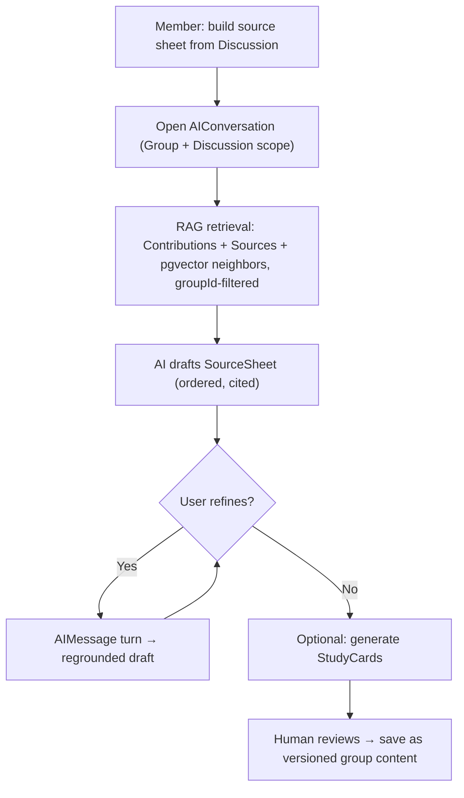

---

### 5.7 Cross-journey friction principles

These hold across every journey above and should constrain design decisions throughout:

1. **Never lose a thought** — aggressive autosave + Revision history mean a dropped connection or a misclick never destroys learning.
2. **Hierarchy discovered by doing** — Topic → Discussion → Contribution → Summary is revealed through inline "add" actions, not taught through menus.
3. **Hebrew-first, bidi-correct, always** — mixed Hebrew/Latin/numeric/source-ref text renders correctly in editors, results, snippets, and emails alike.
4. **Confirmed side-effects** — sending invites, publishing news, and firing notifications are explicit, reviewable actions, never silent.
5. **Every path leads to context** — search hits, citations, and internal links all resolve one tap away from full surrounding context and backlinks.

---

## 6. Database Architecture

The database is the durable core of this platform. Everything else — the TipTap editor, the search box, the future AI assistant — is a projection of what lives here. V1 serves a single study circle, but the schema is engineered from the first migration to become a multi-tenant Digital Beit Midrash without a rewrite. This section specifies that schema: its principles, its tenancy model, how rich Torah content is stored and searched in Hebrew, and how we version, audit, and extend it.

### 6.1 Why PostgreSQL + Prisma

| Concern | Why Postgres | Why Prisma |
|---|---|---|
| Relational integrity | Content is deeply relational (Discussion → Contribution → SourceCitation → Source). FKs, cascades, and constraints enforce correctness in the DB, not just app code. | Type-safe client generated from a single schema; migrations are versioned SQL under source control. |
| Hebrew search | `tsvector` + `pg_trgm` + `unaccent` give real full-text and fuzzy matching in one engine — no second system in V1. | `Unsupported()` columns + `previewFeatures = ["fullTextSearchPostgres"]`; raw SQL via `$queryRaw` where Prisma can't express `tsvector`. |
| Flexible content | `JSONB` stores ProseMirror documents and widget config natively, with GIN indexing. | Maps `Json` fields cleanly; keeps structured columns strongly typed alongside JSON. |
| AI future | `pgvector` lives *inside* the same DB — embeddings join directly to content rows, no sync layer. | Vector columns modeled as `Unsupported("vector(1536)")` and queried with raw SQL. |
| Operational maturity | Neon/Supabase managed Postgres, PITR, branching for preview environments. | Prisma Migrate produces reviewable diffs; `prisma db seed` handles the V1 single-Group bootstrap. |

The one honest trade-off: Postgres has **no Hebrew stemmer**. We therefore use the `'simple'` text-search configuration (no stemming, no stop-words) and lean on `pg_trgm` for morphological/typo tolerance. This is deliberate and documented in §6.9.

### 6.2 Schema design principles

1. **Every content row is tenant-scoped.** `groupId` is a mandatory, indexed, non-null FK on every content table. No exceptions, enforced by convention *and* by a Prisma middleware/extension guard.
2. **Stable surrogate keys.** Primary keys are `cuid()` (opaque, URL-safe, non-enumerable — better than sequential integers for a private-then-public product). Human-facing identifiers (a Discussion slug, a Source `ref`) are separate, unique-per-tenant columns.
3. **Structured first, JSONB where justified.** Anything queried, filtered, sorted, or joined gets a real column. JSONB is reserved for opaque documents (ProseMirror trees, widget prefs) — see §6.10.
4. **Derived columns are generated, not hand-maintained.** Search text (`tsv`) and plain-text renderings are `GENERATED ALWAYS` or trigger-maintained, so they can never drift from the source.
5. **Soft-delete + versioning are universal, not per-feature.** A shared `deletedAt` column and a shared `Revision` strategy apply to all editable content.
6. **Polymorphism via a discriminator pair `(entityType, entityId)`**, used consistently for `SourceCitation`, `Attachment`, `Comment`, `Reaction`, `Follow`, and `ActivityLog`. This is the one place we accept FK-less references (Postgres can't FK to "any table"); integrity is guarded at the application layer and by check constraints on `entityType`.
7. **Timestamps everywhere.** `createdAt`, `updatedAt` on all tables; `createdById`/`updatedById` on editable content.

### 6.3 Multi-tenancy: options and recommendation

**Recommendation: shared-schema, row-level tenancy keyed by `groupId`, from day one.**

| Model | Isolation | Cost / ops | Cross-tenant queries (admin, global search, future public content) | Migration effort | Verdict |
|---|---|---|---|---|---|
| **Shared schema, row-level `groupId`** | Logical (app + RLS) | One DB, cheapest, simplest | Trivial | One migration set | ✅ **Chosen** |
| Schema-per-tenant | Strong (namespace) | Hundreds of schemas to migrate in lockstep; Prisma models one schema | Painful (UNION across schemas) | N× migrations | ❌ Kills cross-tenant AI/search |
| DB-per-tenant | Strongest | Heaviest; connection sprawl; per-DB backups | Very painful | N× everything | ❌ Overkill for a study-group platform |

Row-level is correct because the product's *value* — a shared AI assistant over the corpus, global source reuse, future public Beit Midrash discovery — depends on querying across tenants cheaply. Schema/DB-per-tenant would sabotage exactly the future this architecture exists to enable.

**Isolation, defense in depth:**

- **Layer 1 — Application:** every query flows through a repository/service layer that injects `where: { groupId: ctx.groupId }`. A Prisma Client Extension asserts that read/write on tenant-scoped models always carries `groupId`, throwing in development if absent.
- **Layer 2 — Database (Postgres RLS):** enable Row-Level Security on content tables with a policy `USING (group_id = current_setting('app.current_group')::text)`. Each request sets `app.current_group` via `SET LOCAL` inside the transaction. This is the backstop: even a query that forgets the `where` clause returns nothing. RLS is designed-in now and can be switched on as the tenant count grows.
- **Layer 3 — Auth:** `Membership` is the gate. A `User` only sees a `Group` they have an active `Membership` in; `Role` on that membership scopes what they can do (§6.4).

**V1 → future mapping:** V1 seeds exactly one `Group` ("בית המדרש", *the study house*) and every row carries its `groupId`. Nothing about V1 UI exposes tenancy. When we go multi-tenant, we add a Group-creation/onboarding flow and (optionally) group-less individual users as a `Membership` variant or a personal-Group convention — **zero schema surgery** on content tables.

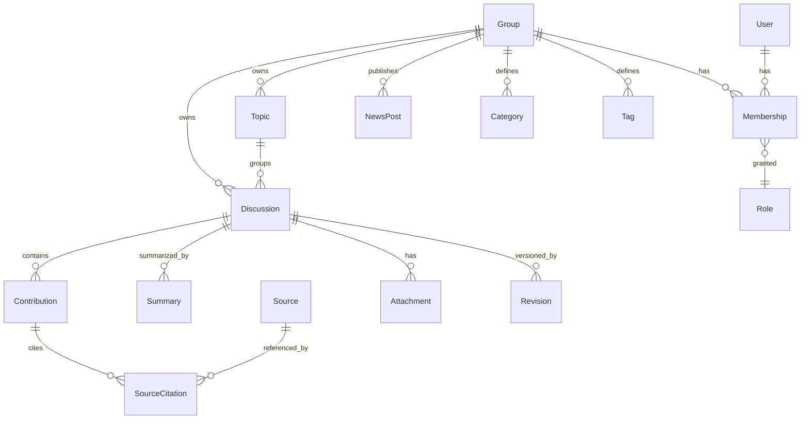

### 6.4 Tenancy, identity & access tables

```prisma
model Group {
  id        String   @id @default(cuid())
  slug      String   @unique          // e.g. "beit-midrash"
  name      String                    // "בית המדרש הדיגיטלי"
  settings  Json     @default("{}")   // locale, theme, feature flags
  createdAt DateTime @default(now())
  deletedAt DateTime?
  memberships Membership[]
  @@map("group")
}

model User {
  id          String   @id @default(cuid())
  email       String   @unique
  displayName String                   // "אבישי כהן"
  avatarKey   String?                  // R2 object key
  locale      String   @default("he")
  createdAt   DateTime @default(now())
  memberships Membership[]
  @@map("user")
}

model Membership {
  id        String   @id @default(cuid())
  groupId   String
  userId    String
  role      Role     @default(MEMBER)  // per-Group RBAC
  status    MembershipStatus @default(ACTIVE)
  invitedById String?
  createdAt DateTime @default(now())
  group     Group @relation(fields: [groupId], references: [id])
  user      User  @relation(fields: [userId], references: [id])
  @@unique([groupId, userId])          // one membership per (group,user)
  @@index([userId])
  @@map("membership")
}

enum Role { OWNER ADMIN EDITOR MEMBER GUEST }
enum MembershipStatus { INVITED ACTIVE SUSPENDED }
```

`Invitation` (invite-only V1) holds a hashed token, target email, `groupId`, intended `role`, and expiry. RBAC is always evaluated as *(this User's Role in this Group)* — roles never leak across tenants.

### 6.5 Rich content modelling (ProseMirror JSON + derived text)

Every rich body is stored **twice**, from a single source of truth:

| Column | Type | Purpose | Maintained by |
|---|---|---|---|
| `bodyJson` | `JSONB` | Canonical ProseMirror document — the editable truth, includes custom nodes (source citations, tables, internal links, attachments). | TipTap on save |
| `bodyText` | `TEXT` | Flattened plain text, for search + previews + AI chunking. | Server, on write (extracted from `bodyJson`) |
| `bodyHtml` | `TEXT` | Optional pre-rendered HTML for fast read-only display / SSR / export. | Server, on write |
| `tsv` | `tsvector` | Generated search vector from `bodyText` (+ title). | Generated/trigger |

Rationale: we never search or index raw ProseMirror JSON (brittle, nested). We extract `bodyText` **server-side on write** using the shared ProseMirror schema, guaranteeing search sees exactly what the editor produced. `bodyJson` remains authoritative for editing and re-rendering.

```prisma
model Discussion {
  id          String   @id @default(cuid())
  groupId     String
  topicId     String?
  slug        String                       // unique per group
  title       String
  status      DiscussionStatus @default(OPEN)
  bodyJson    Json?                         // ProseMirror doc (opening post)
  bodyText    String?  @db.Text             // derived plain text
  bodyHtml    String?  @db.Text
  createdById String
  createdAt   DateTime @default(now())
  updatedAt   DateTime @updatedAt
  deletedAt   DateTime?
  // tsv column added via raw migration (see §6.9)
  topic         Topic?         @relation(fields: [topicId], references: [id])
  contributions Contribution[]
  summaries     Summary[]
  @@unique([groupId, slug])
  @@index([groupId, topicId])
  @@index([groupId, status])
  @@map("discussion")
}
```

`Contribution` (a participant's opinion/message inside a discussion), `Article`, `Summary`, `Note`, and `NewsPost` follow the **identical body-quad pattern** (`bodyJson`/`bodyText`/`bodyHtml`/`tsv`). `TableBlock` stores its grid as structured `JSONB` (`{columns, rows}`) plus a `bodyText` flattening for search.

### 6.6 Torah Source model & polymorphic SourceCitation

Two tables, cleanly separated: a **canonical, reusable `Source`** (the reference itself) and a **`SourceCitation`** that links a Source — with an optional selected range — to *any* content entity.

`Source` aligns with **Sefaria's open reference scheme**: structured work/section/subsection plus a normalized `ref` string (e.g. `"Zevachim 19a"`, `"Shabbat 23b"`, `"Rambam, Hilchot Shabbat 1:1"`). V1 stores manual references; the columns are already shaped for future Sefaria API hydration (text, links, translations).

```prisma
model Source {
  id           String  @id @default(cuid())
  groupId      String?                       // null = shared/global (future); set = tenant-local
  canonicalRef String                        // normalized: "Zevachim 19a"
  refHe        String?                        // "זבחים י״ט ע״א"
  work         String                        // "Zevachim" / "Bavli" / "Rambam"
  category     SourceCategory                // TALMUD, TANACH, RAMBAM, SHULCHAN_ARUCH, MIDRASH, OTHER
  section      String?                       // daf / perek / siman
  subsection   String?                       // amud / se'if
  sefariaRef   String?                       // exact Sefaria API ref for future hydration
  metadata     Json    @default("{}")        // author, era, language, links
  createdAt    DateTime @default(now())
  citations    SourceCitation[]
  @@unique([groupId, canonicalRef])
  @@index([canonicalRef])
  @@index([category])
  @@map("source")
}

model SourceCitation {
  id          String   @id @default(cuid())
  groupId     String
  sourceId    String
  entityType  CitableEntity                  // DISCUSSION | CONTRIBUTION | ARTICLE | SUMMARY | NOTE | NEWSPOST
  entityId    String                         // polymorphic target
  selection   Json?                          // {startChar,endChar,quoteHe,quoteText} selected range
  note        String?  @db.Text              // why this source is cited
  createdById String
  createdAt   DateTime @default(now())
  source      Source @relation(fields: [sourceId], references: [id])
  @@index([entityType, entityId])            // "all sources cited by X"
  @@index([groupId, sourceId])               // "everywhere source Y is discussed"
  @@map("source_citation")
}
```

Why polymorphic rather than one join table per content type: sources are cited from *many* entity kinds and the set will grow (future `Comment`, `SourceSheet`, `StudyCard`). A single `SourceCitation` with `(entityType, entityId)` keeps one query path — `"where is Zevachim 19a cited across the whole Beit Midrash?"` — which is precisely the AI/discovery query we're optimizing for. Integrity is guarded by a `CHECK` on `entityType` (enum) and application-layer validation; the reverse index `(entityType, entityId)` makes per-entity fetches fast.

### 6.7 Versioning, soft-delete & audit

Three mechanisms, all designed in from day one:

**Revision (content history).** On every meaningful edit of a versioned entity, we write an immutable `Revision` snapshot *before* mutating the live row. This gives full history, diffing, and rollback without bloating the main tables.

```prisma
model Revision {
  id          String   @id @default(cuid())
  groupId     String
  entityType  VersionedEntity                // DISCUSSION | CONTRIBUTION | ARTICLE | SUMMARY | NOTE | TABLEBLOCK
  entityId    String
  version     Int                            // monotonic per (entityType, entityId)
  bodyJson    Json?                          // full snapshot of the doc at this version
  title       String?
  editedById  String
  editSummary String?                        // optional "what changed"
  createdAt   DateTime @default(now())
  @@unique([entityType, entityId, version])
  @@index([entityType, entityId])
  @@map("revision")
}
```

**Soft-delete.** A nullable `deletedAt` on all content tables. Default queries filter `deletedAt IS NULL` (centralized in the repository layer / Prisma extension). Actual hard-deletion is an admin-only, out-of-band operation — never a user action — consistent with the platform's archival mandate.

**ActivityLog (audit).** Append-only record of every consequential action, polymorphic like citations.

```prisma
model ActivityLog {
  id         String   @id @default(cuid())
  groupId    String
  actorId    String
  action     String                          // "discussion.create","source.cite","member.invite"
  entityType String
  entityId   String
  metadata   Json     @default("{}")         // diff summary, old/new status, ip/ua
  createdAt  DateTime @default(now())
  @@index([groupId, createdAt])
  @@index([entityType, entityId])
  @@map("activity_log")
}
```

| Mechanism | Answers | Granularity |
|---|---|---|
| `Revision` | "What did this article say last week? Revert it." | Per content version, full snapshot |
| `deletedAt` | "It's gone from view but recoverable / archived." | Per row |
| `ActivityLog` | "Who did what, when, across the group." | Per action, immutable |

### 6.8 Taxonomy, Attachments, and the rest

**Category / Tag.** `Category` is a single-parent hierarchy (curated, per-Group, e.g. הלכה, אגדה, מוסר). `Tag` is a flat free-tagging vocabulary. Content links to tags through a `ContentTag` join with the same `(entityType, entityId)` polymorphic pair, so any entity is taggable without N join tables.

**Attachment (polymorphic file/image/pdf).** DB stores only **metadata + R2 object key** — never bytes. One table serves all binary content; a `kind` discriminator plus PDF/image-specific nullable columns.

```prisma
model Attachment {
  id          String   @id @default(cuid())
  groupId     String
  kind        AttachmentKind                 // IMAGE | PDF | FILE
  entityType  AttachableEntity?              // null = unattached/library item
  entityId    String?
  objectKey   String                         // R2 key
  thumbKey    String?                        // generated thumbnail (image/pdf page 1)
  fileName    String
  mimeType    String
  byteSize    Int
  width       Int?                           // images
  height      Int?
  pageCount   Int?                           // pdfs
  createdById String
  createdAt   DateTime @default(now())
  deletedAt   DateTime?
  @@index([entityType, entityId])
  @@index([groupId, kind])
  @@map("attachment")
}
```

`InternalLink`, `Notification`, `Reaction`, `Follow` all reuse the polymorphic `(entityType, entityId)` pattern. `Widget` + `UserWidgetPref` store dashboard widget definitions and per-user visibility/order as `JSONB` config — pure preference data, correctly denormalized (§6.10).

### 6.9 Hebrew full-text search: columns & indexes

The search stack in V1 is **`tsvector('simple')` + `pg_trgm` + `unaccent`**, behind the `SearchService` abstraction so it can be swapped for Meilisearch/Typesense later without touching callers.

**Setup migration (raw SQL, since Prisma can't model these):**

```sql
CREATE EXTENSION IF NOT EXISTS pg_trgm;
CREATE EXTENSION IF NOT EXISTS unaccent;

-- Generated search vector: title weighted 'A', body 'B'.
-- 'simple' config: no stemming (Postgres has no Hebrew stemmer), no stop-words —
-- correct for Hebrew, where aggressive stemming would corrupt roots/nikud.
ALTER TABLE discussion
  ADD COLUMN tsv tsvector GENERATED ALWAYS AS (
    setweight(to_tsvector('simple', unaccent(coalesce(title,''))), 'A') ||
    setweight(to_tsvector('simple', unaccent(coalesce(body_text,''))), 'B')
  ) STORED;

CREATE INDEX discussion_tsv_idx     ON discussion USING GIN (tsv);
-- Trigram: partial words, typos, and Hebrew morphological variants (prefixes ו/ה/ב/כ/ל/מ/ש)
CREATE INDEX discussion_title_trgm  ON discussion USING GIN (title     gin_trgm_ops);
CREATE INDEX discussion_body_trgm   ON discussion USING GIN (body_text gin_trgm_ops);
```

**Why this shape:**

- **`'simple'`, not a language config** — Postgres ships no Hebrew stemmer; `'simple'` avoids the wrong (English) stemming that would otherwise mangle Hebrew tokens. It gives clean token-boundary matching.
- **`unaccent`** normalizes nikud/diacritics so a search for a word matches its pointed and unpointed forms.
- **`pg_trgm` GIN indexes** cover exactly what `'simple'` can't: partial matches, typos, and Hebrew's clitic prefixes (וה/ב/כ/ל/מ/ש), which no stemmer handles — trigram overlap does, cheaply.
- **`GENERATED ALWAYS … STORED`** means `tsv` can never drift from `bodyText`; no trigger to maintain.

**Query strategy inside `SearchService`:** run a ranked `tsv @@ websearch_to_tsquery('simple', unaccent($q))` for exact-ish hits, UNION-blended with a `similarity(body_text, $q) > threshold` trigram pass for fuzzy hits, ordered by `ts_rank` + similarity. All content tables (`discussion`, `contribution`, `article`, `summary`, `note`, `news_post`, `source`) carry the same `tsv` + trgm treatment; a `search_document` UNION view (or a future materialized `search_index` table) fans one query across them.

**Key indexes summary:**

| Table | Index | Purpose |
|---|---|---|
| all content | `(groupId)` btree | Tenant scoping — the hottest predicate |
| discussion | `(groupId, topicId)`, `(groupId, status)` | Topic listing, open/closed filters |
| *content | GIN `tsv` | Full-text ranking |
| *content | GIN `gin_trgm_ops` | Fuzzy / partial Hebrew |
| source_citation | `(entityType, entityId)`, `(groupId, sourceId)` | Citations both directions |
| attachment | `(entityType, entityId)` | Files for an entity |
| revision | `(entityType, entityId, version)` unique | History + rollback |
| activity_log | `(groupId, createdAt)` | Audit timeline |

### 6.10 JSONB: when to use, when to normalize

| Use `JSONB` | Use normalized columns |
|---|---|
| ProseMirror `bodyJson` (opaque editable document) | Anything filtered/sorted/joined (status, title, groupId, dates) |
| `Widget` / `UserWidgetPref` config (per-user, schemaless prefs) | Foreign keys and relationships |
| `Source.metadata`, `ActivityLog.metadata` (heterogeneous, read-mostly) | Tags, categories, roles (need indexing + integrity) |
| `SourceCitation.selection` (small, always read with its row) | Source `canonicalRef`, `category` (queried directly) |
| `TableBlock` grid (`{columns, rows}` — displayed as a unit) | Membership, counts, statuses used in list views |

Rule of thumb: **JSONB for documents read and written whole; columns for anything the database needs to reason about.** GIN-index a `JSONB` column only when we actually query into it (e.g. widget lookups); otherwise leave it unindexed to keep writes cheap.

### 6.11 pgvector — reserved for AI

Not built in V1, but the table is designed now so the future AI assistant (RAG over our own corpus) drops in without schema churn. Embeddings live in the same database and join straight to content.

```sql
-- Future migration (kept out of V1 runtime path):
CREATE EXTENSION IF NOT EXISTS vector;

CREATE TABLE embedding (
  id           TEXT PRIMARY KEY,
  group_id     TEXT NOT NULL,
  entity_type  TEXT NOT NULL,            -- DISCUSSION | CONTRIBUTION | SOURCE | ARTICLE ...
  entity_id    TEXT NOT NULL,
  chunk_index  INT  NOT NULL,            -- long docs split into chunks
  content      TEXT NOT NULL,            -- the chunk's plain text (from body_text)
  embedding    vector(1536),            -- provider-agnostic dim (configurable)
  created_at   TIMESTAMPTZ DEFAULT now()
);
CREATE INDEX embedding_hnsw ON embedding
  USING hnsw (embedding vector_cosine_ops);
CREATE INDEX embedding_entity ON embedding (entity_type, entity_id);
CREATE INDEX embedding_group  ON embedding (group_id);
```

Because embeddings carry `groupId` and the same polymorphic pair, RAG retrieval is tenant-scoped by construction and can filter to a Group before the vector search — the AI assistant answers over *our* knowledge base, never across tenant boundaries. In Prisma the vector column is modeled as `Unsupported("vector(1536)")` and queried via `$queryRaw`.

### 6.12 Migrations & seeding

**Migrations.**
- Prisma Migrate is the single source of truth for schema; every change is a reviewed, versioned SQL migration in the repo.
- Constructs Prisma can't express — `tsvector` generated columns, GIN/trigram/HNSW indexes, RLS policies, extensions, `CHECK` constraints on polymorphic `entityType` — live in hand-authored `.sql` migration files committed alongside the Prisma ones.
- Extensions (`pg_trgm`, `unaccent`) are enabled in the **first** migration; `vector` is deferred to the AI phase.
- Preview environments use Neon/Supabase **database branching** so each PR gets an isolated, migrated copy.

**Seeding (`prisma db seed`).** The V1 bootstrap is deterministic and idempotent:

1. Create the single `Group` ("בית המדרש הדיגיטלי").
2. Create the owner `User` + an `OWNER` `Membership`.
3. Seed baseline `Role` semantics, a starter `Category` tree (הלכה / אגדה / מוסר), and a few common `Source` references (so citation UX has data on day one).
4. Optionally seed one demo `Discussion` with a `Contribution`, a `SourceCitation` to `"Zevachim 19a"`, and a `Summary` — exercising the full content graph end to end.

Every seeded row carries the single `groupId`, proving the multi-tenant path is real from the very first record — the same code that seeds Group #1 will, unchanged, onboard Group #500.

---

## 7. Entities & Relationships

This section defines the V1 data model: every canonical entity, its key fields, and its relationships. The model is **multi-tenant from row zero** — every content-bearing row carries a `groupId` — and versioned, soft-deletable, and audited from day 1. Future-only entities are marked clearly and kept out of the V1 build surface, but their seams are reserved so they attach later without a migration rewrite.

Design conventions used throughout:

| Convention | Rule |
|---|---|
| Primary keys | `id` — `cuid()` (collision-safe, non-enumerable, sortable enough). Not auto-increment (leaks tenant volume, complicates future sharding). |
| Tenant key | `groupId` on **every** content row. All queries filter by it; enforced in a Prisma middleware/extension, never left to the caller. |
| Timestamps | `createdAt DateTime @default(now())`, `updatedAt DateTime @updatedAt` on all rows. |
| Soft delete | `deletedAt DateTime?` — `null` = live. A global read filter excludes soft-deleted rows unless explicitly querying trash. Hard delete is prohibited in V1. |
| Authorship | `authorId` / `createdById` → `User`, `onDelete: Restrict` (never orphan authored content; deactivate users instead). |
| Rich content | Stored as `contentJson Json` (ProseMirror doc) **plus** `contentText String` (derived plain text) and optionally `contentHtml String` (derived render). The derived text feeds `tsvector` search; the JSON is the source of truth. |
| Enums | Postgres native enums via Prisma `enum` for closed sets (roles, statuses, entity-type discriminators). |

---

### 7.1 Tenancy, Identity & Access

#### Group (בית מדרש — "study house" / tenant)
The top-level tenant. V1 seeds exactly one; the schema treats it as one-of-many.

| Field | Type | Notes |
|---|---|---|
| id | String (cuid) | PK |
| slug | String @unique | URL/tenant handle, e.g. `har-nof-chevruta` |
| name | String | Hebrew display name (שם הקבוצה) |
| description | String? | |
| settingsJson | Json? | Per-group config (locale defaults, feature flags, dashboard defaults) |
| createdAt / updatedAt / deletedAt | | |

**Relationships:** one Group has many of everything (Membership, Topic, Discussion, Article, Source, NewsPost, Invitation, …). It is the parent of the entire content graph.

#### User (משתמש)
A person. Global identity — a User can (in the future) belong to several Groups. **A User is not scoped to a Group; the `Membership` join carries the scope.**

| Field | Type | Notes |
|---|---|---|
| id | String (cuid) | PK |
| email | String @unique | Login identity (magic-link primary) |
| name | String? | Display name |
| hebrewName | String? | e.g. שם לעלייה / preferred Hebrew name |
| image | String? | Avatar object key/URL |
| locale | String @default("he") | UI language preference |
| passwordHash | String? | Optional password auth alongside magic-link |
| emailVerified | DateTime? | Auth.js field |
| status | UserStatus @default(ACTIVE) | `ACTIVE / SUSPENDED / DEACTIVATED` |
| createdAt / updatedAt | | |

**Auth.js companion tables** (`Account`, `Session`, `VerificationToken`) are attached per the NextAuth v5 Prisma adapter and are omitted from the diagram for readability — they belong to identity, not the content domain.

#### Membership (חברוּת — the User × Group × Role join)
This is the **most important relationship in the model** and the reason RBAC is clean. A User's rights are never global — they are always "this User, in this Group, with this Role." Membership is a first-class entity (not an implicit many-to-many) because it carries data of its own.

| Field | Type | Notes |
|---|---|---|
| id | String (cuid) | PK |
| userId | String → User | |
| groupId | String → Group | |
| role | Role (enum) | `OWNER / ADMIN / EDITOR / MEMBER / GUEST` |
| status | MembershipStatus | `INVITED / ACTIVE / SUSPENDED` |
| joinedAt | DateTime? | Null until invitation accepted |
| createdAt / updatedAt | | |

Constraint: `@@unique([userId, groupId])` — a User has exactly one Membership (one Role) per Group. Cardinality: `User 1—* Membership *—1 Group`.

> **Why `Role` is an enum, not a `Role` table in V1:** the canonical entity name is `Role`, but V1 roles are a fixed, code-defined set with code-defined permission checks. Modeling them as a Postgres enum keeps authorization logic simple and fast. The named entity `Role` is honored as this enum. **Future:** if per-Group custom roles/permissions are ever needed, promote `Role` to a table (`Role`, `Permission`, `RolePermission`) and change `Membership.role` from an enum column to a `roleId` FK — a localized, additive migration.

#### Invitation (הזמנה)
Invite-only onboarding for V1.

| Field | Type | Notes |
|---|---|---|
| id | String (cuid) | PK |
| groupId | String → Group | |
| email | String | Invitee |
| role | Role | Role to grant on acceptance |
| token | String @unique | Single-use, hashed |
| invitedById | String → User | |
| expiresAt | DateTime | |
| acceptedAt | DateTime? | |
| createdAt | | |

Constraint: `@@unique([groupId, email])` while pending. On acceptance → creates/activates a `Membership`.

---

### 7.2 Taxonomy: Topic, Category, Tag

#### Category (קטגוריה)
A curated, hierarchical classification (few, admin-managed). Self-referential tree.

| Field | Type | Notes |
|---|---|---|
| id, groupId | | |
| name | String | |
| slug | String | `@@unique([groupId, slug])` |
| parentId | String? → Category | Self-relation for nesting; enforce max depth in app |
| position | Int | Manual ordering |

#### Topic (נושא)
A subject-of-study hub (e.g. "דיני שמירת שבת"). Topics group Discussions, Articles, Notes, Sources under one theme and are the primary thing a user *follows*.

| Field | Type | Notes |
|---|---|---|
| id, groupId | | |
| title | String | |
| slug | String | `@@unique([groupId, slug])` |
| description | String? | |
| categoryId | String? → Category | Optional primary category |
| status | ContentStatus | `DRAFT / PUBLISHED / ARCHIVED` |
| authorId | String → User | Creator |
| createdAt / updatedAt / deletedAt | | |

**Relationships:** `Topic 1—* Discussion`, `Topic 1—* Article` (or M–N, see below), `Topic *—* Tag`, `Topic 1—* Follow`.

#### Tag (תגית) — the many-to-many workhorse
Free-form, folksonomic labels applied across content types. Tags are **shared across content types via explicit join tables**, not a single polymorphic tag link (polymorphic FKs cannot be constrained in Postgres — see §7.6). Each taggable type gets its own thin join:

| Join table | Links |
|---|---|
| `TopicTag` | `topicId` ↔ `tagId` |
| `DiscussionTag` | `discussionId` ↔ `tagId` |
| `ArticleTag` | `articleId` ↔ `tagId` |
| `SourceTag` | `sourceId` ↔ `tagId` |
| `NoteTag` | `noteId` ↔ `tagId` |

Each join carries `@@id([xId, tagId])` and `groupId`. Tag itself: `id, groupId, name, slug` with `@@unique([groupId, slug])`. This costs a few tables but buys **real foreign keys, cascade behavior, and typed Prisma relations** — worth it. A generic `Taggable` view can be composed later if needed.

---

### 7.3 The Discussion core: Discussion → Contribution → Comment

This is the second tricky relationship. The three levels are **distinct entities, not one self-referential thread**, because they mean different things and have different futures:

| Level | Entity | Meaning | Anchoring |
|---|---|---|---|
| 1 | **Discussion** (דיון) | A structured conversation on a question within a Topic | Belongs to a Topic |
| 2 | **Contribution** (תרומה / דעה) | *One participant's opinion or position* inside the Discussion — a substantive, authored block of rich content | Belongs to a Discussion |
| 3 | **Comment** (הערה) | A short reply/annotation, in V1 attached to a Contribution; **future:** anchored to a specific paragraph, and text *or* voice | Belongs to a Contribution (future: + paragraph anchor) |

#### Discussion (דיון)

| Field | Type | Notes |
|---|---|---|
| id, groupId | | |
| topicId | String → Topic | |
| title | String | The question under discussion |
| contentJson / contentText | Json / String | Opening framing (ProseMirror) |
| status | ContentStatus | `DRAFT / OPEN / RESOLVED / ARCHIVED` |
| authorId | String → User | |
| createdAt / updatedAt / deletedAt | | |

**Relationships:** `Discussion *—1 Topic`, `Discussion 1—* Contribution`, `Discussion 1—1 Summary` (V1: one canonical summary; enforce with `@unique` on `Summary.discussionId`), `Discussion *—* Tag`, `Discussion 1—* SourceCitation` (polymorphic), `Discussion 1—* Attachment` (polymorphic), `Discussion 1—* Follow`, `Discussion 1—* Reaction`.

#### Contribution (תרומה — a participant's opinion)

| Field | Type | Notes |
|---|---|---|
| id, groupId | | |
| discussionId | String → Discussion | Parent |
| authorId | String → User | The participant whose opinion this is |
| contentJson / contentText | Json / String | Rich body |
| position | Int | Ordering within the discussion |
| status | ContentStatus | |
| createdAt / updatedAt / deletedAt | | |

**Relationships:** `Contribution *—1 Discussion`, `Contribution 1—* Comment`, `Contribution 1—* SourceCitation`, `Contribution 1—* Attachment`, `Contribution 1—* Reaction`, `Contribution 1—* Revision`.

#### Comment (הערה) — V1 minimal, future-rich
V1 ships a lean Comment (text reply to a Contribution). The columns that light up its future (paragraph anchoring, voice) are reserved as **nullable now** so the future is a data change, not a schema break.

| Field | Type | Notes |
|---|---|---|
| id, groupId | | |
| contributionId | String → Contribution | Parent (V1) |
| authorId | String → User | |
| body | String | Text comment (V1) |
| parentCommentId | String? → Comment | Self-relation for threaded replies |
| anchorJson | Json? | **Future:** ProseMirror position/paragraph range being annotated |
| voiceRecordingId | String? → VoiceRecording | **Future:** voice comment |
| createdAt / updatedAt / deletedAt | | |

> The `anchorJson` and `voiceRecordingId` fields are declared but unused in V1. This is deliberate: paragraph-anchored and voice comments were named as future capabilities, and reserving nullable columns now means the transcription/anchoring feature attaches without touching existing rows.

#### Summary (סיכום)

| Field | Type | Notes |
|---|---|---|
| id, groupId | | |
| discussionId | String → Discussion | `@unique` (V1: one summary per discussion) |
| contentJson / contentText | Json / String | |
| generatedByAI | Boolean @default(false) | Future AI summaries flag |
| authorId | String → User | |
| createdAt / updatedAt / deletedAt | | |

---

### 7.4 Content bodies: Article, Note, TableBlock, NewsPost

#### Article (מאמר)
Long-form authored piece (not a conversation).

| Field | Type | Notes |
|---|---|---|
| id, groupId | | |
| title | String | |
| slug | String | `@@unique([groupId, slug])` |
| contentJson / contentText / contentHtml | | |
| topicId | String? → Topic | Optional home topic |
| status | ContentStatus | |
| authorId | String → User | |
| publishedAt | DateTime? | |
| createdAt / updatedAt / deletedAt | | |

**Relationships:** `*—* Tag`, `1—* SourceCitation`, `1—* Attachment`, `1—* Revision`, `1—* Follow`, `1—* Reaction`.

#### Note (הערה אישית / פתק)
Short, often private or working notes. Attachable to a parent content item so a Note can annotate a Topic/Discussion/Source, or stand alone.

| Field | Type | Notes |
|---|---|---|
| id, groupId | | |
| title | String? | |
| contentJson / contentText | | |
| authorId | String → User | |
| visibility | NoteVisibility | `PRIVATE / GROUP` |
| createdAt / updatedAt / deletedAt | | |

A Note may reference another content item through the same **InternalLink** graph (§7.7) rather than a hard FK, keeping it flexibly attachable.

#### TableBlock (טבלה — editable table)
An editable, structured table. Two placement modes:

- **Inline** — a TipTap custom node inside another document's `contentJson` (no row needed).
- **Standalone** — a first-class, reusable table entity (this row), embeddable via InternalLink or a citation node.

| Field | Type | Notes |
|---|---|---|
| id, groupId | | |
| title | String? | |
| dataJson | Json | `{ columns: [...], rows: [...] }` — schema-flexible grid |
| authorId | String → User | |
| createdAt / updatedAt / deletedAt | | |
| Revisions | | Versioned like other content |

#### NewsPost (עדכון / חדשות) — the internal feed, separate from Discussions
Deliberately its own entity so the news feed (announcements, "interesting source", schedule changes) never mixes with study Discussions.

| Field | Type | Notes |
|---|---|---|
| id, groupId | | |
| title | String | |
| contentJson / contentText | | |
| type | NewsType | `ANNOUNCEMENT / SOURCE / ARTICLE_REF / SCHEDULE / GENERAL` |
| pinned | Boolean @default(false) | |
| authorId | String → User | |
| publishedAt | DateTime? | |
| createdAt / updatedAt / deletedAt | | |

**Relationships:** `1—* Attachment`, `1—* SourceCitation` (a NewsPost about an interesting source), `1—* Reaction`, `1—* Comment` (optional, reuses Comment via its own future anchor — but V1 keeps NewsPost comment-free unless needed).

---

### 7.5 Torah Sources: Source & SourceCitation

#### Source (מקור)
A canonical reference to a Torah text, aligned with **Sefaria's open reference scheme**. V1 stores references manually; the structure is Sefaria-shaped so deep integration later is a data backfill, not a remodel.

| Field | Type | Notes |
|---|---|---|
| id, groupId | | Group-scoped in V1 (each group's source list). A shared/global source library is a future optimization. |
| workTitle | String | Canonical work, e.g. `Zevachim`, `Mishneh Torah`, `Shulchan Aruch` |
| workCategory | SourceCategory | `TALMUD_BAVLI / TANACH / MISHNAH / RAMBAM / SHULCHAN_ARUCH / MIDRASH / OTHER` |
| ref | String | Normalized Sefaria-style ref string, e.g. `Zevachim 19a`, `Shabbat 23b` |
| refStructured | Json | `{ work, section, subsection, … }` — Sefaria structured address |
| hebrewRef | String? | Hebrew display, e.g. `זבחים י"ט ע"א` |
| textHebrew | String? | Cached source text (optional; may be pulled from Sefaria later) |
| sefariaRef | String? | Exact Sefaria API ref for future sync |
| createdById | String → User | |
| createdAt / updatedAt / deletedAt | | |

Constraint: `@@unique([groupId, ref])` — one canonical row per ref per group; citations reuse it.

#### SourceCitation (ציטוט מקור) — polymorphic link
Connects a `Source` (optionally a *selected sub-range* of it) to **any** content entity. This is where a source gets attached to a Discussion, Contribution, Article, Note, or NewsPost.

| Field | Type | Notes |
|---|---|---|
| id, groupId | | |
| sourceId | String → Source | The cited source |
| entityType | CitationTargetType (enum) | `DISCUSSION / CONTRIBUTION / ARTICLE / NOTE / NEWSPOST / SUMMARY` |
| entityId | String | Id of the target row (no DB-level FK — see §7.6) |
| selectionText | String? | The quoted/selected span of source text |
| selectionRange | Json? | Structured range within the source (offsets / Sefaria sub-ref) |
| note | String? | Why this source is cited here |
| createdById | String → User | |
| createdAt | | |

Index: `@@index([entityType, entityId])` and `@@index([sourceId])`.

---

### 7.6 Polymorphism done cleanly: SourceCitation & Attachment

Two entities — **SourceCitation** and **Attachment** — attach to *many different* parent types. Postgres cannot enforce a foreign key whose target table varies by row, so naïve polymorphism (`entityType` + `entityId` with no FK) trades referential integrity for flexibility. Our decision, per entity:

**Chosen approach for V1 — discriminator columns (`entityType` + `entityId`), integrity enforced in the application layer:**

- A single `Attachment` / `SourceCitation` table, each with an `entityType` enum and an `entityId` string.
- **Trade-off accepted:** no DB-level FK on `entityId`; a deleted parent could orphan rows. We mitigate with (a) soft-delete only (parents are never hard-deleted, so `entityId` never dangles), (b) an application-layer cascade in the same service that soft-deletes a parent, and (c) a periodic integrity job that flags orphans.
- **Why not the alternative** (a join table per parent type, e.g. `DiscussionAttachment`, `ArticleAttachment`, … — the "exclusive arc" / true-FK pattern we *did* choose for Tags): Attachments and Citations have **6+ target types and will grow** (every future content type becomes attachable), and they carry rich payload columns. Per-type join tables would multiply that payload across a growing table set. Tags are a thin `(xId, tagId)` link with a small, stable set of targets, so there the per-type tables are cheap and worth the real FKs. Different cost/benefit, different decision — stated explicitly so it's not read as inconsistency.

Prisma expresses the polymorphic side without a relation field on `entityId`; the parent relation is resolved in the service layer by `entityType`. A typed helper (`resolveEntity(entityType, entityId)`) centralizes this so no query hand-rolls the switch.

#### Attachment (קובץ / תמונה / PDF)
Metadata + object-storage key. The **binary lives in R2**; the DB stores only metadata (canonical decision).

| Field | Type | Notes |
|---|---|---|
| id, groupId | | |
| entityType | AttachmentTargetType | `DISCUSSION / CONTRIBUTION / ARTICLE / NOTE / NEWSPOST / TABLEBLOCK / SUMMARY` |
| entityId | String | Polymorphic target (app-enforced) |
| kind | AttachmentKind | `IMAGE / PDF / FILE` |
| objectKey | String | R2 object key (the source of truth for the blob) |
| fileName | String | Original name |
| mimeType | String | |
| sizeBytes | Int | |
| width / height | Int? | Images |
| thumbnailKey | String? | Generated (image/PDF thumbnail) |
| uploadedById | String → User | |
| createdAt / deletedAt | | |

Index: `@@index([entityType, entityId])`.

---

### 7.7 Cross-cutting graphs: InternalLink, Revision, Follow, Notification, Reaction, ActivityLog

#### InternalLink (קישור פנימי) — the content graph
A directed edge between any two content items ("this Discussion references that Source", "this Note relates to that Article"). This is what powers internal linking and, later, the AI's "connect related topics." Modeled as a **polymorphic edge table** (same discriminator pattern as §7.6), directional, with an optional relation type.

| Field | Type | Notes |
|---|---|---|
| id, groupId | | |
| fromType | LinkEntityType | Source side |
| fromId | String | |
| toType | LinkEntityType | Target side |
| toId | String | |
| relation | LinkRelation? | `RELATED / REFERENCES / RESPONDS_TO / SUPERSEDES` |
| createdById | String → User | |
| createdAt | | |

Constraints/indexes: `@@unique([fromType, fromId, toType, toId, relation])` (no duplicate edges), `@@index([fromType, fromId])`, `@@index([toType, toId])` (traverse in both directions). Rendering an item's "related" panel is one indexed query per direction. This edge list is the natural precursor to future graph/semantic features — pgvector similarity can *populate* suggested InternalLinks later.

#### Revision (גרסה) — versioned content from day 1
Every substantive content entity is versioned. Rather than one Revision table per type, use **one polymorphic Revision table** capturing a content snapshot.

| Field | Type | Notes |
|---|---|---|
| id, groupId | | |
| entityType | RevisionEntityType | `DISCUSSION / CONTRIBUTION / ARTICLE / NOTE / SUMMARY / TABLEBLOCK / NEWSPOST` |
| entityId | String | |
| version | Int | Monotonic per (entityType, entityId) |
| contentJson | Json | Full snapshot of the doc at this version |
| title | String? | Snapshot of title if applicable |
| editedById | String → User | Who made this version |
| changeNote | String? | Optional |
| createdAt | | |

Constraint: `@@unique([entityType, entityId, version])`, `@@index([entityType, entityId])`. Snapshot (not diff) storage is chosen for simplicity and correctness with ProseMirror JSON; storage is cheap and diffs over structured JSON are error-prone. A new Revision is written on each meaningful save by the content service.

#### Follow (מעקב)
A User follows a followable item to receive Notifications. Polymorphic target (Topic and Discussion in V1; extensible).

| Field | Type | Notes |
|---|---|---|
| id, groupId | | |
| userId | String → User | |
| entityType | FollowEntityType | `TOPIC / DISCUSSION` (V1) |
| entityId | String | |
| createdAt | | |

Constraint: `@@unique([userId, entityType, entityId])`.

#### Notification (התראה)
Generated by domain events (reply, comment, new source, announcement, followed-topic activity). Delivered in-app in V1; channels extensible.

| Field | Type | Notes |
|---|---|---|
| id, groupId | | |
| userId | String → User | Recipient |
| type | NotificationType | `REPLY / COMMENT / NEW_SOURCE / ANNOUNCEMENT / FOLLOWED_ACTIVITY / MENTION` |
| entityType | String | What the notification points at |
| entityId | String | |
| actorId | String? → User | Who triggered it |
| payloadJson | Json? | Denormalized preview text/labels |
| readAt | DateTime? | Null = unread |
| createdAt | | |

Index: `@@index([userId, readAt])` (unread badge count is hot).

#### Reaction (תגובה רגשית — like/agree)
Lightweight polymorphic reaction (e.g. 👍 / "מסכים").

| Field | Type | Notes |
|---|---|---|
| id, groupId | | |
| userId | String → User | |
| entityType | ReactionEntityType | `DISCUSSION / CONTRIBUTION / COMMENT / ARTICLE / NEWSPOST` |
| entityId | String | |
| type | ReactionType | `LIKE / AGREE / INSIGHT` |
| createdAt | | |

Constraint: `@@unique([userId, entityType, entityId, type])` (one of each reaction per user per item).

#### ActivityLog (יומן פעילות) — audit from day 1
Append-only record of who did what. Never soft-deleted; retained for audit and future AI/timeline features.

| Field | Type | Notes |
|---|---|---|
| id, groupId | | |
| actorId | String? → User | Null for system actions |
| action | String | e.g. `discussion.create`, `membership.role_change` |
| entityType | String | |
| entityId | String? | |
| metadataJson | Json? | Before/after, request context |
| createdAt | | |

Index: `@@index([groupId, createdAt])`, `@@index([entityType, entityId])`.

---

### 7.8 Dashboard: Widget & UserWidgetPref

#### Widget (רכיב לוח) — catalog of available widgets
A registry of widget *types* (Hebrew date, sunset/Shabbat times, Jewish calendar, weather, recent discussions, …). Mostly config-driven; a light table lets admins enable/disable per group.

| Field | Type | Notes |
|---|---|---|
| id, groupId | | |
| key | String | Stable code key, e.g. `hebrew_date`, `shabbat_times` |
| name | String | Hebrew label |
| defaultConfigJson | Json? | Default settings for the widget |
| enabled | Boolean @default(true) | Group-level availability |
| Constraint | | `@@unique([groupId, key])` |

#### UserWidgetPref (העדפת רכיב) — per-user dashboard
Which widgets a user shows, order, and personal config (e.g. their location for sunset).

| Field | Type | Notes |
|---|---|---|
| id, groupId | | |
| userId | String → User | |
| widgetKey | String | References `Widget.key` within the group |
| visible | Boolean @default(true) | |
| position | Int | Layout order |
| configJson | Json? | Per-user overrides (location, units) |
| Constraint | | `@@unique([userId, widgetKey])` |

---

### 7.9 Future-only entities (reserved seams, not built in V1)

These are named in the canonical list and reserved so V1 columns already point at them. **Not implemented in V1.**

| Entity | Purpose | V1 hook already present |
|---|---|---|
| **VoiceRecording** | Uploaded/recorded audio for voice comments | `Comment.voiceRecordingId?` reserved |
| **Transcript** | AI transcription of a VoiceRecording | attaches 1—1 to VoiceRecording |
| **Embedding** | pgvector vectors over content for semantic search / RAG | polymorphic `(entityType, entityId, vector)`, mirrors §7.6 pattern |
| **SourceSheet** | Generated source sheet (דף מקורות) | composed from Sources + SourceCitations |
| **StudyCard** | Study card generated from a Source selection | derives from `SourceCitation.selectionRange` |
| **AIConversation / AIMessage** | User↔AI assistant threads over the knowledge base | independent subtree, group-scoped |

---

### 7.10 Core V1 ER diagram

Future-only entities are omitted for readability. Polymorphic links (`Attachment`, `SourceCitation`, `InternalLink`, `Revision`, `Follow`, `Reaction`, `Notification`) are drawn to their **primary** targets; in the schema their `entityId` is resolved by `entityType` (see §7.6) rather than a hard FK.

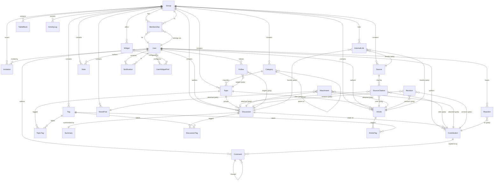

**Reading the diagram:** solid one-to-many crow's-feet are true FKs; the `(poly)`-labeled edges are the discriminator-based polymorphic links whose integrity is enforced in the service layer (§7.6). The three "hard" relationships to study before implementing are (1) **Membership** as the User×Group×Role hinge that all RBAC hangs from, (2) the **Discussion → Contribution → Comment** three-tier hierarchy with reserved future anchoring, and (3) the **polymorphic quartet** (SourceCitation, Attachment, InternalLink, Revision) that keeps the schema extensible without a table-per-parent explosion.

---

## 8. Folder / Project Structure

This section defines the on-disk layout for the Next.js (App Router) codebase. The structure is **feature-oriented, not layer-oriented**: routing lives in `app/`, but the *substance* of each capability (topics, discussions, sources…) lives in a self-contained `features/` module that owns its own components, server logic, validation schemas, and hooks. This is the single most important decision for a codebase meant to grow for years and later split into a multi-tenant platform — you can grow, move, or extract a whole feature without spelunking through four parallel `components/ / hooks/ / services/` trees.

### 8.1 Guiding conventions

| # | Convention | Why |
|---|---|---|
| 1 | **Feature = folder.** Each feature under `features/` is a vertical slice owning `components/`, `server/`, `schema/`, `hooks/`, `queries/`. | Cohesion by domain, not by technical layer. A feature is understandable and extractable in isolation. |
| 2 | **`app/` is thin.** Route files (`page.tsx`, `layout.tsx`, `route.ts`) wire URLs to feature code and do auth/tenant gating — they contain almost no business logic. | Routing stays a stable skeleton; logic churns inside `features/` without moving URLs. |
| 3 | **`lib/` = cross-cutting infrastructure singletons** (db, auth, storage, search, ai, i18n strings). Features depend on `lib/`; `lib/` never imports a feature. | One-directional dependency graph. Swapping Postgres FTS → Meilisearch, or R2 → another S3, touches `lib/`, not features. |
| 4 | **`components/ui/` = design system only** (Button, Dialog, Field…). No domain knowledge. | Reusable, themeable, testable. The RTL + Hebrew typography primitives live here once. |
| 5 | **Server-first.** Data reads happen in Server Components/queries; mutations happen in **Server Actions**; only external-facing or streaming endpoints use **Route Handlers** (§8.4). | Matches the canonical Next.js server-actions + route-handlers decision; keeps client bundles small. |
| 6 | **Every query/action is tenant-scoped.** All DB access flows through a `withTenant(ctx)` helper that injects `groupId`; no feature writes a raw `where` without it. | Row-level multi-tenancy from day 1 is enforced structurally, not by discipline. |
| 7 | **No user-facing string is hardcoded.** All copy resolves through `lib/i18n` / `strings/he.ts`. V1 ships Hebrew only. | i18n-ready without i18n complexity today (§8.6). |
| 8 | **`@/` path alias** to the project root; features import via `@/features/discussions/...`. | Stable, grep-able imports; no `../../../` chains. |

### 8.2 Top-level tree

```text
beit-midrash/
├─ app/                      # App Router: routing skeleton only (RTL root layout, route groups)
├─ features/                 # ★ the product, sliced by domain
├─ lib/                      # cross-cutting infrastructure (db, auth, storage, search, ai, i18n)
├─ components/               # design system (ui/) + shared app chrome
├─ strings/                  # Hebrew copy dictionaries, i18n-ready
├─ prisma/                   # schema, migrations, seed
├─ styles/                   # Tailwind entry, design tokens, Hebrew font faces
├─ tests/                    # e2e + integration (unit tests live beside code)
├─ scripts/                  # one-off / ops scripts (backfills, reindex)
├─ types/                    # global ambient types, module augmentation
├─ public/                   # static assets, fonts (Frank Ruhl Libre, Heebo…)
├─ middleware.ts             # session + tenant resolution at the edge
├─ next.config.ts
├─ tailwind.config.ts
├─ tsconfig.json             # "@/*" path alias, strict: true
├─ vitest.config.ts
├─ playwright.config.ts
├─ eslint.config.mjs         # incl. import-boundary rules (§8.7)
└─ .env / .env.example
```

### 8.3 `app/` — routing skeleton with route groups

Route groups `(auth) / (app) / (admin)` partition the app by layout and access level **without affecting the URL** (parentheses folders are non-routing). The `[group]` future segment is stubbed but inactive in V1 (single seeded Group resolved from session), so the URL structure is already tenant-shaped.

```text
app/
├─ layout.tsx               # ROOT: <html dir="rtl" lang="he">, font vars, theme + <Providers>
├─ globals.css
├─ not-found.tsx
├─ error.tsx
│
├─ (auth)/                  # unauthenticated: minimal centered layout
│  ├─ layout.tsx
│  ├─ sign-in/page.tsx      # התחברות — magic-link (+ optional password)
│  └─ invite/[token]/page.tsx   # הזמנה — accept invitation
│
├─ (app)/                   # authenticated member shell: RTL sidebar/topbar, search, notifications
│  ├─ layout.tsx            # requires session + membership; sets tenant context
│  ├─ page.tsx              # לוח מחוונים (dashboard) — configurable widgets
│  ├─ topics/               # נושאים
│  │  ├─ page.tsx
│  │  └─ [topicId]/page.tsx
│  ├─ discussions/          # דיונים
│  │  ├─ page.tsx
│  │  └─ [discussionId]/page.tsx      # thread + Contributions + (future) anchored Comments
│  ├─ sources/              # מקורות — Source browser + citations
│  ├─ articles/             # מאמרים
│  ├─ feed/                 # מבזקים (news feed) — NewsPosts, separate from discussions
│  ├─ files/                # קבצים — Attachments (files/images/PDFs)
│  ├─ search/page.tsx       # חיפוש — SearchService results
│  └─ settings/             # profile, notification prefs, widget prefs
│
├─ (admin)/                 # ניהול — owner/admin only
│  ├─ layout.tsx            # requireRole('admin')
│  ├─ members/page.tsx      # Memberships + Roles + Invitations
│  ├─ group/page.tsx        # Group settings (Beit Midrash config)
│  └─ activity/page.tsx     # ActivityLog / audit
│
└─ api/                     # Route Handlers ONLY (see §8.4)
   ├─ auth/[...nextauth]/route.ts
   ├─ uploads/presign/route.ts        # presigned R2 upload URL
   ├─ search/route.ts                 # optional client-driven / typeahead search
   ├─ webhooks/route.ts               # future: inbound integrations
   └─ ai/chat/route.ts                # future: streaming AI responses (SSE)
```

### 8.4 Server Actions vs. Route Handlers — the rule

The decision is mechanical, so nobody debates it in review:

| Use **Server Action** (`features/*/server/*.actions.ts`) | Use **Route Handler** (`app/api/**/route.ts`) |
|---|---|
| Mutations triggered by the user's own UI (create Discussion, add Contribution, edit Note, upload metadata) | Third-party/webhook callers (Sefaria sync, payment, inbound mail) |
| Progressive-enhancement forms, optimistic UI | Non-HTML responses: streaming (SSE for AI), file/redirect responses |
| Anything that benefits from `revalidatePath` / `revalidateTag` | Auth.js internal routes (`[...nextauth]`) |
| Default choice for internal writes | Anything a *non-browser* client must call, or that needs a stable public URL/contract |

Every Server Action begins with the same guard trio: **authenticate → resolve tenant → authorize role → validate input (Zod)** before touching the DB.

### 8.5 `features/` — the vertical slice

Every feature has the same predictable internal shape. Contributor muscle memory transfers from one feature to the next.

```text
features/
├─ discussions/
│  ├─ components/           # DiscussionThread.tsx, ContributionCard.tsx, ContributionEditor.tsx (client)
│  ├─ server/
│  │  ├─ discussions.queries.ts   # read fns (Server Components) — tenant-scoped
│  │  ├─ discussions.actions.ts   # "use server" mutations
│  │  └─ discussions.policy.ts    # can(user, 'edit', discussion) authorization
│  ├─ schema/
│  │  └─ discussion.schema.ts      # Zod: input validation + inferred types
│  ├─ hooks/                       # client-only hooks (useDiscussionDraft…)
│  └─ index.ts                     # public surface of the feature (barrel)
│
├─ topics/            # נושאים — Topic, Category, Tag
├─ sources/           # מקורות — Source, SourceCitation (Sefaria-aligned ref model)
├─ articles/          # מאמרים — Article
├─ search/            # SearchService consumers, result rendering, filters
├─ feed/              # מבזקים — NewsPost
├─ files/             # Attachment upload flow (presign → confirm), thumbnails
├─ editor/            # shared TipTap config: RTL, custom nodes (citation, table, internal-link, attachment)
├─ notifications/     # Notification, Follow, Reaction
├─ dashboard/         # Widget, UserWidgetPref (Hebrew date, zmanim, weather…)
├─ members/           # Membership, Role, Invitation (admin)
└─ ai/                # future — AIConversation/AIMessage UI, RAG client (dormant, scaffolded)
```

Notes:
- **`features/editor/`** is shared, not per-feature: the TipTap schema and custom ProseMirror nodes (SourceCitation, TableBlock, InternalLink, Attachment) are one canonical definition reused by discussions, articles, notes, and summaries. Duplicating the editor per feature would be the classic mistake.
- **`features/ai/`** exists in V1 as an empty-but-wired shell so the eventual RAG work drops into a known home rather than reshaping the tree later.

### 8.6 `lib/` and `strings/` — infrastructure & i18n-readiness

```text
lib/
├─ db/
│  ├─ client.ts          # Prisma singleton (dev hot-reload safe)
│  └─ tenant.ts          # withTenant(ctx) → injects groupId into every query
├─ auth/
│  ├─ auth.ts            # Auth.js (NextAuth v5) config
│  ├─ session.ts         # getSession / requireSession
│  └─ rbac.ts            # requireRole, permission matrix (owner/admin/editor/member/guest)
├─ storage/
│  └─ r2.ts              # S3-compatible client, presign, key conventions
├─ search/
│  ├─ search.service.ts  # SearchService interface (the abstraction)
│  └─ postgres.ts        # V1 impl: tsvector('simple') + pg_trgm; Meili/Typesense later
├─ ai/
│  └─ ai.service.ts      # provider-agnostic AIService; Anthropic default; no-op in V1
├─ i18n/
│  ├─ config.ts          # locales: ['he'] today; dir/locale resolution
│  └─ t.ts               # t(key) resolver → strings/*
├─ validation/           # shared Zod primitives (id, pagination, hebrewText)
└─ utils/                # bidi helpers, date/Hebrew-calendar, formatting

strings/
├─ he.ts                 # ★ single Hebrew dictionary — the only place UI copy lives
└─ index.ts              # typed keys; adding en.ts later requires zero call-site changes
```

**Why this is i18n-ready without i18n cost today:** call sites already use `t('discussions.new')` instead of the literal `'דיון חדש'`. V1 ships only `he.ts`, `dir="rtl"` is fixed at the root layout, and no locale routing exists. Adding a language later = add `en.ts` + a `[locale]` segment + flip `dir` from a lookup — the feature code never changes. Because every service (`search`, `ai`, `storage`) sits behind an interface in `lib/`, the "future" swaps (Meilisearch, pgvector RAG, dedicated CDN) are localized replacements, not rewrites.

### 8.7 Design system, prisma, testing, config

```text
components/
├─ ui/                   # Button, Input, Field, Dialog, DropdownMenu, Tabs, Toast, Skeleton…
│                        #   built on logical properties (ms-/me-, ps-/pe-) — RTL-correct by default
├─ typography/           # Prose.tsx (serif long-form), Heading, HebrewDate — reading-optimized
└─ layout/               # AppShell, Sidebar, Topbar, ThemeToggle (shared chrome)

prisma/
├─ schema.prisma         # all canonical entities; every content model carries groupId
├─ migrations/
└─ seed.ts               # seeds ONE Group + owner + roles (multi-tenant-ready, single-tenant seeded)

styles/
├─ tokens.css            # design tokens: color, spacing, radii; light + dark
└─ fonts.ts              # next/font: Frank Ruhl Libre (serif), Heebo (sans)

tests/
├─ e2e/                  # Playwright: RTL flows, auth, create-discussion journey
└─ integration/          # server actions + queries against a test Postgres

# unit tests live beside source: features/discussions/server/discussions.actions.test.ts
```

**Testing layout rationale:** unit tests co-locate with the code they cover (they move when the feature moves); cross-cutting **integration** (real Prisma + Postgres, tenant isolation, RBAC) and **e2e** (Playwright, real RTL browser flows) sit in top-level `tests/` because they span features. A dedicated tenant-isolation test suite — "member of Group A can never read Group B's rows" — is a first-class citizen from day 1.

### 8.8 Dependency direction (the rule that keeps it maintainable)

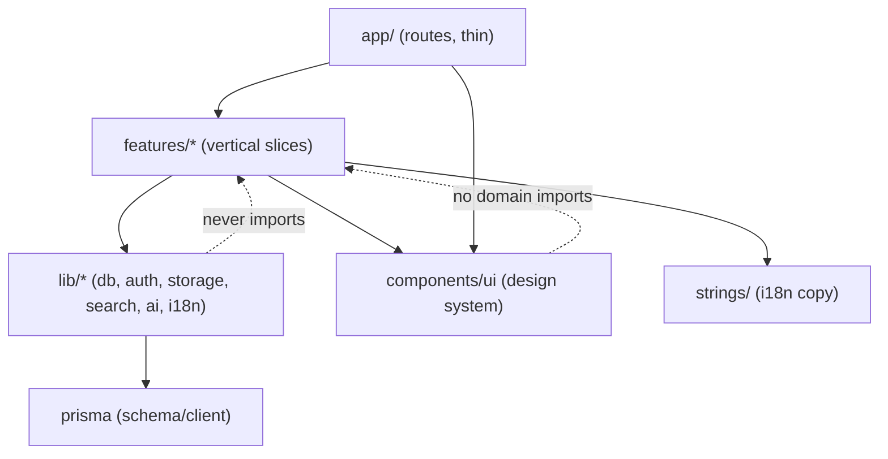

Dependencies point **downward only**: `app → features → lib/ui/strings → prisma`. `lib/` and `components/ui/` never import a feature, and features never import each other's internals (only each other's `index.ts` barrel, sparingly). This acyclic graph — enforced by ESLint import-boundary rules in `eslint.config.mjs` — is precisely what lets V1 stay small while guaranteeing that the eventual multi-tenant admin surface, the Meilisearch/pgvector swap, the AI feature, and additional locales all slot into named, already-reserved homes instead of forcing a reorganization.

---

## 9. Technology Stack

This section specifies the recommended stack for V1 and defends each pivotal choice for *this* project: a Hebrew-first (עברית תחילה), RTL, long-form content platform built by a small team, intended to run and grow for many years, and designed today to become a multi-tenant Digital Beit Midrash (בית מדרש דיגיטלי) tomorrow. Choices are optimized for three things in priority order: **(1) longevity and low operational surface**, **(2) extensibility toward the future capabilities**, and **(3) developer velocity for a small team**.

### 9.1 Stack at a Glance

| Layer | Choice (V1) | Version target | Why (one line) |
|---|---|---|---|
| Framework | **Next.js (App Router)** | 15.x (React 19) | Server Components + Server Actions unify data + UI; huge ecosystem; SSR is ideal for searchable, archived, SEO-able content. |
| Language | **TypeScript** | 5.5+ (strict) | Type safety across the full stack; shared types DB→UI. |
| UI runtime | **React** | 19.x | Server + Client Components; industry default, long support horizon. |
| Database | **PostgreSQL** | 16.x (17 acceptable) | Relational integrity for a richly linked domain; FTS + extensions cover V1 search; pgvector path for future AI. |
| ORM | **Prisma** | 5.18+ (→6.x) | Type-safe schema + migrations; readable models for a small team; strong tooling. |
| Auth | **Auth.js (NextAuth v5)** | 5.0 (beta→GA) | Self-hosted, invite-only magic-link, RBAC per Group; no per-MAU vendor cost. |
| Object storage | **Cloudflare R2** (S3 API) | — | S3-compatible, **zero egress fees**, presigned direct uploads. |
| Rich editor | **TipTap (ProseMirror)** | 2.x | RTL-capable structured JSON; custom nodes for citations/tables/links. |
| Styling | **Tailwind CSS** (logical props) | 3.4+ (4.x when stable) | RTL via logical properties; design tokens; light/dark. |
| UI primitives | **Radix UI** + **shadcn/ui** pattern | current | Accessible, unstyled primitives; we own the components (no lock-in). |
| Server state | **TanStack Query** (client islands only) | 5.x | For interactive client data; most reads go through Server Components. |
| Client state | **Zustand** (sparingly) | 4.x | Light local UI state (editor, dashboard layout) without Redux weight. |
| Validation | **Zod** | 3.23+ | One schema for forms, Server Actions, and API boundaries. |
| Forms | **React Hook Form** + Zod resolver | 7.x | Performant forms; shared validation with server. |
| Background jobs | **BullMQ + Redis** (Upstash) | current | Future async: transcription, thumbnails, embeddings, notifications. |
| Email | **Resend** + **React Email** | current | Magic links + notifications; templated in JSX; good deliverability. |
| Hosting | **Vercel** + **Neon** (Postgres) + **R2** | — | Zero-ops V1; Docker-on-VPS documented as the full-control alternative. |
| Observability | **Sentry** + **Vercel Analytics** + **pino** logs | current | Errors, web vitals, structured logs from day one. |
| Testing | **Vitest** + **Testing Library** + **Playwright** | current | Unit/component + E2E; Playwright validates RTL/bidi in real browsers. |
| CI/CD | **GitHub Actions** | — | Lint, typecheck, test, `prisma migrate` gate, preview deploys. |
| Tooling | **ESLint + Prettier**, **pnpm** | current | Consistent code; fast, disk-efficient installs. |

### 9.2 System Shape

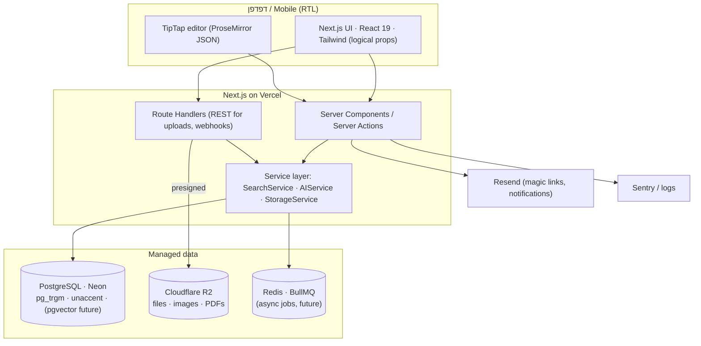

### 9.3 Pivotal Choices — Alternatives Weighed

#### Framework: Next.js vs Remix vs SvelteKit — **confirmed: Next.js**

| Criterion | **Next.js (App Router)** | Remix / React Router 7 | SvelteKit |
|---|---|---|---|
| Server-render long-form content | Excellent (RSC streaming) | Excellent (loaders) | Excellent |
| Data mutations | Server Actions (co-located) | Actions (web-standard forms) | Form actions |
| Ecosystem / hiring pool | Largest in React | Growing | Smaller |
| Editor/library availability (TipTap, Radix) | First-class React | React | Svelte ports, thinner |
| AI/RAG examples & SDKs | Most abundant | Some | Fewer |
| Hosting flexibility | Vercel-first, self-hostable | Very portable | Very portable |
| Long-horizon risk | Low (backed, dominant) | Low-med | Med (smaller talent pool) |

**Decision & defense:** Keep **Next.js**. It is the correct pick here, not merely the user's preference. The domain is content-heavy, searchable, and archived — server rendering with React Server Components gives fast first paint on long Hebrew reading pages and keeps most data-fetching on the server (no client waterfall). Server Actions collapse the form→mutation→revalidate loop, which suits a small team. The React ecosystem gives us mature, RTL-capable building blocks (TipTap, Radix) that Svelte cannot match, and the largest hiring pool for a multi-year project. The honest trade-off is App Router's complexity (RSC vs Client Component boundaries, caching semantics that changed across 13→15) and a degree of Vercel gravity — both mitigated in §9.6.

#### ORM: Prisma vs Drizzle — **Prisma**

| Criterion | **Prisma** | Drizzle |
|---|---|---|
| Schema readability (small team) | High (declarative `schema.prisma`) | Med (TS schema, more verbose) |
| Migrations | Mature (`prisma migrate`) | Good (drizzle-kit), younger |
| Type-safety | Strong (generated client) | Strong (inferred, closer to SQL) |
| Raw SQL / complex queries | Improving; `$queryRaw` escape hatch | Excellent (thin over SQL) |
| pgvector / FTS ergonomics | Needs raw SQL for tsvector/vector ops | More natural for hand-written SQL |
| Maturity / stability | Very mature | Mature-ish, fast-moving |

**Decision & defense:** **Prisma** for V1. A readable, declarative schema is a real asset for a small team modeling a large domain (25+ entities). Migrations and tooling are battle-tested. The known weakness — advanced Postgres features like `tsvector` and future `pgvector` — is handled by dropping to `$queryRaw` **behind the `SearchService`/`AIService` abstractions**, so raw SQL is localized, not sprinkled. Drizzle is the strongest alternative and would shine on the search/vector queries; if those queries dominate later, adopting Drizzle *alongside* Prisma for those hot paths is a viable, low-regret escalation.

#### Database: PostgreSQL vs MongoDB — **PostgreSQL**

| Criterion | **PostgreSQL** | MongoDB |
|---|---|---|
| Relational integrity (Group→Membership→Content→Citation) | Native, enforced FKs | App-enforced |
| Row-level multi-tenancy (`groupId` everywhere) | Natural + RLS option later | Possible, less rigorous |
| Full-text + fuzzy Hebrew | `tsvector` + `pg_trgm` + `unaccent` in-DB | Atlas Search (managed lock-in) |
| Rich JSON content (ProseMirror doc) | `jsonb` (best of both) | Native documents |
| Future semantic search | **pgvector** in same DB | Separate/Atlas vector |
| Versioning/audit (Revision, ActivityLog) | Straightforward relational | Doable, less natural |

**Decision & defense:** **PostgreSQL**, decisively. The domain is a dense graph of relationships (citations linking sources to any entity, memberships, follows, revisions) — exactly what a relational DB with enforced foreign keys protects. Crucially, Postgres also stores the TipTap document as `jsonb`, so we get document flexibility *and* relational integrity in one engine. It uniquely lets V1 search (`tsvector` + `pg_trgm` + `unaccent`) and the future AI layer (`pgvector`) live in the **same database**, avoiding a second datastore for years. Mongo would trade away integrity and force managed Atlas Search for Hebrew FTS — more lock-in, not less.

#### Auth: Auth.js (NextAuth v5) vs Clerk — **Auth.js**

| Criterion | **Auth.js v5** | Clerk |
|---|---|---|
| Cost model | Free, self-hosted | Per-MAU pricing |
| Data ownership (users in *our* Postgres) | Yes (Prisma adapter) | Data at vendor |
| Invite-only magic-link V1 | Straightforward | Straightforward |
| Per-Group RBAC (owner/admin/editor/member/guest) | We model it (fits multi-tenancy) | Orgs feature, but vendor-shaped |
| Hebrew/RTL custom auth UI | Full control | Themeable, less control |
| Setup effort | Higher (we wire it) | Lower (drop-in) |
| Long-term lock-in | Minimal | Higher |

**Decision & defense:** **Auth.js v5**. For a private, invite-only group that will become multi-tenant, we want **users and roles in our own Postgres**, RBAC modeled as `Membership`+`Role` scoped per `Group`, and no per-MAU meter as the platform grows to many groups. Auth.js gives magic-link (primary) + optional password, secure-cookie sessions, and a Prisma adapter that keeps identity co-located with content. The cost is more wiring and owning security-sensitive flows — acceptable and, for tenancy control, necessary. The main watch item is that **NextAuth v5 is in late beta**; pin an exact version and gate upgrades (see §9.6).

#### Object storage: Cloudflare R2 vs AWS S3 — **R2**

| Criterion | **Cloudflare R2** | AWS S3 |
|---|---|---|
| Egress fees | **$0** | Charged per GB out |
| API compatibility | S3-compatible | S3 (reference) |
| Presigned direct uploads | Yes | Yes |
| Ecosystem maturity | Growing | Deepest |
| CDN integration | Native (Cloudflare) | Via CloudFront (extra) |
| Cost predictability | High | Variable with traffic |

**Decision & defense:** **R2**. A content archive with images and PDFs will be read far more than written; **zero egress** makes long-term serving costs predictable, which matters over a multi-year horizon. It speaks the S3 API, so the `StorageService` abstraction keeps S3 as a drop-in fallback if we ever need AWS-native services. Presigned uploads keep large files off our serverless functions.

#### Hosting: Vercel vs VPS/Docker — **Vercel for V1, Docker documented**

| Criterion | **Vercel (V1)** | Docker on VPS |
|---|---|---|
| Ops burden (small team) | Minimal (managed) | You run it |
| Preview deploys / DX | Best-in-class | Manual |
| Next.js fidelity | First-party | Good (standalone output) |
| Cost at scale | Rises with usage | Flat, cheaper at scale |
| Background workers / cron | Limited (needs external Redis/queue) | Native |
| Control / no lock-in | Lower | Full |

**Decision & defense:** Ship V1 on **Vercel + Neon + R2** — near-zero ops lets the small team spend effort on the product, and preview deploys make review painless. Because Next.js can emit a **standalone** server, we keep a documented **Docker-on-VPS** path (app + Postgres + Redis) as the full-control, flat-cost alternative for when tenant count and background work (transcription, embeddings) make always-on workers and predictable billing attractive. Neon (serverless Postgres, branching) is the V1 pick; **Supabase** is the equally valid alternative if we later want its built-in auth/storage/realtime.

### 9.4 Supporting Choices (briefly justified)

- **Styling — Tailwind + logical properties + Radix/shadcn:** Logical properties (`ms-`, `me-`, `ps-`, `pe-`, `start/end`) make RTL a first-class default rather than a mirrored afterthought. Design tokens drive light/dark and the Hebrew font stack (serif for reading — Frank Ruhl Libre / Noto Serif Hebrew; sans for UI — Heebo / Assistant / Rubik). We own components (shadcn pattern over Radix primitives) — accessible, no vendor lock-in.
- **Editor — TipTap:** Structured ProseMirror JSON is the right substrate for custom nodes (`Source` citations, `TableBlock`, `InternalLink`, `Attachment`) and for deriving a plain-text/HTML rendering for search. RTL and bidi are configurable. Store JSON as the source of truth plus a derived text column for `tsvector`.
- **Validation — Zod (+ React Hook Form):** One schema validates the form, the Server Action, and the API boundary — no drift between client and server. This is the safety net for user-generated Hebrew content and uploads.
- **Data-fetching/state:** Prefer **Server Components** for reads (no client fetching library needed for most pages). Use **TanStack Query** only in interactive client islands (search-as-you-type, notifications), and **Zustand** for local UI state (editor session, dashboard widget layout). This keeps client bundles small.
- **Background jobs — BullMQ + Redis (Upstash):** Not core V1, but the queue is scaffolded now so future async work (voice transcription, thumbnail/image pipeline via `sharp`, embedding generation, notification fan-out) has a home without re-architecting.
- **Email — Resend + React Email:** Magic-link auth and notifications share JSX-templated, RTL-aware emails with good deliverability.
- **Observability — Sentry + pino + Vercel Analytics:** Error tracking, structured logs, and Core Web Vitals from day one — long-form reading performance is a product feature, so we measure it.
- **Testing — Vitest + Testing Library + Playwright:** Unit/component speed from Vitest; **Playwright** is specifically valuable here to assert real-browser **RTL layout and bidi** correctness (mixed Hebrew/Latin/numbers/source refs) that unit tests can't catch.
- **CI — GitHub Actions:** lint → typecheck → test → `prisma migrate` check, with Vercel preview deploys per PR.

### 9.5 Version Considerations

| Component | Target | Note |
|---|---|---|
| Next.js / React | 15.x / 19.x | App Router + RSC are stable; caching semantics shifted across majors — pin and read release notes before upgrading. |
| NextAuth (Auth.js) | v5 (0.x / beta→GA) | **Highest version risk.** Pin exact version; isolate behind an auth module; upgrade deliberately. |
| Prisma | 5.18+ (→6) | Enable `postgresqlExtensions` preview for `pg_trgm`/`unaccent`; plan the v6 bump. |
| Tailwind | 3.4 now; 4.x later | v4 changes config model — adopt after it stabilizes and RTL logical-property usage is verified. |
| PostgreSQL | 16 (17 ok) | Confirm `pg_trgm`, `unaccent`, and (future) `pgvector` are available on the managed provider (Neon supports them). |
| pnpm / Node | pnpm current, Node 20 LTS | Match Vercel's supported Node runtime. |

### 9.6 Key Risks & Mitigations

| Risk | Impact | Mitigation |
|---|---|---|
| **NextAuth v5 pre-GA churn** | Auth breakage on upgrade | Pin exact version; wrap in an auth module; upgrade only with a full auth E2E pass. |
| **App Router / RSC caching complexity** | Subtle stale-data or perf bugs | Team convention doc on `cache`/`revalidate`; lean on Server Actions + explicit `revalidatePath`. |
| **Prisma vs advanced Postgres (FTS, pgvector)** | Awkward raw SQL | Localize raw SQL inside `SearchService`/`AIService`; consider Drizzle for hot query paths later. |
| **Vercel cost/lock-in as tenants grow** | Rising bills, worker limits | Keep app portable (standalone output); documented Docker-on-VPS exit; storage already on R2, not Vercel Blob. |
| **Hebrew search quality (no PG stemmer)** | Weaker recall in FTS | `simple` config + `pg_trgm` + `unaccent` for V1; `SearchService` abstraction enables Meilisearch/Typesense swap later. |
| **RTL/bidi regressions** | Broken reading UX | Logical properties enforced by lint; Playwright RTL snapshot tests on mixed-script content. |
| **Small team, broad stack** | Maintenance load | Favor managed services (Neon, R2, Resend, Vercel) in V1 to minimize ops; defer self-hosting until scale justifies it. |

**Bottom line:** The canonical stack is sound and internally coherent for a Hebrew-first, multi-year, extensibility-driven platform. Next.js is confirmed and defended; PostgreSQL is the load-bearing choice that lets V1 search and future AI share one datastore; Prisma, Auth.js, R2, and Vercel each optimize for a small team's velocity now while preserving clean exits (Drizzle, self-hosted Docker, alternate search engine) later — with **NextAuth v5's pre-GA status** as the single risk warranting the most discipline.

---

## 10. Authentication & Authorization

Authentication answers *who is this user*; authorization answers *what may this user do inside this Group*. In our design the two are cleanly separated: Auth.js owns identity and sessions, while a small in-house RBAC layer owns per-Group permissions. Both are built multi-tenant-ready from day 1 even though V1 seeds a single Group (בית מדרש / Beit Midrash).

### 10.1 Auth.js (NextAuth v5) setup

| Aspect | Decision (V1) |
|---|---|
| Library | Auth.js / NextAuth v5, self-hosted inside the Next.js App Router |
| Adapter | `@auth/prisma-adapter` — Auth.js `User`, `Account`, `Session`, `VerificationToken` tables live in the same Postgres, alongside our domain `User` |
| Primary sign-in | Email **magic link** (קישור כניסה / passwordless email) |
| Optional sign-in | Password (Credentials provider, Argon2id hashes) — off by default, enabled per deployment |
| Config surface | `auth.ts` exporting `handlers`, `auth`, `signIn`, `signOut`; route handler at `app/api/auth/[...nextauth]/route.ts` |
| Session read | Server components / server actions call `auth()`; never trust client-passed identity |

**User model note.** Auth.js `User` and our canonical `User` are the *same* row (extended Prisma model). Group scoping lives on `Membership`, **not** on `User` — a User is a global identity that may belong to zero, one, or many Groups. V1 uses exactly one Membership per user, but the schema does not assume it.

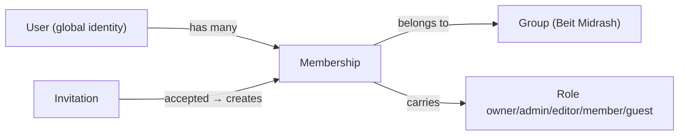

### 10.2 Invite-only onboarding & the Invitation flow (V1)

V1 is a **closed, private** chevruta. There is no public sign-up page. Every account originates from an `Invitation` issued by an `owner` or `admin`.

**Invitation entity (essentials):** `id`, `groupId`, `email`, `role` (the role granted on acceptance), `token` (hashed), `invitedByUserId`, `expiresAt` (default 7 days), `acceptedAt`, `revokedAt`, `status` (`pending | accepted | expired | revoked`).

Flow:

1. Admin enters an email + target role in ניהול חברים (member management). We store a **hash** of a random token (never the raw token) and email the raw token as a signed link.
2. Invitee opens the link → we validate token hash, expiry, and `status = pending`.
3. Invitee authenticates via magic link **to the invited email** (the invite email and the auth email must match — this binds the invitation to a verified inbox).
4. On success we create (or reuse) the global `User`, create the `Membership` with the invited `Role`, mark the Invitation `accepted`, and write an `ActivityLog` entry.
5. If the email already has a Membership in this Group, the invite is rejected as redundant.

Guardrails: single active invitation per (groupId, email); resend rotates the token and extends expiry; `owner`/`admin` can revoke; expired/revoked tokens fail closed. Invitations are themselves group-scoped rows and count toward the audit log.

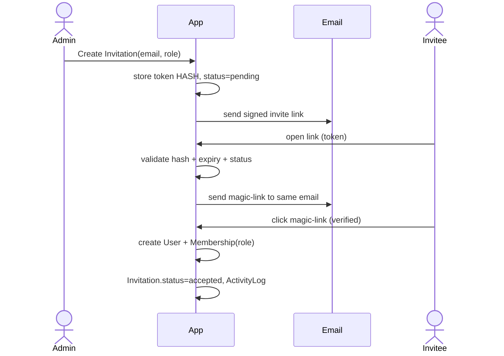

### 10.3 Sign-in methods

| Method | V1 | Notes |
|---|---|---|
| Email magic link | ✅ Primary | Short-lived, single-use `VerificationToken`; 10–15 min TTL; one-time consumption |
| Password (Credentials) | ◐ Optional | Argon2id; only meaningful for users who set one; rate-limited; never the onboarding path |
| OAuth / SSO (Google, Apple) | ⏳ Future | Provider plug-ins already supported by Auth.js; add without schema change via `Account` table |
| Organization SSO (SAML/OIDC) | ⏳ Future | Relevant when a Group is an institution; gated behind multi-tenant billing tier |

Magic-link hardening: bind token to the requested email, invalidate on use, throttle requests per email/IP, and show a neutral "check your inbox" response regardless of whether the email exists (no account enumeration).

### 10.4 Session strategy & security

| Control | Decision |
|---|---|
| Session store | **Database sessions** via Prisma adapter (server-side, revocable) — preferred over JWT so we can force-logout, revoke on role change, and audit active sessions |
| Cookie flags | `HttpOnly`, `Secure`, `SameSite=Lax`, host-prefixed (`__Host-`) session cookie |
| CSRF | Auth.js built-in CSRF token for auth routes; **all mutations go through server actions / route handlers** that re-check `auth()` server-side, so cookies alone never authorize a write |
| Session lifetime | Rolling 30-day expiry, refreshed on activity; absolute cap re-evaluated at each request |
| Rotation | New session row on each successful sign-in; session invalidated on sign-out, on password change, and on Membership role/removal changes |
| Transport | HTTPS only (HSTS at the edge on Vercel / VPS) |
| Secrets | `AUTH_SECRET` from env/secret manager; rotated on a documented schedule |

Because sessions are DB-backed, a "Sign out everywhere" and an admin "revoke sessions" capability are straightforward (delete session rows). This matters for a private group where a lost device must be cut off immediately.

### 10.5 RBAC model — roles per Group

Roles are **scoped to a Group via `Membership.role`**, never global. The same User could be `owner` in one Beit Midrash and `guest` in another (future multi-group). Roles form a strict hierarchy of increasing capability:

| Role (Hebrew) | Gloss | Intended for |
|---|---|---|
| `owner` (בעלים) | Owner | Founder of the group; billing/tenant-level control |
| `admin` (מנהל) | Admin | Runs day-to-day: invites, members, moderation |
| `editor` (עורך) | Editor | Trusted contributor who curates content beyond their own |
| `member` (חבר) | Member | Standard study participant; creates & edits own content |
| `guest` (אורח) | Guest | Read-mostly observer; limited participation |

Role is a canonical `Role` (enum-backed) referenced by `Membership`. We keep roles coarse in V1; a fine-grained `Permission` table is a documented future extension (feature-flag / per-Group custom roles) that slots in without changing enforcement call-sites, because all checks route through a single `can(user, action, resource)` helper.

### 10.6 Permissions matrix

Legend: ✅ any such row · **Own** = only rows the user authored · ➖ none.

| Capability | owner | admin | editor | member | guest |
|---|---|---|---|---|---|
| View content (Topics, Discussions, Sources, News, Articles, Notes) | ✅ | ✅ | ✅ | ✅ | ✅ |
| Create Topic / Category / Tag | ✅ | ✅ | ✅ | ✅ | ➖ |
| Edit / delete Topic | ✅ | ✅ | ✅ | Own | ➖ |
| Post Contribution (opinion in a Discussion) | ✅ | ✅ | ✅ | ✅ | ➖ |
| Edit / delete Contribution | ✅ | ✅ | ✅ | Own | Own |
| Create / edit Discussion, Summary, Article, Note, TableBlock | ✅ | ✅ | ✅ | Own | ➖ |
| Add Source / SourceCitation | ✅ | ✅ | ✅ | ✅ | ➖ |
| Edit / delete Source | ✅ | ✅ | ✅ | Own | ➖ |
| Upload Attachment (file/image/PDF) | ✅ | ✅ | ✅ | ✅ | ➖ |
| Create / edit / delete NewsPost (חדשות) | ✅ | ✅ | ✅ | ➖ | ➖ |
| React / Follow | ✅ | ✅ | ✅ | ✅ | ✅ |
| Moderate (edit/soft-delete others' content, pin, lock) | ✅ | ✅ | ◐ editor: content only, not members | ➖ | ➖ |
| Invite users (create Invitation) | ✅ | ✅ | ➖ | ➖ | ➖ |
| Manage members (change roles, remove) | ✅ | ✅ (not owners) | ➖ | ➖ | ➖ |
| Manage Group settings / widgets defaults | ✅ | ✅ | ➖ | ➖ | ➖ |
| Transfer ownership / delete Group | ✅ | ➖ | ➖ | ➖ | ➖ |
| View ActivityLog / audit | ✅ | ✅ | ➖ | ➖ | ➖ |

Notes: (1) **Own** rows are always additionally editable by `editor`/`admin`/`owner` for moderation. (2) An `admin` cannot modify or remove an `owner`, and cannot promote anyone to `owner`. (3) Deletes are **soft-delete** (§ links to Revision/soft-delete), so "delete" means hide + audit, not destroy.

### 10.7 How authorization is enforced

Defense in depth — four layers, each failing closed. **Middleware is a coarse gate, never the security boundary; the server action / data layer is.**

1. **Edge middleware (`middleware.ts`)** — cheap gatekeeping: redirect unauthenticated requests to `/signin`, keep the whole app private (no anonymous browsing in V1). Not trusted for row-level decisions.
2. **Server-action / route-handler guards** — every mutation begins with `const { user, membership } = await requireMembership(groupId)` then `assertCan(membership.role, action, resource)`. A helper `can(role, action, resourceOwnerId?)` centralizes the matrix above so rules live in one place.
3. **Prisma query scoping by `groupId`** — all reads/writes go through a per-request **tenant-scoped Prisma client** (Prisma Client Extension / `$extends`) that injects `where: { groupId }` and forbids cross-tenant access by construction. No query touches data without a `groupId`. Ownership checks (`authorId === user.id`) are applied for **Own**-level permissions.
4. **Data invariants** — every content table has a non-null `groupId` FK; composite indexes lead with `groupId`; soft-deleted and revision rows are also scoped. Even a logic bug in layer 2 cannot leak another Group's rows because layer 3 filters them out.

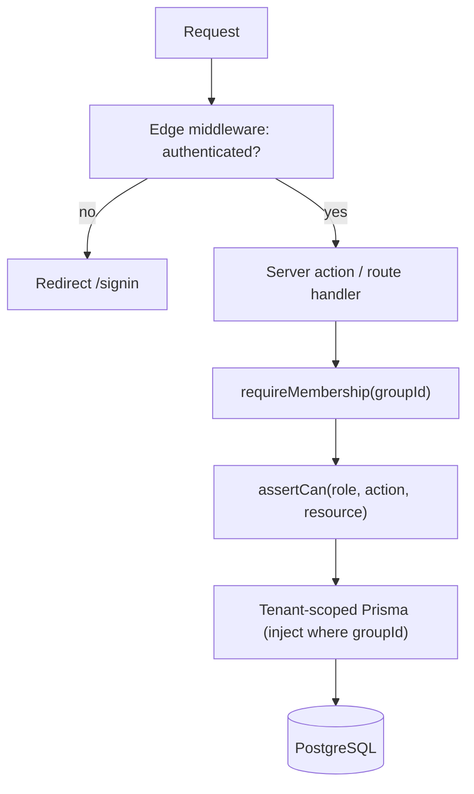

This same `can()` function is imported by the UI to hide/disable controls the user can't use — but the UI check is cosmetic; the server re-checks unconditionally.

### 10.8 Protecting file / download URLs

Object storage (Cloudflare R2) is **private**; buckets are never public. The DB stores only object keys + metadata on `Attachment`.

- **Uploads:** client requests a short-lived **presigned PUT** from a server action that first verifies Membership + upload permission and stamps the target key with `groupId` (e.g. `g/{groupId}/att/{uuid}`).
- **Downloads / display:** served through a **presigned GET** minted per request (typically 60–300s TTL) by a route handler that checks the caller's Membership and that the `Attachment.groupId` matches the caller's Group. `next/image` loader points at this guarded endpoint.
- No durable public URLs, no "unguessable link = access". A leaked presigned URL expires quickly and is scoped to one object. PDFs and image thumbnails follow the same presign path.

### 10.9 Future: individual users, multi-group membership, OAuth

- **Group-less (individual) users:** because Group scoping lives on `Membership` (not `User`), an individual can exist as a User with a **personal Group** auto-provisioned at sign-up — no schema change, the same row-level model applies (a personal Beit Midrash of one).
- **Multi-group membership:** already supported — a User holds several `Membership` rows. UI adds a Group switcher (מעבר בין קבוצות); the active `groupId` is resolved per request (from route segment `/[groupSlug]/...` or a selected-group cookie, then re-validated against Membership). Roles never cross Groups.
- **Public / semi-public groups & self-serve sign-up:** a future per-Group `joinPolicy` (`invite-only | request-to-join | open`) extends onboarding without touching the invite path V1 relies on.
- **OAuth/SSO & org SSO:** added via Auth.js providers and the existing `Account` table; no domain migration.

### 10.10 Account recovery

- **Magic-link users:** recovery == sign-in. "Forgot access" simply re-sends a magic link to the verified email; there is no password to reset. Neutral responses prevent enumeration.
- **Password users (optional):** standard reset via one-time, short-TTL, single-use token emailed to the verified address; using it invalidates existing sessions.
- **Lost email inbox:** because V1 is a small private group, recovery of a lost *inbox* is handled **administratively** — an `owner`/`admin` re-invites the person at a new email and removes the stale Membership. This avoids weak "security question" recovery vectors.
- **Future:** optional TOTP 2FA and admin-assisted recovery workflows; recovery-contact designation for owners.

### 10.11 Privacy for a private group

- **Closed by default:** no anonymous access, no public pages, no search-engine indexing (`noindex`, robots-disallow, auth-gated routes). Middleware blocks unauthenticated reads.
- **Tenant isolation:** every row carries `groupId`; the tenant-scoped Prisma client makes cross-group reads structurally impossible. Presigned file access is group-checked.
- **Least data:** we store email + display name; magic-link flow means most members never set a password. Voice recordings/transcripts (future) inherit the same group scoping and access rules.
- **Auditability:** `ActivityLog` records sign-ins, invitations, role changes, and moderation — visible only to `owner`/`admin`. Combined with revocable DB sessions, a compromised account can be cut off and its actions reviewed.
- **Data lifecycle:** deletes are soft (recoverable + audited); a documented hard-delete/export path (member offboarding, right-to-be-forgotten) is an admin operation, consistent with the Revision/soft-delete model.

---

## 11. File Storage

### 11.1 Objectives & Decision

File storage backs every `Attachment` (file/image/pdf), plus derived assets (thumbnails, optimised image variants, future PDF previews and extracted text). The design must be private-by-default, Group-scoped, cheap to run at V1 scale, and able to grow into a many-tenant Beit Midrash without re-keying existing objects.

**Decision: Cloudflare R2** (S3-compatible object storage) as the canonical store, with a thin `StorageService` abstraction so any S3 API-compatible backend (AWS S3, MinIO, Backblaze B2) is a drop-in swap.

| Criterion | Cloudflare R2 (chosen) | AWS S3 (alternative) |
|---|---|---|
| Egress fees | **None** — decisive for a read-heavy archive that lives for years | $0.09/GB after free tier; the silent cost killer |
| API compatibility | S3 API — reuse `@aws-sdk/client-s3` + presigner | Native |
| CDN | Built-in via Cloudflare edge; can bind a custom domain | Needs CloudFront wired up separately |
| Presigned uploads | Supported (`PutObject`, `POST` policy) | Supported |
| Free tier | 10 GB storage, generous Class A/B ops | 5 GB / limited months |
| Lock-in | Low (S3 API) | Moderate (egress makes leaving expensive) |

Why R2 wins for us: this is an **archival** knowledge base where the same Torah source PDFs, images and study sheets are read repeatedly for years. Zero egress means read traffic never becomes a cost surprise, and the S3 API keeps us portable. The `StorageService` interface (`getUploadUrl`, `getDownloadUrl`, `head`, `delete`, `copy`) means the VPS/self-host alternative can point at MinIO with no application changes.

> V1 pragmatism: a **single R2 bucket** with Group-scoped key prefixes. Per-tenant buckets are a future scaling lever (§11.11), not a V1 requirement.

### 11.2 Key / Namespacing Scheme

Every object key is scoped by `groupId` first, so multi-tenancy is enforced structurally, not just by a WHERE clause. Keys are opaque, unguessable, and never derived from user-supplied filenames.

```
g/{groupId}/{entityType}/{yyyy}/{mm}/{attachmentId}/{variant}.{ext}
```

| Segment | Purpose |
|---|---|
| `g/{groupId}` | Hard tenant boundary; enables per-Group listing, quota accounting, lifecycle rules, and future per-tenant bucket migration |
| `{entityType}` | `discussion`, `article`, `source`, `note`, `newspost`, `avatar`… — coarse routing & auditing |
| `{yyyy}/{mm}` | Time buckets keep any single prefix from growing unbounded; helps lifecycle rules |
| `{attachmentId}` | Prefix owns all variants of one upload (original + derivatives) so delete is a single prefix sweep |
| `{variant}` | `orig`, `thumb`, `md`, `lg`, `preview` (PDF page 1), etc. |

- Original filename is preserved **only** as `Attachment.originalName` metadata (for display and the `Content-Disposition` on download), never in the key.
- Keys and `groupId` are immutable once written. Moving content between Groups (rare/admin) is a server-side `copy` + re-record, not a rename.

### 11.3 Upload Flow (Presigned, Direct-to-Storage)

Clients upload **directly to R2** using a short-lived presigned URL. Bytes never transit the Next.js server, keeping serverless functions cheap and dodging body-size limits. The server's job is authorization, validation of the *declared* upload, minting the signed URL, and recording metadata.

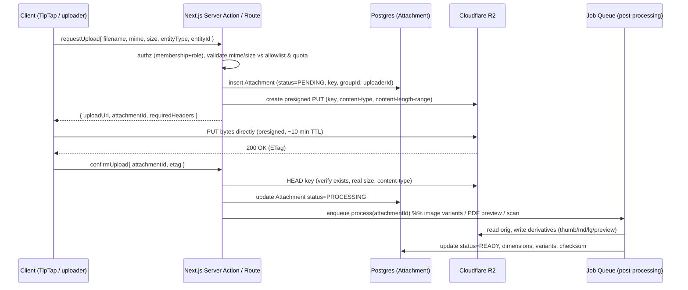

Key points:

- **Two-phase commit.** `Attachment` is created `PENDING` before the PUT and only becomes `READY` after server-side `HEAD` verification and processing. Abandoned `PENDING` rows are swept (§11.9).
- **Presign constraints.** The signed PUT pins `Content-Type` and a `content-length-range`, so the client cannot upload a different type or a 5 GB file against a 10 MB grant. TTL ~10 minutes.
- **Never trust the client's declared size/mime alone** — the server re-checks via `HEAD` (and the processing job sniffs magic bytes) before `READY`.
- In V1, post-processing runs in a queued job (BullMQ/Cloudflare Queues). Where a synchronous path is simpler (small avatar), the server may process inline, but the **contract stays async-ready**.

### 11.4 Supported Types & Per-Type Handling

| Category | Types (V1 allowlist) | Handling |
|---|---|---|
| Images | JPEG, PNG, WebP, GIF, SVG* | Validate, EXIF-strip, resize to variants, thumbnail (§11.5). *SVG sanitised (strip `<script>`/event handlers) or rejected in V1 if sanitiser not ready |
| PDF | application/pdf | Store original; generate page-1 preview image + thumbnail; reserve text extraction (§11.6) |
| Documents | DOCX, XLSX, PPTX, TXT, MD, CSV | Store + generic type-icon thumbnail; no server-side render in V1; download only |
| Audio (future) | m4a, mp3, ogg, webm | `VoiceRecording` → future transcription (`Transcript`); out of V1 scope |

An explicit **allowlist** (not a blocklist) is enforced by MIME **and** by magic-byte sniff on the server. Executables, archives, HTML, and anything not on the list are rejected. Filenames are sanitised for display; extensions are never trusted for type decisions.

### 11.5 Image Pipeline

Processing runs in the post-upload job using **sharp**; delivery uses **`next/image`** for responsive sizing and format negotiation.

1. **Validate** — magic-byte sniff, decode header, enforce max dimensions (e.g. ≤ 12 000 px/side) and a decompression-bomb guard (reject absurd pixel counts before full decode).
2. **EXIF / metadata strip** — remove all metadata (GPS, camera, timestamps) for privacy; honour orientation first by baking rotation into pixels (`sharp.rotate()`), then drop the tag.
3. **Normalise & optimise** — convert to a sane working format; produce WebP (and keep a broadly-compatible JPEG/PNG fallback).
4. **Variants** — generate a fixed ladder and record each in `Attachment.variants`:

| Variant | Longest edge | Use |
|---|---|---|
| `thumb` | 200 px | Lists, editor inline chips, cards |
| `md` | 800 px | In-reading embeds (mobile & column widths) |
| `lg` | 1600 px | Full-width / lightbox on desktop |
| `orig` | untouched | Preserved for archive & re-processing |

5. **Persist** dimensions, byte sizes, dominant colour/blur-hash (for graceful loading), and a content checksum (SHA-256) for dedup and integrity.

Keeping `orig` means the variant ladder can be regenerated later (e.g. adding AVIF, or a larger `xl`) without asking users to re-upload — important for a decade-long archive.

### 11.6 PDF Handling

| V1 | Future |
|---|---|
| Store original object; generate **page-1 preview** (raster) + `thumb` via a headless render (pdf → image). Show inline preview card with page count and title metadata. Download via signed URL. | **Text extraction** into a searchable field (feeds `SearchService` tsvector). **Chunk + embed** extracted text into `Embedding` (pgvector) for RAG. Selectable ranges to seed `SourceCitation` and `StudyCard`/`SourceSheet` generation. |

The extracted-text and embedding hooks are designed now (job pipeline + `Attachment.status` states) but **not implemented in V1** — the archive keeps originals, so extraction can be run retroactively.

### 11.7 Access Control

- **Buckets are 100% private.** No public-read. There is no anonymous URL that returns content.
- **Every read is a fresh presigned GET**, minted only after the server checks: valid session → active `Membership` in the object's `groupId` → role permits reading the owning entity. Authorization is on the **Attachment's `groupId`**, matched against the requester's membership — never inferred from the URL.
- **Short TTL** on download URLs (e.g. 5–15 min). URLs are not shareable long-term by design; a shared link expires. `Content-Disposition` carries the original filename.
- For hot public-ish assets *within a Group* (e.g. inline images in a long discussion the member is already authorised to read), we mint per-request signed CDN URLs; we do **not** make objects public. This preserves the private-Beit-Midrash guarantee even at CDN scale.
- Presigned **upload** URLs are equally gated: only members with an editor/member role on the target Group and entity get one.

### 11.8 Validation, Quotas & Malware Safety

| Control | V1 behaviour |
|---|---|
| Type validation | MIME allowlist + server-side magic-byte sniff; extension ignored |
| Size limits | Per-type caps (e.g. image 15 MB, PDF 50 MB, doc 25 MB) enforced in presign (`content-length-range`) **and** re-checked on `HEAD` |
| Per-Group quota | `Group.storageQuotaBytes` + running `storageUsedBytes` (maintained on `READY`/delete). Uploads rejected when over quota. V1 default generous; enforced from day 1 so it isn't retrofitted |
| Rate / abuse | Per-user upload rate limit on the presign endpoint |
| Malware safety (V1) | Private buckets + strict allowlist + magic-byte sniff + never executing/serving-as-HTML uploaded content (`Content-Type` forced, `X-Content-Type-Options: nosniff`); SVG sanitised or rejected |
| Malware scanning (future) | Async AV scan (ClamAV/API) in the processing job before `READY`; infected → quarantine status, never served |
| Integrity | SHA-256 checksum stored; enables dedup and tamper detection |

Uploaded content is always served with a forced, safe `Content-Type` and `Content-Disposition`, never inline HTML/JS, eliminating stored-XSS via file upload.

### 11.9 Lifecycle, Retention & Orphan Cleanup

The platform's ethos is **archival** — content is soft-deleted, not destroyed, and history is preserved (aligns with `Revision` + `ActivityLog` + soft-delete decisions).

- **Soft-delete.** Deleting an `Attachment` sets `deletedAt`; the object stays in R2 and remains restorable. It disappears from normal queries and search but is recoverable by an admin within a retention window.
- **Grace window → purge.** After a configurable window (e.g. 30–90 days) a lifecycle job hard-deletes the object + all variants (single prefix sweep) and frees quota. This is a *scheduled admin/system* purge, never a user-facing hard delete (consistent with the prohibition on irreversible deletion in normal flows).
- **Orphan sweep.** A periodic job reconciles both directions:
  - `PENDING` attachments with no confirmed object after TTL → delete row.
  - `READY`/`PROCESSING` rows whose object is missing → flag for admin.
  - R2 objects under a Group prefix with no matching live `Attachment` row → candidate for cleanup after a safety window.
- **Revisions & references.** An attachment referenced by any historical `Revision` or `SourceCitation` is retained until all referencing revisions age out — the archive never loses an asset still cited by preserved history.

### 11.10 CDN & Caching

- Serve reads through **Cloudflare's edge** bound to a custom domain, with signed URLs (zero egress from R2).
- **Immutable derivatives** (`thumb`/`md`/`lg`/`preview`) get long `Cache-Control: public, max-age=31536000, immutable` because their keys are content/attachment-scoped and never mutated in place — a new image is a new `attachmentId`, so cache invalidation is a non-issue.
- `next/image` handles responsive `srcset`/format negotiation against the variant ladder; the browser fetches only the size it needs (critical for the deliberately-designed mobile experience).
- Originals are cached shorter or bypass CDN, since they're fetched rarely (downloads, re-processing).

### 11.11 Cost & Multi-Tenant Scaling

**Cost posture (V1):** within R2 free tier or a few dollars/month at single-group scale. Zero egress is the structural win — read traffic on a growing archive never becomes a runaway bill. Main cost drivers: total stored bytes (mitigated by WebP optimisation and per-Group quotas) and Class A write ops (mitigated by generating a bounded, fixed variant set).

**Scaling to many tenants — already baked in:**

| Lever | How the V1 design enables it |
|---|---|
| Per-Group isolation | `g/{groupId}/…` prefix is a hard boundary from day 1 |
| Per-Group usage & billing | `storageUsedBytes` per Group already tracked → straightforward metering/plans |
| Prefix → bucket migration | A large tenant's `g/{groupId}/…` prefix can be copied to a dedicated bucket; `StorageService` resolves bucket per Group, so app code is unchanged |
| Backend swap / regionality | S3-compatible interface → move a tenant to a regional bucket or a different provider without code changes |
| Lifecycle at scale | Time-bucketed keys + per-prefix lifecycle rules keep cleanup and archival tractable as object counts grow into the millions |
| Signed-URL model | Already per-request and per-Group-authorized, so it holds as tenant count grows without ever exposing public objects |

The single-bucket, prefix-scoped V1 keeps operations trivial today while the key scheme, quota accounting, and `StorageService` abstraction ensure the jump to per-tenant buckets, metered billing, and regional storage is a configuration and migration exercise — not a redesign.

---

## 12. Search Architecture

Search is the spine of an archive. A Beit Midrash whose discussions cannot be re-found is a filing cabinet with no index. This section specifies how V1 delivers fast, forgiving Hebrew search on PostgreSQL alone, behind an abstraction (`SearchService`) that lets us swap in a dedicated engine and semantic (vector) search later without touching callers.

### 12.1 The Hebrew Problem

Postgres full-text search was built around European languages. Hebrew breaks three of its assumptions at once:

| Challenge | What breaks | Consequence if ignored |
|---|---|---|
| **No Hebrew stemmer** | Postgres ships no Hebrew dictionary/`ts` config. Rich root-and-pattern morphology (ש.מ.ר → שומר, נשמר, משמרת, שמירה) means one concept has dozens of surface forms. | A search for `שמירה` misses `נשמר`. English-style stemming configs actively corrupt Hebrew tokens. |
| **Nikud (ניקוד / vowel points)** | The same word may be stored with or without diacritics (שַׁבָּת vs שבת). Combining marks are separate Unicode codepoints. | `שבת` and `שַׁבָּת` compare as different strings; ranking and matching silently fail. |
| **Final-letter forms (אותיות סופיות)** | Five letters change shape at word end (מ/ם, נ/ן, צ/ץ, פ/ף, כ/ך). Mostly stable in storage, but user input and mixed sources are inconsistent. | Edge-case mismatches on names and inflected forms. |
| **Bidi + mixed content (כיווניות)** | A single field mixes Hebrew, Latin (Rambam, PDF), digits, and source refs (`Zevachim 19a`, `שבת כג ע"ב`). | Tokenization must not assume one script; refs must survive as searchable units. |
| **Prefix particles (אותיות השימוש)** | ו/ה/ב/כ/ל/מ/ש attach directly to words (ולשבת = ו+ל+שבת). No stemmer strips them. | Exact-token search under-recalls; this is where trigrams rescue us. |

The decisive consequence: **we do not pretend to do linguistic stemming in V1.** We combine a deliberately dumb tokenizer (`simple`) with normalization and fuzzy trigram matching, which together give good recall without lying about Hebrew morphology.

### 12.2 V1 Strategy — PostgreSQL, Two Complementary Mechanisms

We run two search mechanisms over the same normalized text and blend their scores:

1. **`tsvector` with the `simple` config** — exact-ish token matching, phrase support, and fast ranking. `simple` lowercases and splits on whitespace/punctuation but does **no** stemming and **no** stopword removal, which is exactly right for Hebrew (no stemmer means no corruption; keeping stopwords is fine at our corpus size).
2. **`pg_trgm` (trigram) similarity** — partial, typo-tolerant, and prefix-particle-tolerant matching. Because `ולשבת` and `שבת` share the trigram `שבת`-run, trigrams recover matches that exact tokens miss. This is our substitute for stemming.

`unaccent` is extended to strip Hebrew nikud so `שַׁבָּת` normalizes to `שבת` before both mechanisms see it.

#### Normalization pipeline (applied to every indexed + every query string)

```
raw text
  → NFC Unicode normalization
  → strip nikud + cantillation (unaccent, extended for U+0591–U+05C7)
  → lowercase Latin
  → collapse whitespace, normalize gershayim/geresh (״ ׳ → " ')
  → normalized text  ──►  to_tsvector('simple', …)   (exact)
                     └─►  raw normalized string        (trigram similarity)
```

Normalization lives in one place (a SQL `IMMUTABLE` function `bm_normalize(text)`) so indexing and querying can never drift apart — the classic source of "it's in there but won't come up" bugs.

#### Field weighting

Not all text is equal. A hit in a title should outrank a hit deep in a body. We use Postgres's built-in weight classes:

| Weight | Fields | Rationale |
|---|---|---|
| **A** | Title / heading, Source normalized ref (e.g. `שבת כג ע"ב`) | Strongest signal of aboutness |
| **B** | Summary (סיכום), tags, author display name | Curated, high-value |
| **C** | Section headings, first paragraph | Structural signal |
| **D** | Body plain text (derived from ProseMirror JSON) | Bulk content |

#### Generated + stored search columns

Each searchable table carries a **stored generated column** `search_tsv tsvector` built from the weighted, normalized fields, plus we keep a normalized `search_text` column for trigram queries. Storing (not computing on the fly) keeps reads fast and lets the GIN index do its job.

```sql
-- illustrative shape, not final migration
ALTER TABLE "Article" ADD COLUMN search_tsv tsvector
  GENERATED ALWAYS AS (
    setweight(to_tsvector('simple', bm_normalize(coalesce(title,''))), 'A') ||
    setweight(to_tsvector('simple', bm_normalize(coalesce(summary,''))), 'B') ||
    setweight(to_tsvector('simple', bm_normalize(coalesce(body_plain,''))), 'D')
  ) STORED;

CREATE INDEX article_tsv_idx  ON "Article" USING GIN (search_tsv);
CREATE INDEX article_trgm_idx ON "Article" USING GIN (search_text gin_trgm_ops);
CREATE INDEX article_group_idx ON "Article" (group_id);   -- tenant filter
```

> Note: `bm_normalize` must be `IMMUTABLE` for a generated column. Since `unaccent` is only `STABLE`, V1 wraps a fixed nikud-stripping translation (not the dictionary lookup) inside `bm_normalize` to keep it immutable. This is a small, well-known Postgres gotcha and is called out here so the implementer does not lose a day to it.

#### Ranking (blended score)

```
score =  w1 · ts_rank_cd(search_tsv, query)          -- exact / phrase relevance
       + w2 · similarity(search_text, normalized_q)   -- fuzzy / partial
       + w3 · recency_boost(updated_at)               -- gentle freshness tilt
```

Exact token hits dominate; trigram similarity fills the long tail (typos, prefix particles, partial words) and rescues zero-result queries. A configurable `similarity()` threshold (start at `0.2`, `pg_trgm.similarity_threshold`) plus a `word_similarity` fallback handles short queries and substrings.

#### Highlighting (הדגשה)

`ts_headline('simple', body_plain, query, …)` produces snippet highlights for exact matches. For trigram-only matches (where `ts_headline` finds nothing), the `SearchService` does a normalized client-side substring highlight so the user always sees *why* a result matched. Snippets render RTL with the matched span wrapped, respecting bidi so a Latin ref inside a Hebrew snippet doesn't visually jump.

### 12.3 What Is Searchable, and Filters

**Searchable entities (V1):** `Topic`, `Article`, `Summary`, `Contribution`, `Source` (its normalized ref + title/label), `Note`. Every ProseMirror-based entity contributes its **derived plain text** (`*_plain`), never raw JSON.

**Deferred to future:** extracted text from `Attachment` (PDF/image OCR), `Comment` (paragraph-anchored + voice → `Transcript`), `NewsPost`. The schema and `SearchService` interface already accommodate them (they are just more `SearchableType` values); we simply don't index them in V1.

**Filters (facets), all AND-composable:**

| Filter | Source | Notes |
|---|---|---|
| **Group (קבוצה)** | `group_id` | **Mandatory, always applied** — row-level tenant isolation; never optional. |
| **Type (סוג)** | entity type | Topic / Article / Summary / Contribution / Source / Note |
| **Tag (תגית)** | `Tag` join | Multi-select |
| **Author (מחבר)** | `author_id` | |
| **Date (תאריך)** | `created_at` / `updated_at` | Range |
| **Category (קטגוריה)** | `Category` | For Topics/Articles |

Group is enforced in the query builder itself (and mirrored by row-level scoping), so a search can never leak across tenants even if a caller forgets to pass it.

### 12.4 The `SearchService` Abstraction

Every search call in the app goes through one interface. Callers never write SQL, never know whether Postgres, Meilisearch, or pgvector answered. This is what makes the V1→future migration a config change, not a rewrite.

```ts
type SearchableType =
  | 'topic' | 'article' | 'summary'
  | 'contribution' | 'source' | 'note';   // future: 'attachment' | 'comment' | 'newspost'

interface SearchQuery {
  groupId: string;                 // required — tenant scope
  q: string;                       // raw user text; service normalizes
  types?: SearchableType[];
  filters?: {
    tagIds?: string[];
    authorId?: string;
    categoryId?: string;
    dateFrom?: Date; dateTo?: Date;
  };
  mode?: 'keyword' | 'semantic' | 'hybrid';  // V1 supports 'keyword' only
  page?: number; pageSize?: number;
}

interface SearchHit {
  id: string;
  type: SearchableType;
  title: string;
  snippetHtml: string;   // highlighted, RTL-safe
  score: number;
  updatedAt: Date;
}

interface SearchService {
  search(query: SearchQuery): Promise<{ hits: SearchHit[]; total: number }>;
  index(entity: IndexableEntity): Promise<void>;    // upsert one
  remove(type: SearchableType, id: string): Promise<void>;
  reindex(scope: { groupId?: string; type?: SearchableType }): Promise<void>;
}
```

- **V1 binding:** `PostgresSearchService implements SearchService` (tsvector + pg_trgm as above). `index`/`remove` are largely no-ops because generated columns keep `search_tsv` current automatically — they exist so future engines have real work to do without changing callers.
- **Future bindings:** `MeiliSearchService`, `TypesenseSearchService`, `HybridSearchService` (keyword + pgvector). Selected by env/config; callers unchanged.

### 12.5 Indexing Strategy — Sync-on-Write with Background Reindex

| Concern | V1 approach |
|---|---|
| **Keeping the index current** | **Sync-on-write via generated columns.** When a row is written, `search_tsv`/`search_text` recompute in the same transaction — atomically consistent, zero drift, no lag. Server actions do nothing extra. |
| **Bulk / schema changes** | **Background reindex** job (`reindex()`), enqueued on the existing job queue. Used for migrations, `bm_normalize` changes, weight tuning, and backfills. Runs off the request path. |
| **Future external engines** | When Meilisearch/pgvector arrive, sync-on-write becomes **enqueue an index job** on write (eventual consistency, typically sub-second). The `SearchService.index()` hook is already the seam; only the binding changes. |

For V1 the generated-column approach is strictly better than an external index: transactional correctness, no extra moving parts, no queue latency in search freshness. We accept its one limitation — search sophistication is capped at what Postgres offers — knowingly, because the abstraction lets us lift that cap later.

### 12.6 Future — Dedicated Engine

Once the corpus grows past comfortable Postgres FTS territory (roughly tens of thousands of long documents, or when we want instant-search-as-you-type and better Hebrew ranking), we introduce a dedicated engine behind the same `SearchService`.

| | **Meilisearch** | **Typesense** |
|---|---|---|
| Hebrew tokenization | Good; Unicode-aware, handles RTL scripts; strong out-of-box relevance | Good; Unicode-aware; comparable |
| **Typo tolerance** | Excellent, automatic, per-word, tunable — best-in-class for the "prefix-particle + nikud + misspelling" Hebrew mess | Very good, configurable typo budget |
| RTL / bidi | Content-agnostic; RTL handled at display layer (ours) | Same |
| Instant search / latency | Sub-50ms, built for as-you-type | Sub-50ms, built for as-you-type |
| Faceted filtering | First-class (maps cleanly to our filters) | First-class |
| Ops footprint | Single binary, very low ops | Single binary, low ops; clustering built-in |
| Vector / hybrid support | Built-in hybrid (keyword+vector) | Built-in hybrid |

**Recommendation:** **Meilisearch**, primarily for its aggressive, automatic typo tolerance — the single most valuable property for Hebrew, where users routinely omit nikud, guess final-letter forms, and glue on prefix particles. Typesense is a fully acceptable second choice if we later need its native clustering. Either way, the swap is one new `SearchService` implementation plus an index-sync job; **no caller changes**.

### 12.7 Future — Semantic Search & Hybrid Retrieval (for the AI Assistant)

Keyword search answers "find the word." The AI assistant needs "find the *idea*" — connect a discussion about מסירות נפש to one about קידוש השם though they share no keywords. That is vector search.

- **`Embedding` table + `pgvector`.** Each chunk of indexable content (discussion, summary, source selection) gets an embedding, stored in a `vector` column with an HNSW index, scoped by `group_id`. Provider-agnostic via the `AIService` module (default: Anthropic/Claude embeddings pipeline).
- **Hybrid retrieval.** The `HybridSearchService` runs **keyword (tsvector/trigram or Meili) + vector (pgvector cosine)** in parallel and fuses results with **Reciprocal Rank Fusion (RRF)**. Keyword guarantees exact-term precision (names, refs); vector adds conceptual recall. This hybrid is the retrieval layer behind the AI assistant's RAG (summarize discussions, find prior conversations, connect related topics, build source sheets).
- **Same abstraction.** `mode: 'semantic' | 'hybrid'` on `SearchQuery` already reserves the entry point. V1 rejects those modes; nothing else changes when they light up.

### 12.8 Architecture at a Glance

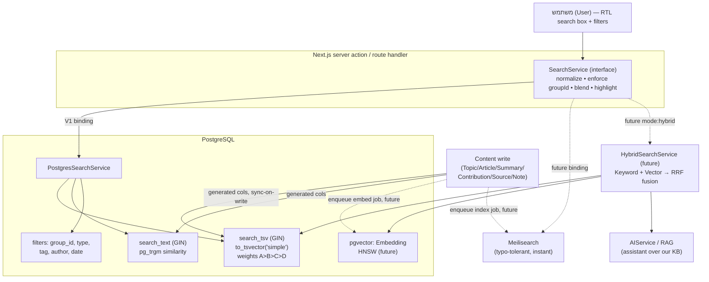

### 12.9 Decisions Summary

| Decision | V1 | Future |
|---|---|---|
| Engine | PostgreSQL FTS (`simple` tsvector) + `pg_trgm` | Meilisearch (typo tolerance) + pgvector |
| Hebrew handling | Normalize (strip nikud, NFC) + no stemming + trigram recall | Engine tokenizer + embeddings |
| Freshness | Sync-on-write via **generated columns** (transactional) | Enqueued index/embed jobs (eventual) |
| Ranking | `ts_rank_cd` + `similarity` + recency, weighted A–D | Engine relevance + RRF hybrid |
| Abstraction | `SearchService` — one interface, Postgres binding | New bindings, callers unchanged |
| Scope | Topic, Article, Summary, Contribution, Source, Note | + Attachment text, Comment/voice, NewsPost, semantic |
| Tenant safety | `group_id` enforced in query builder, always | Same, mirrored in every engine's filter |

---

## 13. AI Integration Strategy

The AI layer is **mostly future work**, but three decisions must be made *today* so that V1 content is AI-ready without any V1 AI code: (1) content is stored as structured ProseMirror JSON **plus** a derived plain-text rendering, (2) every content row carries `groupId` and stable IDs, and (3) the `pgvector` extension is reserved (installed but unused). If we get those right, AI becomes an additive module, never a migration.

Guiding principle: the assistant is a **חברותא דיגיטלי** (digital study partner) that helps you *find, summarize, and connect* what the group already produced — it does **not** invent Torah, and it does **not** pasken (rule on halacha).

### 13.1 The AIService abstraction (provider-agnostic)

All AI access flows through a single bounded module, `AIService`, mirroring the `SearchService` pattern. Application code never imports a vendor SDK directly.

| Concern | Design |
|---|---|
| Interface | `AIService` exposes `embed()`, `complete()`, `chatWithTools()`, `transcribe()` — capability verbs, not vendor calls. |
| Default provider | **Anthropic Claude** (`claude-*`) for generation & tool-use; a dedicated embeddings provider for `embed()`. |
| Swappability | Providers implement an `AIProvider` port; selection by env/config per capability. No provider name leaks past the port. |
| Terms constraint | Only providers whose API terms guarantee **no training on our data** are eligible (see 13.6). |
| Failure mode | AI is **optional and degradable** — if `AIService` is down or disabled, search, reading, and editing are fully unaffected. |

Feature-flagged per Group (`aiEnabled`) so V1 ships with the whole subsystem dark.

### 13.2 Phased capability roadmap

Nothing here is in V1 **core**. V1 only prepares the ground.

| Phase | Capability | Hebrew label (gloss) | Depends on |
|---|---|---|---|
| **V1 (prep only)** | Derived plain-text per content entity; `pgvector` installed; stable IDs; no AI UX | — | Content model, Revision |
| **Phase A** | RAG search / Q&A over our own KB, grounded + cited | שאל את בית המדרש (Ask the Beit Midrash) | Embedding, hybrid retrieval |
| **Phase A** | Summarize a discussion | סיכום דיון (Discussion summary) | Discussion→Summary link |
| **Phase B** | Find prior conversations; connect related topics | מצא דיונים קשורים (Find related) | Vector similarity |
| **Phase B** | Build **source sheets** (human-reviewed draft) | דף מקורות (Source sheet) | Source, SourceCitation, SourceSheet |
| **Phase B** | Generate tables from content | טבלה מתוכן (Table from content) | TableBlock |
| **Phase C** | Transcribe voice comments | תמלול הערה קולית (Voice transcription) | VoiceRecording, Transcript |
| **Phase C** | Generate study cards / images / PDFs | כרטיס לימוד (Study card) | StudyCard, Attachment pipeline |

### 13.3 RAG pipeline

The retrieval-augmented generation loop is grounded strictly in our own corpus — Discussions, Contributions, Summaries, Articles, Notes, Sources, NewsPosts — never in the model's parametric memory.

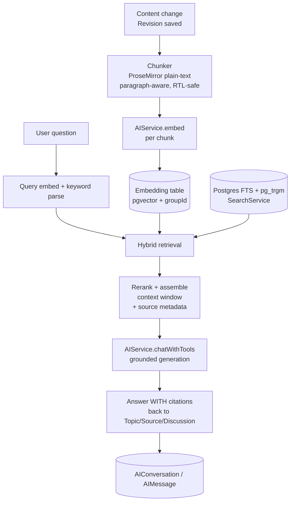

**Pipeline details:**

1. **Chunk** — driven off the derived plain-text (not raw JSON), split on ProseMirror block boundaries into ~300–500 token chunks with small overlap; each chunk keeps back-references (`entityType`, `entityId`, `revisionId`, block/paragraph anchor). Re-chunk on new Revision; chunks are versioned so citations point at what was actually retrieved.
2. **Embed** — `AIService.embed()` per chunk → stored in `Embedding`. Regeneration is a background queue job (never blocks the save).
3. **Hybrid retrieval** — run **both** the existing keyword path (Postgres `tsvector` + `pg_trgm`, which already handles Hebrew partial/typo matching) **and** vector cosine search over `pgvector`, fuse the result sets (reciprocal-rank fusion), then optionally rerank. Hybrid matters in Hebrew because `simple`-config FTS has no stemmer — vectors recover semantic matches, keywords anchor exact terms and source refs like `Zevachim 19a`.
4. **Grounded generation** — the model receives only the retrieved chunks + their metadata and is instructed to answer **only** from them and to cite. Unsupported → "I don't have that in our Beit Midrash" (`לא מצאתי זאת במקורות שלנו`).
5. **Persist** — turn stored in `AIConversation`/`AIMessage`, including which chunks/citations were used (for audit and "why did it say that").

**Tenant isolation is non-negotiable:** every retrieval query filters `groupId`. Vector search never crosses tenants.

### 13.4 Data-model touchpoints

Future-only tables, but their *shape* is fixed now so V1 IDs remain stable targets.

| Table | Purpose | Key fields |
|---|---|---|
| `Embedding` | One row per content chunk vector | `id`, `groupId`, `entityType`, `entityId`, `revisionId`, `chunkIndex`, `content` (chunk text), `vector` (pgvector), `model`, `createdAt` |
| `AIConversation` | An assistant session, scoped to a Group + User | `id`, `groupId`, `userId`, `title`, `createdAt` |
| `AIMessage` | One turn | `id`, `conversationId`, `role`, `content`, `toolCalls` (jsonb), `citations` (jsonb → entity refs), `tokensIn/Out`, `costCents`, `createdAt` |

`citations` are structured references (`entityType` + `entityId` + optional `SourceCitation`/anchor), rendered in the UI as clickable internal links — the same `InternalLink`/anchor machinery the editor already uses. No free-floating "the model said so."

### 13.5 Assistant tools (function-calling surface)

The assistant is **tool-first**: it acts by calling typed functions against our own services, not by free-generating facts. Every tool is `groupId`-scoped server-side (the model cannot pass a tenant).

| Tool | Phase | Signature (conceptual) | Notes |
|---|---|---|---|
| `searchSources` | A | `(query, filters?) → SourceRef[]` | Over our Source/SourceCitation corpus; read-only |
| `searchContent` | A | `(query, entityTypes?) → Chunk[]` | Hybrid retrieval; read-only |
| `getTopic` | A | `(topicId) → Topic + linked discussions/sources` | Read-only fetch |
| `getDiscussion` | A | `(discussionId) → Discussion + Contributions` | For summaries; read-only |
| `summarizeDiscussion` | A | `(discussionId) → draft Summary` | Produces a **draft**, saved only on user action |
| `findRelated` | B | `(entityId) → related entities` | Vector similarity + citations |
| `buildSourceSheet` | B | `(topicId or refs[]) → draft SourceSheet` | **Human-in-the-loop required** before publish |
| `makeTable` | B | `(prompt, sourceEntityIds[]) → draft TableBlock` | Draft ProseMirror table node; user edits/accepts |

Writes are always **drafts into the normal editing flow**, subject to Revision/audit and RBAC — the assistant proposes, a member commits.

### 13.6 Guardrails

| Guardrail | Stance | Mechanism |
|---|---|---|
| **Grounded-only** | Answers come from our corpus, always cited | RAG + system prompt + citation-required; refuse when unsupported |
| **Halachic sensitivity** | **Assist study, never pasken** — no rulings, no "the halacha is X" | System prompt hard rule; frames answers as "sources say / the discussion held"; directs halachic decisions to a rav |
| **Privacy / no training** | Private group data must never train a model | Only no-training API terms (13.1); no data sold/shared; per-Group opt-in |
| **Tenant isolation** | No cross-group leakage | `groupId` filter enforced server-side on every retrieval & tool call |
| **Human-in-the-loop** | Generated source sheets / tables / cards are drafts | Nothing published without a member accepting it; Revision + audit trail |
| **Cost controls** | Bounded spend | Per-Group monthly token/cost budget in `AIMessage`; cached embeddings; cap context size; small models for cheap tasks |
| **Rate limits** | No runaway usage/abuse | Per-user and per-Group request limits via the queue; back-pressure on embeddings |
| **Transparency** | Show the work | Every answer lists sources used; low-confidence/empty retrieval says so plainly |
| **Attribution & voice** | Don't misattribute opinions | Contributions cited to their author; the assistant never speaks *as* a participant |

### 13.7 V1 vs. later — the crisp line

- **Built in V1:** the *substrate only* — derived plain-text per entity, stable content IDs, `groupId` everywhere, Revision history, `pgvector` extension installed, `AIService`/`AIProvider` port stubbed and feature-flagged **off**. Zero AI in the user-facing product.
- **Phase A (first real AI):** RAG Q&A ("Ask the Beit Midrash") + discussion summaries, both grounded and cited.
- **Phase B:** related-topic discovery, draft source sheets, draft tables.
- **Phase C:** voice transcription (VoiceRecording→Transcript) and generated study cards / images / PDFs.

The bet: because V1 already stores clean, ID-stable, tenant-scoped, versioned text, turning on Phase A is *adding a service and three tables*, not reshaping the data model.

---

## 14. Scalability Strategy

This section describes how the platform grows from **one private study group on a single managed Postgres** to a **multi-tenant Digital Beit Midrash SaaS** serving many Groups and, eventually, individual users. The guiding principle: **build the seams in V1, not the scale.** Every V1 decision below is cheap; every deferred item is explicitly deferred so we do not pay complexity tax before there is load to justify it.

### 14.1 Guiding principles

| Principle | What it means in practice |
|---|---|
| **Seams over scale** | Ship abstractions (`SearchService`, `AIService`, `StorageService`, `QueueService`) with the simplest possible V1 implementation behind each. Swapping the implementation must never touch call sites. |
| **`groupId` on every row from day 1** | Row-level multi-tenancy is a schema fact, not a feature. It costs one indexed column now and saves a migration nightmare later. |
| **Stateless app tier** | Next.js server components/actions hold no session state in memory. All state lives in Postgres, Redis, or object storage, so we scale horizontally by adding instances. |
| **Async by default for anything slow or spiky** | Embeddings, transcription, PDF processing, reindex, fan-out notifications — never inline in a request. A worker tier exists precisely so a request never waits on them. |
| **Measure before you move** | Every "when to escalate" trigger below is a metric threshold, not a hunch. We do not shard, replicate, or extract a service until a dashboard says we must. |

### 14.2 The tenancy path

We ride a single tenancy model as far as it will comfortably go, and only change the physical layout when a metric forces it.

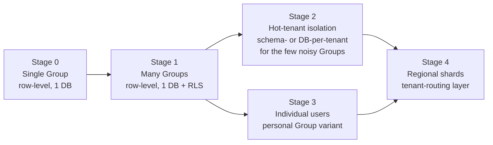

| Stage | Tenancy shape | Trigger to reach it | What we build |
|---|---|---|---|
| **0 (V1)** | One seeded `Group`, row-level, single managed Postgres (Neon/Supabase) | — | `groupId` everywhere; `Membership`+`Role` RBAC; every query scoped by `groupId` at the data-access layer. |
| **1** | Many `Group`s, still one shared DB, **Postgres Row-Level Security (RLS)** as a second wall behind app-level scoping | First external groups onboarded | Enable RLS policies keyed on a per-request `app.current_group_id` session GUC set inside a transaction; keep app-level `where groupId` as defense-in-depth. |
| **2** | **Schema-per-tenant** or **DB-per-tenant** for *individual hot/regulated tenants only** — the shared DB stays home for the long tail | A tenant exceeds noisy-neighbour thresholds (see below) or contractually requires physical isolation | Tenant-routing map (`Group.storageShard`, `Group.dbConnectionRef`); connection resolver picks the right pool per request. |
| **3** | **Individual (group-less) users** implemented as a *personal Group* under the hood | Product decision to open self-serve signups | No schema change — a personal Group with a single owner Membership. The `Group` abstraction was designed for exactly this. |
| **4** | **Regional / horizontal shards** with a tenant→shard directory | Single primary can no longer hold the working set, or data-residency (EU) demands regional placement | Directory service + shard-aware connection layer; migrate tenants shard-to-shard as a background job. |

**Do NOT start at schema-per-tenant.** It multiplies migration cost by N tenants and complicates cross-tenant analytics, backups, and the future AI knowledge base. Row-level with RLS serves hundreds to low-thousands of small study groups comfortably. Schema/DB isolation is a *surgical* tool for the rare hot or regulated tenant, not the default.

**Noisy-neighbour isolation triggers** (per-Group metrics; breach any → candidate for Stage 2):

| Signal | Escalate when |
|---|---|
| Query time share | A single `groupId` consumes > 15–20% of DB CPU sustained |
| Storage footprint | A single Group > ~10× the median Group's row/object count |
| Write throughput | A Group's write QPS starves shared connection pool / lock contention observed |
| Compliance | Contractual/legal data-isolation or residency requirement |

Interim noisy-neighbour mitigations *before* physical isolation: per-tenant rate limits (§14.9), per-tenant queue concurrency caps, statement timeouts, and `pg_stat_statements`-driven index fixes.

### 14.3 Database scaling

Postgres is the long-term system of record. We scale it in the following order — each step only taken when the prior one is exhausted.

**Indexing (V1, non-negotiable):**
- Composite indexes leading with `groupId` on every content table (e.g. `(groupId, createdAt)`, `(groupId, topicId)`), because *every* query is tenant-scoped.
- GIN index on the `tsvector` search column; GIN `gin_trgm_ops` for `pg_trgm` fuzzy Hebrew matching.
- Partial indexes for soft-delete (`where deletedAt is null`) so the common path never scans tombstones.
- FK indexes on all `SourceCitation`, `Contribution`, `Comment`, `Revision` join columns.

**Connection pooling (V1):**
- Serverless Next.js (Vercel) opens many short-lived connections — Postgres hates this. Use **PgBouncer in transaction mode** (Neon/Supabase provide a pooled endpoint out of the box). Prisma connects through the pooled port; migrations use the direct port.
- Keep Prisma `connection_limit` low per instance and let PgBouncer multiplex.

**Read replicas (Stage 1–2):** Route read-heavy, non-transactional traffic (search result hydration, article reading, dashboards, the AI knowledge base's retrieval reads) to replicas via a read/write split in the data layer. Writes and read-after-write flows stay on the primary. Trigger: primary read CPU sustained > 60–70%.

**Partitioning (Stage 2–3):** High-churn append-only tables are partitioned before they hurt.

| Table | Strategy | Why |
|---|---|---|
| `ActivityLog` | Range-partition by month (`createdAt`) | Append-only, unbounded, mostly written-and-forgotten; old partitions detach → cold storage. |
| `Notification` | Range by month + drop/archive read-and-old rows | Highest write fan-out; users rarely read old notifications. |
| `Revision` | Range by month, or hash by `groupId` if a few Groups dominate | Grows with every edit; rarely read except history views. |
| `Embedding` (future) | Hash-partition by `groupId` | Keeps pgvector index sizes and ANN recall manageable per tenant. |

**Redis caching (Stage 1+):** Introduce Redis (Upstash serverless in the Vercel world) for: session/rate-limit counters, hot dashboard widget data (Shabbat/zmanim/weather — cache with sane TTLs, never recompute per request), rendered-HTML fragment cache keyed by content `Revision` id, and a short-TTL search-result cache. **Not in V1** — a single small group does not need it; the *seam* is a thin `CacheService` with a no-op/in-memory default.

### 14.4 Next.js application scaling

| Lever | V1 posture | Scale posture |
|---|---|---|
| **React Server Components** | Default. Data fetching on the server, minimal client JS — cheap to serve, cache-friendly. | Unchanged; RSC is the reason the app tier stays light. |
| **CDN / edge caching** | Static assets, fonts (Hebrew serif/sans), images via `next/image` on the CDN. | Cache public/rarely-changing responses at edge; push read-only content closer to users. |
| **ISR (Incremental Static Regeneration)** | Minimal — most content is private and auth-gated. | Use ISR + on-demand revalidation for cacheable, low-personalization pages (e.g. a Group's public source sheets if that ships). Revalidate on `Revision` write. |
| **Server Actions** | Primary mutation path. | Enforce limits deliberately: keep actions **fast and small**; anything > ~1s of work, or large uploads, does **not** run in a server action — it enqueues a job or uses a presigned direct-to-R2 upload. Body-size and execution-time caps are guardrails, not surprises. |
| **Instance scaling** | Vercel autoscaling of the stateless app tier. | Same model on VPS/Docker: horizontal replicas behind a load balancer, because the tier holds no local state. |

**Hard rule:** server actions and route handlers are for *coordinating* work, not *doing* slow work. Uploads go direct to R2 via presigned URLs (bytes never transit the app tier); heavy processing goes to the queue.

### 14.5 Background jobs / worker tier

An async worker tier is **required, not optional** — several core future capabilities are inherently slow, spiky, or retry-prone, and none may block a user request.

| Job type | Why it must be async |
|---|---|
| Embedding generation (`Embedding`) | LLM/API latency + rate limits; batchable; retryable. |
| Voice transcription (`VoiceRecording`→`Transcript`) | Seconds-to-minutes of processing per clip. |
| PDF processing / thumbnail generation (`Attachment`) | CPU-heavy (sharp/rendering); bursty on bulk upload. |
| Search reindex | Bulk, throughput-bound; must not contend with live traffic. |
| Notification fan-out (`Notification`) | One event → many recipients; classic fan-out amplification. |
| Source-sheet / study-card / image/PDF generation (future) | Composed LLM + rendering pipelines. |
| Scheduled digests, zmanim/calendar precompute | Cron-driven, off the request path. |

**Implementation path:**
- **V1:** `QueueService` interface with the simplest backing that is still real — a Postgres-backed job table (e.g. a `pgboss`-style outbox) driven by a single worker process. Zero new infra; correct semantics (retry, backoff, idempotency keys).
- **Scale:** swap the backing to **Redis-based (BullMQ)** or a managed queue (SQS/Cloud Tasks) and run a dedicated, independently-scaled worker fleet. Because call sites only know `QueueService`, this is a config change.
- **Discipline everywhere:** idempotent handlers (keyed by content id + revision), exponential backoff, dead-letter queue, and **per-tenant concurrency caps** so one Group's bulk import cannot starve everyone's notifications.

### 14.6 Extracting search into a dedicated service

Search is deliberately built behind `SearchService` so the engine can change without touching features.

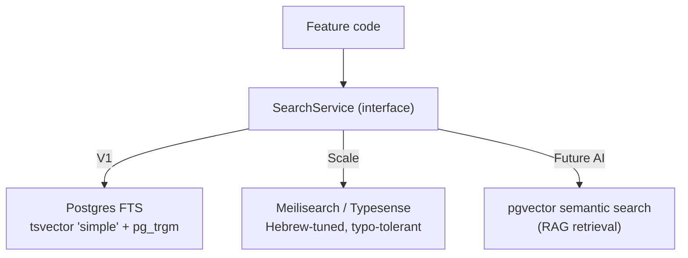

- **V1:** Postgres `tsvector` (`simple` config, since Postgres has no Hebrew stemmer) + `pg_trgm` + `unaccent` for typo/partial Hebrew matching. Good enough for one group's corpus, and the write path already maintains a derived plain-text rendering to index.
- **Trigger to extract:** corpus size or query latency degrades Postgres FTS (p95 search > ~300–500ms), or we need faceting/typo-tolerance/instant-search quality Postgres can't match. Then stand up **Meilisearch or Typesense** as a separate service, fed by the same reindex jobs. Postgres remains source of truth; the engine is a derived, rebuildable index.
- **Semantic search** (pgvector + `Embedding`) is the AI/RAG retrieval layer, *complementary* to keyword search, not a replacement. It arrives with the AI phase, populated by embedding jobs.

### 14.7 File and CDN scaling

The storage design already scales; V1 just uses the small end of it.

- **Object storage: Cloudflare R2** (S3-compatible, **no egress fees** — decisive for a media-heavy Torah library of PDFs/images/audio). DB stores only metadata + object keys.
- **Presigned direct uploads:** clients upload straight to R2; the app tier never proxies bytes, so upload load never scales with the app tier.
- **Delivery via CDN** in front of R2; `next/image` + `sharp` for responsive image variants; PDF thumbnails generated by workers and cached as their own objects.
- **Scale levers:** per-tenant storage shard/bucket-prefix (`Group.storageShard`) so hot or isolated tenants can move buckets/regions; lifecycle rules to tier cold `Attachment`s and detached partitions to cheaper storage; signed-URL TTLs to keep private content private.

### 14.8 Observability

We cannot operate a multi-tenant platform we cannot see. Observability is **light in V1 but present from day 1** — you cannot retrofit tenant-tagging after an incident.

| Pillar | V1 | Scale |
|---|---|---|
| **Structured logging** | JSON logs, **every log line carries `groupId` + `userId` + `requestId`** | Centralized aggregation (Datadog / Grafana Loki / Axiom); per-tenant log views. |
| **Metrics** | Basic request rate/latency/error counts | Per-tenant + per-endpoint RED metrics; queue depth, worker throughput, DB pool saturation, cache hit rate. |
| **Tracing** | Trace IDs threaded request→action→job | OpenTelemetry distributed tracing across app → worker → DB → search → AI provider. |
| **Error tracking** | **Sentry from day 1** (cheap, high ROI), tenant-tagged | Alerting rules, release health, source-mapped stack traces. |
| **Uptime / synthetics** | Simple external health check | Multi-region synthetic checks on login, search, upload, read. |

**Rule:** tenant identity in every log/metric/trace/error from the first commit. It is one field now and un-addable later.

### 14.9 Rate limiting & abuse protection

| Layer | Control |
|---|---|
| **Auth** | Invite-only in V1 removes most abuse surface; magic-link + password with attempt throttling. |
| **Per-user / per-tenant limits** | Token-bucket in Redis (V1: in-memory/no-op seam). Distinct budgets for cheap reads vs. expensive actions (search, AI calls, uploads, transcription). |
| **AI cost abuse** | Hard per-tenant quotas and per-request token ceilings on `AIService`; queue-side concurrency caps; billing-aware throttles. This is the single biggest runaway-cost risk — gate it explicitly. |
| **Upload abuse** | Presigned-URL scoping, max object size, MIME allow-list, per-tenant storage quotas, malware scan job on upload. |
| **Edge** | Cloudflare/WAF bot and DDoS protection in front of the app; CAPTCHA only on public surfaces if/when self-serve signup opens. |

### 14.10 Tenant data-isolation & security

Defense in depth, layered:

1. **Application layer:** a single tenant-scoped data-access boundary — no query leaves it without a `groupId`. Reviewers reject any raw query that isn't tenant-scoped.
2. **Database layer (Stage 1+):** Postgres **RLS** policies as a hard backstop, so even a buggy or malicious query cannot cross tenants.
3. **Storage layer:** object keys namespaced by `groupId`/shard; signed URLs; no cross-tenant key guessing.
4. **AI/RAG layer:** retrieval is **tenant-filtered before** it reaches the model — embeddings are `groupId`-scoped, and the vector query always includes the tenant filter. The AI must never see another Group's content. This is a security requirement, not a quality one.
5. **Backups & residency:** per-tenant restore capability; regional placement (Stage 4) for EU data-residency obligations.

### 14.11 Cost trajectory

| Stage | Rough monthly shape | Main cost drivers |
|---|---|---|
| **0 — one group** | Near-free / hobby tier | Neon/Supabase free-ish tier, R2 (no egress), Vercel hobby/pro. Effectively fixed and tiny. |
| **1 — dozens of groups** | Low, mostly fixed | Managed Postgres step-up, Sentry, small Redis (Upstash), modest R2 storage. |
| **2 — hundreds of groups + AI on** | Scales with **usage, not tenants** | **AI provider tokens** (the dominant variable cost — quota-gate hard), worker compute for embeddings/transcription/PDF, read replicas, search engine host. |
| **3–4 — SaaS at scale** | Per-tenant marginal cost, monitored | Sharded DBs, dedicated search cluster, worker fleet, cross-region storage/egress; per-tenant cost accounting drives pricing. |

**Cost seams to install early (cheap now):** per-tenant usage metering (AI tokens, storage GB, job minutes) captured from day 1 so pricing and quota enforcement have real data when self-serve arrives.

### 14.12 What NOT to build in V1 (avoid premature scaling)

Build the **seam** (left) now; defer the **implementation** (right) until the trigger fires.

| Seam to ship in V1 (cheap) | Do **NOT** build in V1 — defer until trigger |
|---|---|
| `groupId` on every row + app-level scoping | Postgres **RLS** policies (add at first external tenant) |
| `SearchService` over Postgres FTS + `pg_trgm` | Meilisearch/Typesense cluster (add when FTS p95 degrades) |
| `QueueService` over a Postgres job table + one worker | BullMQ/managed queue + worker fleet (add on job backlog/latency) |
| `AIService` interface, provider-agnostic | pgvector RAG, embeddings pipeline, transcription (add in AI phase) |
| `CacheService` no-op | Redis caching layer (add on read-latency/DB pressure) |
| `StorageService` → R2 presigned uploads | Multi-region buckets / per-tenant shards (add for residency/hot tenants) |
| Single managed Postgres via PgBouncer | Read replicas, partitioning, sharding (add per §14.3 triggers) |
| Tenant-tagged structured logs + Sentry | Full OTel tracing + metrics stack (add as ops load grows) |
| Personal-Group data model designed but not exposed | Self-serve individual signup + CAPTCHA (add when product decides) |

**Rule of thumb:** *In V1, the only scaling work permitted is (a) indexing correctly, (b) keeping `groupId` on every row, (c) not doing slow work in the request path, and (d) hiding every future engine behind a service interface.* Everything else waits for a metric to demand it. Premature sharding, premature Redis, premature dedicated search, and a premature worker fleet are the failure modes we are explicitly avoiding — the seams make each of them a later configuration change, not a rewrite.

---

## 15. Future Roadmap

This roadmap sequences the platform from a single private study group (Phase 0 / V1) to a multi-tenant public *בית המדרש הדיגיטלי* (Digital Beit Midrash). The governing principle: **V1 stays deliberately small, but the schema, service boundaries, and design system are built once, correctly, so later phases add capabilities rather than re-plumbing foundations.** Every phase below assumes the canonical stack (Next.js App Router, Postgres + Prisma, row-level multi-tenancy via `groupId`, Auth.js, TipTap JSON, R2 storage, SearchService/AIService abstractions).

### 15.1 Phase overview

| Phase | Name (Hebrew UI) | Goal | Ships |
|---|---|---|---|
| **0 / V1** | הבית שלנו ("Our house") | A complete, private, searchable, archived study workspace for one chevruta | The MVP set below — usable end-to-end |
| **1.1** | ליטוש (Polish) | Harden and enrich V1 from real usage | Quality, notifications, dashboard widgets, richer news feed |
| **2** | מקורות (Sources) | Turn manual references into a living Torah source layer | Sefaria integration, source sheets, study cards |
| **2.5** | חברותא (Chavruta) | Discussion at paragraph resolution, including voice | Anchored comments, voice notes, transcription |
| **3** | העוזר (The assistant) | AI over *our own* knowledge base | RAG search, summarization, source-sheet generation |
| **4** | בית המדרש הפתוח ("The open beit midrash") | Many groups + individuals, publicly | Multi-tenant onboarding, billing, i18n, individual users |

Phases are **cumulative and roughly sequential**, but 1.1 runs continuously alongside 2/2.5 as a hardening track. Phase 4 is a business/scale decision, gated on product-market fit, not a technical prerequisite for 2/2.5/3.

### 15.2 Dependency map

```mermaid
graph TD
  P0["Phase 0 / V1<br/>MVP workspace"] --> P11["Phase 1.1<br/>Polish + notifications + widgets"]
  P0 --> P2["Phase 2<br/>Sefaria sources + sheets + cards"]
  P0 --> P25["Phase 2.5<br/>Anchored + voice comments"]
  P2 --> P3["Phase 3<br/>AI assistant / RAG"]
  P25 --> P3
  P11 --> P4["Phase 4<br/>Multi-tenant public + billing + i18n"]
  P3 --> P4
  P0 -. "row-level groupId built here" .-> P4
  P0 -. "SourceCitation model built here" .-> P2
  P0 -. "TipTap paragraph IDs reserved here" .-> P25
  P0 -. "SearchService abstraction here" .-> P3
```

The dotted edges are the point of the whole plan: **the hard architectural seams are cut in Phase 0 even though the features arrive later.**

---

### 15.3 Phase 0 / V1 — the MVP (build this first)

**Goal:** one study group can capture, organize, read, search, and archive everything it studies — comfortably in Hebrew, on desktop and mobile — with nothing missing that would push the group back to WhatsApp/Docs.

**Headline features (Hebrew label → English gloss):**

| Area | V1 scope |
|---|---|
| כניסה והזמנות (Auth & invitations) | Auth.js, invite-only, email magic-link (+ optional password), secure-cookie sessions |
| קבוצה וחברים (Group & membership) | Single seeded `Group`; `Membership` + `Role` (owner/admin/editor/member/guest) enforced server-side |
| נושאים (Topics) | `Topic`, `Category`, `Tag` — the organizing spine |
| דיונים ותרומות (Discussions & contributions) | `Discussion` + `Contribution` (a participant's opinion/message); **flat**, not paragraph-anchored yet |
| סיכומים (Summaries) | `Summary` attached to discussions/topics |
| מאמרים והערות (Articles & notes) | `Article`, `Note` — long-form TipTap content |
| טבלאות (Tables) | `TableBlock` editable tables |
| קבצים (Attachments) | `Attachment` — images/PDF via R2 presigned upload; thumbnails; metadata in DB |
| מקורות (Sources) | **Manual** `Source` + `SourceCitation` (normalized ref string, e.g. `זבחים י״ט ע״א`) — no Sefaria fetch yet |
| קישורים פנימיים (Internal links) | `InternalLink` custom TipTap node between any two entities |
| חדשות (News feed) | `NewsPost` — separate from discussions |
| חיפוש (Search) | Postgres `tsvector` (`simple`) + `pg_trgm`/`unaccent` behind `SearchService` |
| לוח מחוונים (Dashboard) | Basic landing dashboard: recent activity, my topics, latest news |
| ארכיון והיסטוריה (Archive & history) | `Revision` versioning, soft-delete, `ActivityLog` — from day 1 |
| עיצוב (Design system) | RTL Tailwind (logical properties), Hebrew serif reading + sans UI stack, design tokens, light/dark, deliberate mobile layout |

**Architectural work that must land now (even if the feature is future):**

- **Row-level multi-tenancy**: every content row carries `groupId`; a Prisma middleware/extension injects and enforces the tenant scope. Building this later is a rewrite — building it now costs one column and one guard.
- **`SourceCitation` as a polymorphic link** with an optional selected-text range field — Phase 2 fills it with real Sefaria data; V1 fills it manually.
- **TipTap paragraph node IDs**: assign stable IDs to block nodes now, so Phase 2.5 comments can anchor without a content migration.
- **`SearchService` / `AIService` abstractions**: V1 has one real implementation (Postgres FTS) and a stub, so Phases 2–3 swap engines behind the interface.
- **Revision + ActivityLog + soft-delete**: retrofitting audit history onto a live DB loses the history that already happened. Non-negotiable in Phase 0.

**Explicitly deferred (do NOT build in V1):** Sefaria API calls, source sheets, study cards, paragraph-anchored/voice comments, transcription, notifications delivery, configurable widgets, AI features, additional groups, billing, non-Hebrew UI.

---

### 15.4 Phase 1.1 — Polish

**Goal:** absorb feedback from real daily use; close the gaps that only appear once the group lives in the product.

| Feature | Architectural work |
|---|---|
| התראות (Notifications) — replies, comments, followed topics | Activate `Notification` + `Follow` + `Reaction` models (schema present from V1); add a delivery worker on the queue; in-app first, email second |
| ווידג'טים ללוח (Dashboard widgets) — Hebrew date, שקיעה/זמני שבת (sunset/Shabbat times), Jewish calendar, weather | Activate `Widget` + `UserWidgetPref`; each widget is a self-contained server component with a data source; user picks visibility |
| News feed enrichment | Categories, pinning, richer composition for `NewsPost` |
| Search UX | Saved searches, filters by type/tag/source; still on Postgres FTS |
| Reading & a11y polish | Typography tuning, keyboard nav, print/export of a topic |

Depends only on Phase 0. Runs as a **continuous hardening track** in parallel with Phase 2 work.

---

### 15.5 Phase 2 — Deep Torah sources & Sefaria

**Goal:** promote the `Source` model from hand-typed strings to a live, structured Torah reference layer.

**Headline features:** Sefaria-aligned source lookup and attach; select a passage and cite a precise range; auto-render source text alongside discussions; **source sheets** (`SourceSheet`) assembled from citations; **study cards** (`StudyCard`) and generated images/PDF exports of a source or sheet.

**Architectural work:**
- Integrate Sefaria's open reference scheme + API behind a `SourceService`; cache fetched text; keep the normalized ref string as the canonical key already established in V1.
- Introduce future-only entities `SourceSheet`, `StudyCard`.
- Extend the citation flow to store precise character/segment ranges (the range field reserved in V1).
- Rendering/export pipeline (sheet → PDF/image) reuses the R2 + sharp/PDF thumbnail infrastructure from V1.

**Dependencies:** Phase 0's `Source`/`SourceCitation` model. Independent of 2.5/3.

---

### 15.6 Phase 2.5 — Anchored & voice comments

**Goal:** move discussion from the whole-item level down to the paragraph, and let people speak, not only type.

**Headline features:** `Comment` anchored to a specific paragraph (using the stable TipTap block IDs reserved in V1); text **or** voice comments (`VoiceRecording`); AI transcription (`Transcript`) of voice into searchable text.

**Architectural work:**
- Activate `Comment` with an anchor referencing a block ID + content revision.
- Audio capture → R2 upload (same presigned pipeline) → queue job → transcription provider via `AIService` → `Transcript` indexed by `SearchService`.
- First use of the background queue for user-facing async work at scale.

**Dependencies:** Phase 0 paragraph IDs + queue; the transcription step shares the `AIService` seam used in Phase 3.

---

### 15.7 Phase 3 — AI assistant / RAG

**Goal:** an assistant grounded **only in our own knowledge base** — discussions, summaries, sources, sheets — that searches, summarizes, finds prior conversations, builds source sheets, generates tables, and connects related topics.

**Architectural work:**
- Enable **pgvector**; add `Embedding` and index existing content (discussions, contributions, summaries, transcripts, sources).
- Build the RAG pipeline behind `AIService` (default provider Anthropic Claude, provider-agnostic).
- Add `AIConversation` + `AIMessage`; enforce `groupId` scoping so the assistant never leaks across tenants.
- Optionally introduce a dedicated search engine (Meilisearch/Typesense) behind the existing `SearchService` if Postgres FTS is outgrown; hybrid keyword + semantic ranking.

**Dependencies:** richest when Phases 2 (structured sources) and 2.5 (transcripts) exist, so there is more high-quality content to retrieve over. Bounded, optional, phased — never blocks core study workflows.

---

### 15.8 Phase 4 — Multi-tenant public Beit Midrash

**Goal:** open the platform to many groups and individual (group-less) users as a real product.

**Headline features:** self-serve group creation and onboarding; individual users as a `Group`-of-one variant; billing/subscriptions; internationalization (i18n) with Hebrew remaining first-class; public/discoverable content options; per-tenant admin.

**Architectural work:**
- The row-level tenancy built in V1 now carries real load — audit every query path for `groupId` enforcement; add tenant isolation tests.
- Billing integration; plan/entitlement gating on features.
- i18n layer (message catalogs, locale routing) added **without** compromising the Hebrew-first reading experience.
- Scale hosting: connection pooling, per-tenant rate limits, background-job scaling; the documented Docker-on-VPS alternative becomes a real option for self-hosters.

**Dependencies:** technically unlocked by V1's tenancy model; commercially gated on validated demand. This is a go-to-market decision, not a blocker for 2/2.5/3.

---

### 15.9 Sequencing summary — what to build first

1. **Phase 0 is the only thing that matters until it ships.** Resist pulling Phase 2+ features forward; instead, ensure Phase 0 lays the *seams* (tenancy, citation model, paragraph IDs, service abstractions, revisions).
2. After V1 ships, run **Phase 1.1 continuously** while starting **Phase 2** (sources) — it delivers the most Torah-study value and reuses V1 infrastructure with the least new plumbing.
3. **Phase 2.5** and **Phase 3** follow; 3 is richest after 2 and 2.5 populate the knowledge base.
4. **Phase 4** when there is demand to serve groups beyond the founding chevruta.

---

### 15.10 Immediate next-steps checklist (kick-off, once planning is approved)

- [ ] **Provision infrastructure**: Next.js repo (App Router, TS, Tailwind logical-properties), managed Postgres (Neon/Supabase), Cloudflare R2 bucket + presigned-upload keys.
- [ ] **Enable Postgres extensions**: `pg_trgm`, `unaccent` (V1 search); reserve `pgvector` migration for Phase 3 — do not enable yet.
- [ ] **Author the full Prisma schema now**, including future-ready fields: `groupId` on every content row, `SourceCitation` with range field, `Revision`/`ActivityLog`/soft-delete columns, `Follow`/`Notification`/`Widget` tables (dormant). Seed a single `Group` + owner `Membership`.
- [ ] **Implement the tenancy guard**: Prisma extension/middleware that injects and enforces `groupId`; write a test that proves cross-group reads fail.
- [ ] **Stand up Auth.js** (magic-link, invite-only) with the RBAC role model wired into server actions.
- [ ] **Build the RTL design system first**: tokens, Hebrew serif-reading + sans-UI font stack, light/dark, mobile layout skeleton — before feature screens, so every screen inherits it.
- [ ] **Integrate TipTap** with RTL config and **stable block IDs** on every paragraph node from the first commit (enables Phase 2.5 with no migration).
- [ ] **Define `SearchService` and `AIService` interfaces**; implement only the Postgres FTS backend now; stub the rest.
- [ ] **Ship the V1 content vertical slices** in this order: Topics → Discussions/Contributions → Summaries → Articles/Notes → Tables → Attachments → manual Sources/Citations → Internal links → News feed → Dashboard → Search.
- [ ] **Wire the background-job queue** (even if idle in V1) so notifications, transcription, and RAG indexing have a home later.
- [ ] **Establish the archive guarantees on day 1**: verify `Revision`, soft-delete, and `ActivityLog` capture every mutation before onboarding the real group.

---

## 16. Key Decisions, Trade-offs & Open Questions

This section records the pivotal architectural decisions in a lightweight ADR (Architecture Decision Record) format, then red-teams each one — because the product owner explicitly asked to be challenged, not reassured. Every decision below is *defensible*, not *unquestionable*. The final subsection isolates the handful of questions where we genuinely need the owner's input before locking the plan.

### 16.1 How to read this section

Each ADR carries five fields:

| Field | Meaning |
|---|---|
| **Decision** | What we are committing to for V1. |
| **Why** | The reasoning that makes it the default. |
| **Rejected** | The serious alternatives we looked at and why they lost. |
| **Wrong when** | The concrete conditions under which this becomes the *wrong* call. |
| **Red-team** | The strongest honest argument against it — the thing that should keep us slightly uncomfortable. |

Status legend: **Locked** (canonical, build on it) · **Locked-with-watch** (committed but carries a named risk to monitor) · **Provisional** (defaulted, but see §16.14 open questions).

```mermaid
graph TD
    A[Product goals: Hebrew-first, private V1, multi-tenant future] --> B[Next.js App Router]
    A --> C[Postgres + Prisma]
    C --> D[Row-level multi-tenancy from day 1]
    C --> E[FTS-first search]
    C --> F[Versioning + audit from day 1]
    B --> G[Auth.js invite-only]
    B --> H[TipTap ProseMirror JSON]
    A --> I[Sefaria-aligned Source model]
    C --> J[pgvector-ready AI]
    B --> K[Vercel + Neon vs VPS/Docker]
    A --> L[Monolith-first]
    R2[R2 object storage] --> H
    style D fill:#5b8a72,color:#fff
    style E fill:#5b8a72,color:#fff
    style K fill:#b5651d,color:#fff
    style I fill:#b5651d,color:#fff
```

Nodes in green are the decisions most likely to be *right*; nodes in orange are the ones most exposed to being wrong (§16.9, §16.11, §16.14).

---

### 16.2 ADR-01 — Next.js App Router (React, TypeScript) · **Locked**

| Field | Detail |
|---|---|
| **Decision** | Next.js App Router with Server Components, Server Actions, and Route Handlers; TypeScript throughout. |
| **Why** | One codebase for SSR + API; server-first rendering gives fast, SEO-irrelevant-but-fast reading pages; Server Actions cut boilerplate for a small team; first-class RTL is a CSS concern, not a framework one; huge hiring/AI-assist ecosystem. |
| **Rejected** | **Remix** (excellent, smaller ecosystem, weaker managed-hosting story); **SvelteKit** (leaner, but smaller talent pool and fewer Hebrew/RTL component references); **plain React SPA + separate API** (more moving parts, worse first-paint for long reading pages); **Astro** (great for content, awkward for the heavily interactive editor/dashboard). |
| **Wrong when** | If the app were mostly a highly interactive real-time client (it is not — it is reading + structured authoring), an SPA-first stack would fit better. |
| **Red-team** | App Router is still the most *churn-prone* surface in the React world: Server Actions semantics, caching defaults, and the RSC mental model have shifted repeatedly. A part-time volunteer dev maintaining this in 3 years may hit patterns that were "best practice" in a version now deprecated. **Mitigation:** keep business logic in framework-agnostic service modules (SearchService, AIService, storage, source parsing) so a framework migration never means a data-model migration. |

### 16.3 ADR-02 — PostgreSQL + Prisma · **Locked**

| Field | Detail |
|---|---|
| **Decision** | PostgreSQL as the single system of record; Prisma as ORM and migration tool. |
| **Why** | One database gives us relational integrity, JSONB for ProseMirror docs, full-text search, `pg_trgm`/`unaccent` for Hebrew fuzzy matching, and `pgvector` for future AI — *without adding a second datastore in V1*. Prisma gives typed queries, readable migrations, and a schema that doubles as documentation. |
| **Rejected** | **MongoDB** (loses relational integrity we need for Membership/Revision/Citation graphs); **MySQL** (weaker FTS + no pgvector); **Drizzle** (leaner, more SQL-native, but Prisma's migration ergonomics + ecosystem win for a small team); **raw SQL** (too much hand-maintenance for the entity count here). |
| **Wrong when** | At very large multi-tenant scale with hot write paths, Prisma's query patterns and connection model can become a bottleneck before Postgres itself does. |
| **Red-team** | Prisma + serverless Postgres is a *known* pain axis: connection pooling (PgBouncer/Neon pooler), cold-start latency, and Prisma's historically heavy client. We are pairing two things (Prisma + Vercel serverless, ADR-10) that each amplify the other's connection weakness. **Mitigation:** use Neon/Supabase pooled connection strings from day 1; treat Prisma's `driverAdapters`/edge story as a watch item; keep an escape hatch to Drizzle or raw SQL for any hot query. |

### 16.4 ADR-03 — Row-level multi-tenancy from day 1 (`groupId` on every content row) · **Locked-with-watch**

| Field | Detail |
|---|---|
| **Decision** | Every content entity carries `groupId`; a `Group` is seeded as the single tenant in V1; `Membership` links `User`↔`Group` with a `Role`. No tenant isolation via separate schemas/DBs. |
| **Why** | Retrofitting tenancy later is the classic "rewrite the whole data layer" migration. Adding one indexed column now is nearly free; it makes the multi-tenant future a *feature-flag*, not a *rebuild*. |
| **Rejected** | **Schema-per-tenant** / **DB-per-tenant** (strong isolation, but painful migrations and pointless for V1's single group); **no tenancy now, add later** (rejected on principle — this is exactly the debt the brief tells us to avoid). |
| **Wrong when** | If the product were *permanently* single-tenant, the `groupId` plumbing would be dead weight. The brief explicitly says it is not. |
| **Red-team** | Row-level tenancy is only as safe as its *weakest query*. One `findMany` that forgets `where: { groupId }` and V1's "private" promise silently leaks group A's Torah discussions to group B the day we onboard a second group. This is the single highest-consequence latent bug in the whole plan. **Mitigation (must-build, not optional):** enforce tenancy at a layer below individual queries — a Prisma `$extends` / middleware that injects `groupId` from request context, and/or Postgres Row-Level Security policies as a belt-and-suspenders backstop. This should be an explicit acceptance criterion, tested with a "cross-tenant read must fail" test in CI. **Watch** until that guard exists. |

### 16.5 ADR-04 — Auth.js (NextAuth v5), self-hosted, invite-only, magic-link · **Locked**

| Field | Detail |
|---|---|
| **Decision** | Auth.js v5 self-hosted; invite-only via `Invitation`; email magic-link primary, optional password; secure-cookie sessions; RBAC roles scoped per `Group`. |
| **Why** | Invite-only matches a private chevruta exactly. Magic-link removes password management for non-technical Torah-study members (likely a real usability win for the actual users). Self-hosted keeps us off per-MAU auth-vendor pricing and keeps user data in *our* Postgres. |
| **Rejected** | **Clerk / Auth0 / WorkOS** (fastest to ship, best DX, but external identity store, per-user cost, and data-residency questions for a group that may care where its data lives); **roll-your-own auth** (never, for security reasons). |
| **Wrong when** | If the group needs enterprise SSO/SAML, org-directory sync, or advanced bot/abuse defenses on public signup — then a managed provider earns its cost. V1 has none of these needs. |
| **Red-team** | Magic-link's security *is* the user's email inbox and our email deliverability. If a member's email is compromised, so is their account (no second factor). And magic links landing in spam is a real, unglamorous way to make the whole app feel broken on day one. **Mitigation:** use a reputable transactional email provider with proper SPF/DKIM/DMARC; offer optional password/2FA as a hardening path for admins; short link TTLs. Confirm whether the group wants 2FA for owner/admin roles (§16.14). |

### 16.6 ADR-05 — Cloudflare R2 object storage, presigned direct uploads · **Locked**

| Field | Detail |
|---|---|
| **Decision** | S3-compatible object storage on Cloudflare R2; browser uploads via presigned URLs; DB stores only metadata + object keys; `next/image` + `sharp` for images; PDF thumbnails generated server-side. |
| **Why** | R2 has **no egress fees** — decisive for a media-heavy Torah archive (scanned sources, PDFs, images) that will be *read* far more than written. Presigned uploads keep large files off our serverless function bandwidth/timeout budget. S3-compatibility means we are never locked to Cloudflare. |
| **Rejected** | **AWS S3** (egress fees add up on a read-heavy archive); **Supabase/Vercel Blob** (convenient, but egress/pricing and less neutral); **DB-stored blobs** (never — bloats Postgres, wrecks backups). |
| **Wrong when** | If our compute already lives in one cloud and traffic is low, co-locating storage there can simplify ops more than R2's egress savings are worth. |
| **Red-team** | R2 is operationally excellent but not *identical* to S3 at the edges (event notifications, lifecycle, some multipart nuances). More importantly, **presigned direct upload is a common security hole**: without server-issued content-type/size constraints and post-upload validation, it becomes an open bucket for arbitrary files. **Mitigation:** presign with enforced key prefix (`groupId/…`), max size, and allowed content-types; validate + generate thumbnails server-side *after* upload; never trust client-reported metadata. Also confirm a private-by-default access model (signed read URLs), since V1 content is private. |

### 16.7 ADR-06 — TipTap / ProseMirror JSON as canonical content · **Locked-with-watch**

| Field | Detail |
|---|---|
| **Decision** | TipTap (ProseMirror) RTL editor; store the structured ProseMirror **JSON** as source of truth **plus** a derived plain-text/HTML rendering for search & display. Custom nodes for `SourceCitation`, `TableBlock`, `InternalLink`, `Attachment`. |
| **Why** | Structured JSON is queryable, versionable (ADR-11), and lets us anchor future paragraph-level `Comment`s and source citations to stable node positions — impossible with an HTML blob. The derived text feeds FTS without parsing JSON at query time. RTL + bidi are first-class in ProseMirror. |
| **Rejected** | **Store HTML/Markdown only** (loses structure needed for anchored comments & citations); **Slate/Lexical** (Lexical is strong and Meta-backed, but ProseMirror's document model, collaboration story, and citation-node ecosystem fit our Torah-source needs better); **Notion-style block DB** (over-engineered for V1). |
| **Wrong when** | If content were simple prose with no citations, tables, or anchored comments, a Markdown field would be dramatically simpler. Our roadmap says it is not simple. |
| **Red-team** | We are now maintaining **two representations that can drift** (JSON vs derived text/HTML) and a set of **custom ProseMirror nodes** — the highest-skill, least-replaceable code in the app. If the volunteer maintainer can't work in ProseMirror internals, custom nodes rot. And paragraph-anchored comments against evolving documents is a genuinely hard problem (positions shift on every edit). **Mitigation:** make the derived rendering a pure, tested function of the JSON (never hand-edited); keep custom nodes minimal in V1 (citation + attachment + table only); design comment anchors against stable node IDs, not character offsets; treat full anchored-comment robustness as a *future* milestone, not a V1 promise. **Watch** the custom-node maintenance burden. |

### 16.8 ADR-07 — Postgres full-text search first (FTS + `pg_trgm`) behind a `SearchService` · **Locked**

| Field | Detail |
|---|---|
| **Decision** | V1 search = Postgres `tsvector` (`simple` config, since Postgres has no Hebrew stemmer) + `pg_trgm`/`unaccent` for partial/typo-tolerant Hebrew — all behind a `SearchService` abstraction. Future = Meilisearch/Typesense + `pgvector` semantic search. |
| **Why** | Zero new infrastructure in V1; good-enough Hebrew matching for one group's corpus; the abstraction means swapping engines later touches one module, not the whole app. |
| **Rejected** | **Meilisearch/Typesense now** (better Hebrew relevance, but a second service to run/back-up for a corpus that starts tiny); **Elasticsearch** (operationally heavy, overkill); **client-side search** (won't scale past a trivial archive). |
| **Wrong when** | The moment Hebrew relevance quality becomes a *daily complaint* — Postgres `simple` config does no stemming, so morphological Hebrew matches (prefixes ו/ה/ב/כ/ל/מ/ש, plural/gender forms) will be mediocre. |
| **Red-team** | This is the decision most likely to under-deliver *for the actual users*, precisely because the product is Hebrew-first. Hebrew's rich morphology means `simple` FTS will miss matches a human considers obvious, and `pg_trgm` papers over spelling variance but not grammar. We may be shipping the weakest search *exactly* where the product promises strength. **Mitigation:** the `SearchService` seam is the whole insurance policy — build it clean; consider promoting Meilisearch (which has serviceable Hebrew tokenization) earlier than "future" if early testing disappoints. Flag search-quality as a thing to *measure with real content*, not assume. |

### 16.9 ADR-08 — Sefaria-aligned canonical `Source` model · **Locked-with-watch**

| Field | Detail |
|---|---|
| **Decision** | Canonical `Source` reference modeled on Sefaria's open reference scheme (structured work/section/subsection + normalized ref string, e.g. `Zevachim 19a`); `SourceCitation` polymorphically links a `Source` (with optional selected text range) to any content entity. V1 may store **manual** references only; deep Sefaria API integration is future. |
| **Why** | Aligning to the de-facto open standard for Jewish texts means our references are portable, and a future Sefaria integration is *populating* a model we already have, not reshaping it. Polymorphic citation lets any entity cite any source. |
| **Rejected** | **Free-text citations** (unstructured, unsearchable, un-linkable — betrays the whole "attach sources to discussions" roadmap); **inventing our own reference taxonomy** (needless divergence from the ecosystem standard). |
| **Wrong when** | If the group cites mostly *non-Sefaria* material (personal shiurim, unpublished manuscripts, oral traditions), a rigid Sefaria-shaped model could feel like forcing pegs into holes. |
| **Red-team** | We are hard-coupling our canonical data model to *another project's* schema and reference conventions — Sefaria's ref format has real edge cases (Talmud daf/amud, Rambam's nested structure, Tanach chapter:verse, competing editions, spelling of transliterated tractate names). If we model it slightly wrong now, every stored citation inherits the error. And "manual references in V1" means humans typing `Zevachim 19a` by hand — **guaranteed inconsistency** (`Zevachim` vs `Zvachim` vs `זבחים`) that undermines the very normalization we're paying for. **Mitigation:** ship a small *normalizer/validator* for ref strings even in V1 (canonical Hebrew + transliterated names, daf/amud validation) rather than a raw text box; store both the structured parts and the normalized string; treat the model as versioned so a future Sefaria sync can correct legacy rows. **Watch** ref-string data quality from the first real discussion. Also: confirm licensing/attribution terms for aligning to and later pulling Sefaria data (§16.14). |

### 16.10 ADR-09 — `pgvector`-ready, provider-agnostic AI (not in V1 core) · **Locked**

| Field | Detail |
|---|---|
| **Decision** | Reserve `pgvector`; route all AI through a provider-agnostic `AIService` (default Anthropic Claude); RAG over our own content via embeddings. AI is bounded, optional, phased — **not** in the V1 critical path. |
| **Why** | Keeping AI behind one module and off the V1 critical path means the platform is fully useful *without* AI, and AI is additive when ready. `pgvector` in the existing DB avoids a separate vector store. |
| **Rejected** | **AI baked into V1 core** (scope creep, cost, and a dependency on a fast-moving vendor for a product whose core value is human chevruta); **dedicated vector DB** (Pinecone/Weaviate — unnecessary second system at our scale); **single-vendor lock** (rejected — hence the abstraction). |
| **Wrong when** | If AI-assisted study were the *headline* feature the owner is actually buying, deferring it would be under-building. The brief frames AI as future/optional — confirm that hasn't changed (§16.14). |
| **Red-team** | "Provider-agnostic" is easy to *claim* and hard to *keep* — the moment we use Claude-specific tool-use, prompt-caching, or citation features to get quality, the abstraction leaks and swapping providers is a rewrite. Also, RAG over a *small, private* Torah corpus can produce confidently wrong answers about halacha/sources — a real trust-and-safety concern in a religious-study context where an AI misattributing a source is worse than no answer. **Mitigation:** keep the abstraction honest by defining a narrow internal interface (embed, retrieve, generate-with-citations) and accepting we'll lose some vendor-specific polish; when AI ships, make it *cite-or-abstain* (always ground answers in retrieved sources, never free-generate halachic claims), and label AI output clearly. |

### 16.11 ADR-10 — Hosting: Vercel + Neon/Supabase + R2 for V1; VPS/Docker documented as the alternative · **Provisional** (needs owner input)

| Field | Detail |
|---|---|
| **Decision** | V1 default: Vercel (Next.js) + managed Postgres (Neon or Supabase) + R2. A single-Docker-on-VPS deployment is documented as the full-control/lower-ceiling-cost alternative. |
| **Why** | Vercel is the lowest-friction path to a running Next.js app with previews, zero server ops for a small/volunteer team, and generous low-traffic tiers. Managed Postgres removes DBA burden. |
| **Rejected** | **VPS/Docker as the default** (full control + predictable cost, but someone must own patching, backups, TLS, uptime — a real burden for a chevruta with no ops team); **big-cloud (AWS/GCP) from scratch** (overkill, steep). |
| **Wrong when** | (a) **Data residency / privacy** requirements say the data must live on infrastructure the group controls or in a specific jurisdiction — then VPS wins outright. (b) Cost predictability matters more than convenience and traffic is steady — a fixed-price VPS beats usage-based Vercel/Neon. (c) The Prisma-on-serverless connection tax (ADR-02 red-team) proves annoying. |
| **Red-team** | We are recommending the *convenient* option, but this is a **private religious-study group's** data — the owner may have strong feelings about it living on US-based serverless infra with third-party sub-processors, versus a box he controls. Convenience is our preference, not necessarily *his* priority. Also, Vercel + Neon + R2 is *three* vendors' free/hobby tiers; the day traffic or storage crosses a threshold, costs appear on three bills at once, and "serverless" cold starts on a low-traffic private site can make the app feel sluggish precisely because it's rarely hit. **Mitigation:** because our whole stack is portable (Next.js containerizes; Postgres is Postgres; R2 is S3-compatible), *keep both paths real* — CI that builds a Docker image alongside the Vercel deploy — so the hosting choice stays reversible. **This is a decision to confirm, not assume (§16.14).** |

### 16.12 ADR-11 — Versioning (`Revision`) + soft-delete + `ActivityLog` from day 1 · **Locked**

| Field | Detail |
|---|---|
| **Decision** | Versioned content via a `Revision` table; soft-delete (never hard-delete in normal flows); an audit/activity log (`ActivityLog`) from the first release. |
| **Why** | A Torah archive's *value is its permanence and trust*. Being able to see who changed a summary, restore a prior version of a discussion, and prove nothing was silently lost is core to the product, not a nice-to-have. Cheap to build now, near-impossible to reconstruct retroactively. |
| **Rejected** | **Add history later** (you can't recover history you never recorded); **full event-sourcing** (over-engineered for V1 — a revision table + audit log gives 90% of the value at 10% of the complexity). |
| **Wrong when** | For genuinely ephemeral data (draft scratchpads, transient UI state) full versioning is wasted storage — so we version *content entities*, not everything. |
| **Red-team** | "Never hard-delete" collides with **data-protection reality**: if a member invokes a right-to-erasure request, or someone uploads content that legally *must* be removed, soft-delete + immutable revisions + audit log means the data is still there. We've optimized for permanence in a way that can conflict with a deletion obligation. **Mitigation:** design a *true* purge path (admin-only, audited, for legal/erasure cases) distinct from everyday soft-delete; decide retention policy for revisions of deleted content. Confirm the group's data-privacy obligations (§16.14). Secondary risk: revision storage of large ProseMirror docs can bloat — store diffs or cap retained versions if needed. |

### 16.13 ADR-12 — Monolith-first (modular, not micro-services) · **Locked**

| Field | Detail |
|---|---|
| **Decision** | A single Next.js application containing well-separated service modules (SearchService, AIService, storage, source-parsing, tenancy guard) — **not** microservices. Background/async work goes through a queue abstraction, ready but minimal in V1. |
| **Why** | One deployable is the correct complexity for one team and one group. Modular boundaries give us the *option* to extract services later without paying the distributed-systems tax now (network failures, eventual consistency, multi-service deploys). |
| **Rejected** | **Microservices from day 1** (premature — buys scaling and team-autonomy we don't need at the cost of ops we can't staff); **big-ball-of-mud monolith** (rejected — the whole point is *modular* boundaries so extraction stays possible). |
| **Wrong when** | At genuine multi-tenant scale with independent teams owning different domains (search team, AI team), service extraction earns its keep. That is years away, if ever. |
| **Red-team** | "Modular monolith" is aspirational until enforced. Without discipline — dependency rules, clear module ownership, no reaching across boundaries — it silently becomes the ball of mud we said we'd avoid, and *then* the future extraction we designed for is impossible. The boundaries only exist if we *police* them. **Mitigation:** encode module boundaries as real import rules (lint boundaries / package structure), keep each service module's public interface narrow and documented, and review PRs against boundary violations. The tenancy guard (ADR-03) is the first boundary that must never be bypassed. |

---

### 16.14 Decisions to confirm with the product owner

These are the genuine forks where senior judgment has produced a *default*, but the right answer depends on facts only the owner holds. Each should get an explicit yes/no before or during early build — not discovered mid-project.

| # | Question | Why it matters / what changes | Our current default |
|---|---|---|---|
| 1 | **Hosting & data location: Vercel+Neon+R2, or self-controlled VPS/Docker?** And is there a monthly budget ceiling? | Flips ADR-10. If the group wants its Torah data on infrastructure it controls (or in a specific country), we go VPS-first. Also sets cost expectations. | Vercel+Neon+R2 for convenience; both paths kept portable. |
| 2 | **Reachability: public internet (private-by-login) or intranet/VPN-only?** | Changes threat model, auth hardening, and hosting. "Private" can mean "login-gated but on the open web" or "not reachable at all from outside" — very different builds. | Login-gated on the public internet. |
| 3 | **Expected scale: how many members in this first group, and how many *content items/files* per year?** | Validates FTS-first search (ADR-07), storage sizing, and whether serverless cold-starts matter. A 12-person chevruta and a 300-person community are different products. | Small single group (tens of members). |
| 4 | **Data-privacy & retention obligations** (any legal regime — e.g. members in the EU → GDPR — and any erasure requirements). | Directly affects ADR-11 (soft-delete vs true purge), ADR-05 (where identity lives), and ADR-10 (data residency). | Assume good-practice privacy; build an audited purge path. |
| 5 | **How early does *deep* Sefaria integration matter** (live source lookup, pulling text, source-sheet generation) vs. manual references being fine for a while? | Decides whether the ADR-08 normalizer is "nice" or "urgent," and whether Sefaria API work enters an early milestone. Also flags licensing/attribution to sort out. | Manual references in V1; deep integration is future. |
| 6 | **Priority of voice comments + AI over the KB** — headline feature or later phase? | If AI-assisted study is what the owner is really buying, ADR-09/ADR-06(voice) move forward in the roadmap; if not, they stay future and V1 ships leaner and sooner. | Future/optional; V1 is fully useful without them. |
| 7 | **Search-quality bar for Hebrew** — is "good enough" acceptable at launch, or is search a headline promise? | If search must feel excellent in Hebrew on day one, we promote Meilisearch earlier rather than shipping `simple`-config FTS (ADR-07 red-team). | FTS-first, measure with real content, upgrade if it disappoints. |
| 8 | **Admin/owner account 2FA** — required for privileged roles? | Hardens ADR-04's magic-link model where it matters most (owner/admin can restructure the whole archive). | Optional 2FA; recommend it for owner/admin. |

**Recommended sequencing of these confirmations:** #1, #2, and #4 gate the *foundation* (hosting, network model, data handling) and should be answered before serious build. #3, #5, #6, #7 shape the *roadmap* and can be answered during V1 build as long as they land before the relevant milestone. #8 is a small hardening choice that can be made any time before launch.

---

## Lead Architect Review - Consistency & Gaps

### 1. Contradictions to resolve

| # | Where | The conflict | Resolution |
|---|---|---|---|
| **C1** | §6.8 vs §7.2 | **Tag modeling is directly contradictory.** §6.8 says tags attach via one polymorphic `ContentTag` `(entityType, entityId)` join "without N join tables"; §7.2 explicitly *rejects* that and mandates per-type join tables (`TopicTag`, `DiscussionTag`, …) for real FKs. | Adopt §7.2 (per-type join tables). It is internally justified against §7.6's own cost/benefit rule (tags = thin link, small stable target set → real FKs are cheap). Fix §6.8 to match. |
| **C2** | §12.3 vs §6.9 | **Searchable entity set disagrees.** §12.3 lists V1 searchable = Topic, Article, Summary, Contribution, Source, Note — **omits Discussion** and **defers NewsPost**. §6.9 indexes `discussion` and `news_post` (and never lists `topic`). | Canonicalize one list. Discussion **must** be searchable (it is the core entity — almost certainly an omission in §12). Recommend V1 set = Topic, Discussion, Contribution, Summary, Article, Note, Source, **NewsPost**. Align §12.3 and §6.9's table enumeration to it. |
| **C3** | §7.3 vs §13.2/§15.6 | **Is `Comment` in V1 or future?** §7.3 "V1 ships a lean Comment (text reply to a Contribution)." §13/§15 treat Comment as Phase 2.5 (anchored + voice), and §15 Phase 0 says discussion is "flat." | Decide explicitly. Cleanest: keep the `Comment` **table** in the V1 schema (with dormant `anchorJson`/`voiceRecordingId`) but **do not surface** text comments in the V1 UI — matches "model for the future, build for the present." If flat text replies are wanted at launch, say so in §15 Phase 0. Today §7 and §15 promise different products. |
| **C4** | §3.4 vs §7.3/§6.5 | **Summary attaches to Topic or Discussion?** §3.4 renders the Summary as a **Topic**-level curated block; §7.3/§6.5 model `Summary` with only `discussionId` (1:1, `@unique`). No `topicId` exists on Summary. | Add `topicId` (nullable) to `Summary`, or introduce a topic-level summary field. Also reconcile cardinality: §6.5 shows `summaries Summary[]` (1:many) while §7.3 enforces `@unique(discussionId)` (1:1). Pick one — recommend 1:many with an `isCanonical`/pinned flag, which supports both the Topic pinned-summary and versioned drafts. |
| **C5** | §9.1 vs §14.5/§14.3 | **V1 queue + Redis.** §9 stack table lists **BullMQ + Redis (Upstash)** and Redis caching as the V1 choice; §14 explicitly *defers* Redis and BullMQ ("Not in V1"), using a Postgres-backed job table + `CacheService` no-op. | Adopt §14 (Postgres-backed queue seam, Redis/BullMQ deferred) — it is consistent with the plan's "seams not scale" doctrine. Re-label BullMQ/Redis as *future* in §9's table. |
| **C6** | §4.5 vs §8.3 | **Discussion URL structure.** §4.5 nests discussions under topics (`/topics/[slug]/discussions/[id]`); §8.3 makes `discussions/[discussionId]` a **top-level** route sibling to `topics/`. | Pick one canonical route shape. Recommend §4.5's nested form (a Discussion always lives in a Topic per §7.3's required `topicId`) and correct the §8 folder tree. |
| **C7** | Labels throughout | **News feed label drift:** "חדשות" (§1,3,5,15) vs "מבזקים" (§4); route `/feed` everywhere. | Trivial but user-visible: choose one Hebrew label (recommend **חדשות**) and use it in nav, IA, and journeys. |

Note also two smaller naming drifts (not blocking): `SourceCategory` enum values differ (`TALMUD`/§6 vs `TALMUD_BAVLI`/§7); Attachment target enum named `AttachableEntity` (§6) vs `AttachmentTargetType` (§7). Unify enum names/values before schema authoring.

### 2. Gaps worth closing before implementation

- **Concurrent editing / write conflicts.** §5.2 promises "autosave aggressively" for live capture, but nothing specifies what happens when two members edit the same Summary/TableBlock at once. Define at least last-write-wins + Revision-based conflict detection (a stale-base-revision reject) for V1; real-time CRDT/collab is future but the *conflict policy* must be stated now.
- **Contribution attribution needs two actors.** §5.2 lets a member attribute a Contribution to *another* member, but §7 gives Contribution only `authorId`. Add `createdById` (who typed it) alongside `authorId` (whose opinion it is) — otherwise audit/RBAC "edit own" and attribution collide.
- **Private Notes vs the permission matrix.** §7 gives `Note.visibility = PRIVATE|GROUP`; §10's matrix shows "View … Notes ✅" for all roles. Specify that PRIVATE notes are author-only regardless of role, and that search/RAG must exclude other users' private notes (a tenant-*and*-visibility filter).
- **North-star metric has no instrumentation plan.** §1.7 defines search→open rate, revisit depth, etc., but no section says how events are captured. `ActivityLog` covers writes, not reads/opens/searches. Add a lightweight read/search event stream (or explicitly scope the metrics to what ActivityLog can answer in V1).
- **Backups / restore / DR.** Multi-tenant isolation and RLS are covered; per-group backup, point-in-time restore, and the R2 object-vs-DB consistency story (orphan/purge is in §11.9, but not restore) are not. State the V1 backup posture (Neon PITR + R2 versioning) as an explicit guarantee.
- **Hebrew ref normalizer ownership.** §16.9 rightly flags manual `Zevachim`/`זבחים` inconsistency as a latent data-quality bug. §15.10 lists it as "ship a normalizer even in V1," but no section owns the canonicalization rules (tractate name table, daf/amud validation). Make the V1 normalizer a named deliverable, since every stored citation inherits its correctness.
- **Data export / erasure path.** §16.12 raises the soft-delete-vs-right-to-erasure conflict but no section designs the admin true-purge + group data-export flow. Needed before onboarding real (possibly EU) members.
- **`bm_normalize` immutability gotcha (§12.2)** is correctly flagged but interacts with §6.9's `unaccent`-based generated column, which is only `STABLE`. Ensure both sections use the *same* immutable nikud-stripping function in the generated columns, or they will not compile as `GENERATED ALWAYS … STORED`.

### 3. Decisions to confirm with the product owner

1. **Hosting & data residency** — Vercel + Neon + R2 (convenience, US serverless, 3 vendors) vs self-controlled Docker-on-VPS. Is there a jurisdiction requirement or monthly budget ceiling? *(Gates the foundation; keep both paths portable regardless.)*
2. **Reachability & privacy regime** — login-gated on the public internet vs intranet/VPN-only, and any GDPR/erasure obligations (drives the purge-path and residency work). Confirm before build.
3. **First-group size & content volume/year** — validates FTS-first search and storage sizing (a 12-person chevruta vs a 300-person community are different products).
4. **Comment/voice & AI priority** — are text comments, voice, and RAG headline features or genuinely deferrable? This resolves contradiction C3 and sets whether Phases 2.5/3 move forward in the roadmap.
5. **Hebrew search-quality bar at launch** — is `simple`-config FTS + `pg_trgm` acceptable to start, or must search "feel excellent" on day one (→ promote Meilisearch earlier)? Commit to measuring with real content.
6. **Sefaria integration urgency & licensing** — is manual reference entry fine for a while, or is live source lookup/source-sheets an early milestone? Confirm attribution/licensing terms for aligning to Sefaria data.
7. **2FA for owner/admin roles** — magic-link security equals the member's inbox; require optional TOTP for privileged accounts that can restructure the archive?
8. **Summary placement** (C4) — should a curated summary live at the **Topic** level (as the UI implies), the **Discussion** level (as the schema implies), or both? Small but shapes the core Topic screen and the data model.
